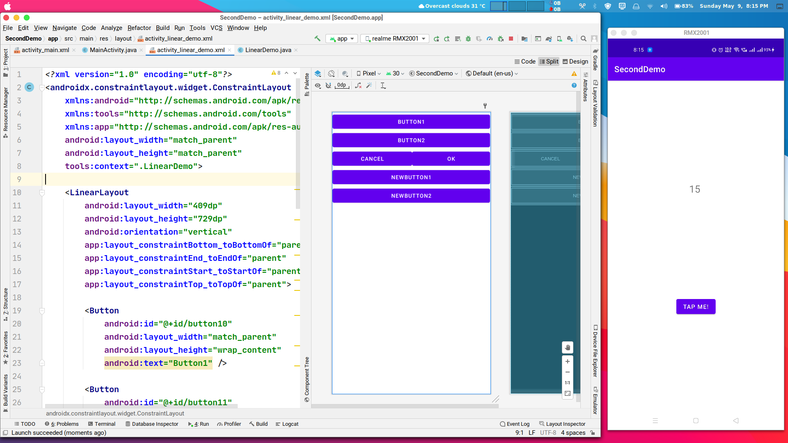

# SecondDemo

This Android App demonstrates Layouts and is a simple button counter app (we will be adding Intent to this app in next class).

Visit: [https://github.com/CC-MNNIT/2021-22-Classes/tree/main/Android/2021_05_09_AndroidClass-1/SecondDemo/](https://github.com/CC-MNNIT/2021-22-Classes/tree/main/Android/2021_05_09_AndroidClass-1/SecondDemo/) for the source code.

## Outcome

