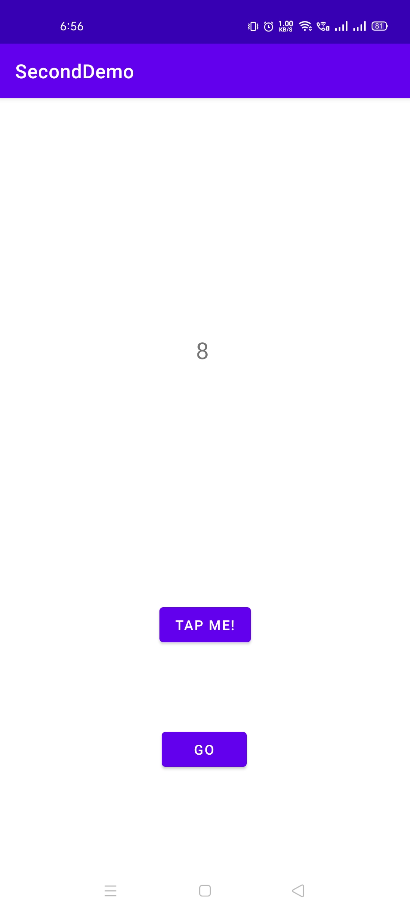
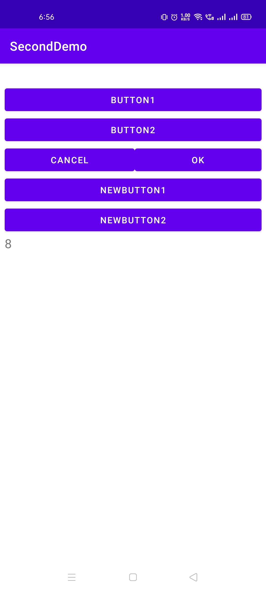

# IntentDemo

This Android App demonstrates how to Intent b/w activities.

Visit: [https://github.com/CC-MNNIT/2021-22-Classes/tree/main/Android/2021_05_11_AndroidClass-2/IntentDemo/](https://github.com/CC-MNNIT/2021-22-Classes/tree/main/Android/2021_05_11_AndroidClass-2/IntentDemo/) for the source code.

## Outcome:

| Activity 1 | Activity 2 |
|--|--|
|  |  |
