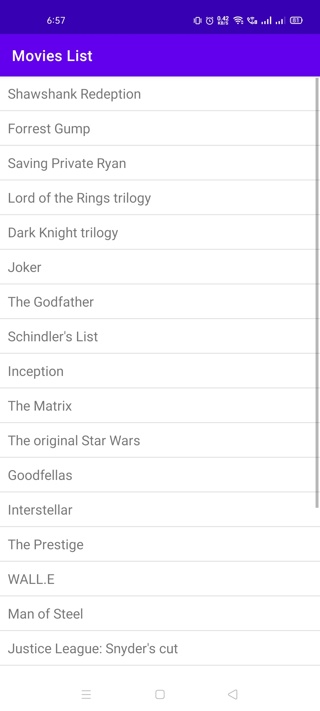

# ListStringDemo

This Android App demonstrates how to create ListView using ArrayAdapter<String>.

Visit: [https://github.com/CC-MNNIT/2021-22-Classes/tree/main/Android/2021_05_11_AndroidClass-2/ListStringDemo/](https://github.com/CC-MNNIT/2021-22-Classes/tree/main/Android/2021_05_11_AndroidClass-2/ListStringDemo/) for the source code.

## Outcome:

