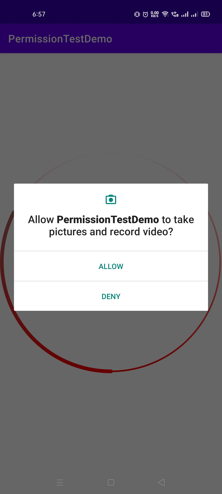

# PermissionDemo

This Android App demonstrates how to send runtime permission requests and adding dependencies.

Visit: [https://github.com/CC-MNNIT/2021-22-Classes/tree/main/Android/2021_05_11_AndroidClass-2/PermissionDemo/](https://github.com/CC-MNNIT/2021-22-Classes/tree/main/Android/2021_05_11_AndroidClass-2/PermissionDemo/) for the source code.

## Outcome:

