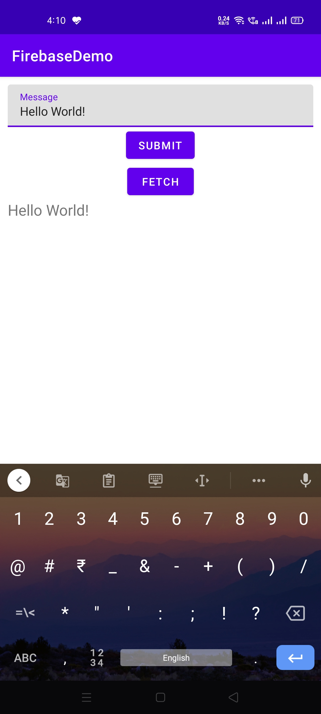

# FirebaseDemo

This Android App demonstrates how to use Firebase Realtime Database.

Visit: [https://github.com/CC-MNNIT/2021-22-Classes/tree/main/Android/2021_05_13_AndroidClass-3/FirebaseDemo/](https://github.com/CC-MNNIT/2021-22-Classes/tree/main/Android/2021_05_13_AndroidClass-3/FirebaseDemo/) for the source code.

Note: ./app/google-services.json has not been uploaded. Use the code as reference only.

## Outcome:

