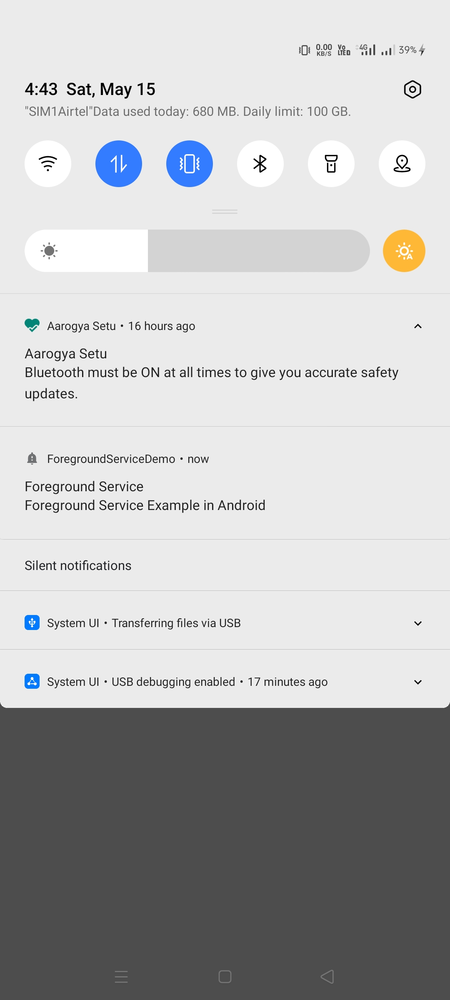

# ForegroundDemo

This Android App demonstrates how to make a Foreground Service.

Visit: [https://github.com/CC-MNNIT/2021-22-Classes/tree/main/Android/2021_05_13_AndroidClass-3/ForegroundDemo/](https://github.com/CC-MNNIT/2021-22-Classes/tree/main/Android/2021_05_13_AndroidClass-3/ForegroundDemo/) for the source code.

## Outcome:

