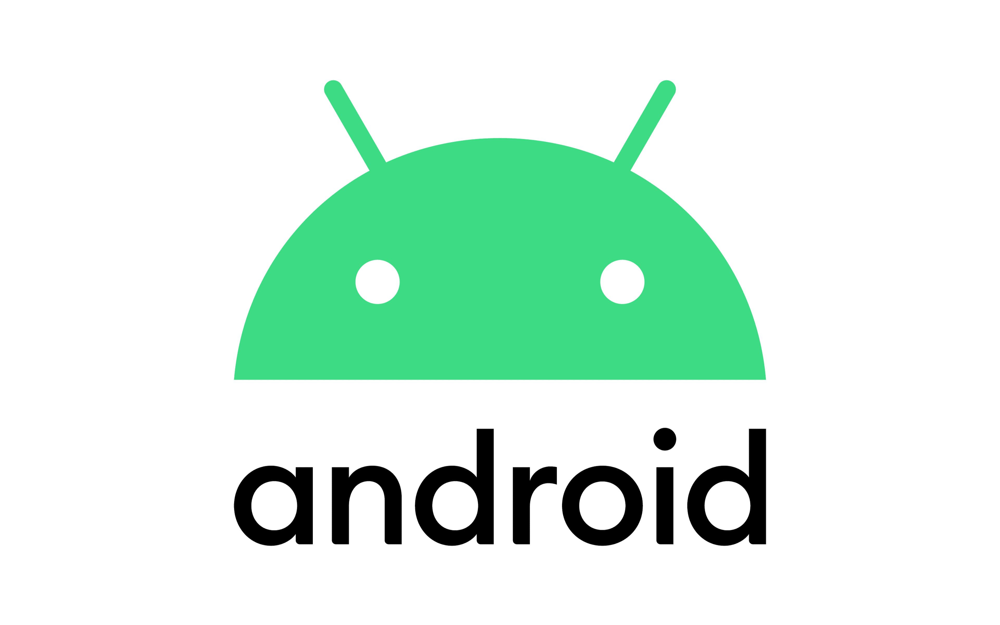

# Android Development Class - III

## Get the Presentation used in class: [Here](Android_Class-3.pdf)

## Get the Class recording: [Here](https://drive.google.com/file/d/1F2sIHVR5E1PqqvsvwusEzgqVRVgwH8Te/view?usp=sharing)

#### May 13, 2021

## Class coverage:

-   [JSON demo](JSONDemo) (click to visit)
-   [Firebase demo](FirebaseDemo) (click to visit)
-   [Location demo](LocationDemo) (click to visit)
-   [Notification demo](NotificationDemo) (click to visit)
-   [Foreground service demo](https://androidwave.com/foreground-service-android-example/) (click to visit)

## Class Content:

-   [Services](https://developer.android.com/guide/components/services)
-   [Background tasks](https://developer.android.com/guide/background)
    -   [Scheduling Repeating Alarms](https://developer.android.com/training/scheduling/alarms)
-   JSON parsing:
    -   [Volley](https://developer.android.com/training/volley) for network requests. For tutorial [click here](https://developer.android.com/training/volley/simple). For NetworkImageView [click here](https://cypressnorth.com/web-programming-and-development/setting-android-google-volley-imageloader-networkimageview/).
    -   [JSONObject class](https://developer.android.com/reference/org/json/JSONObject)
    -   [Android JSON Parser Tutorial](https://www.javatpoint.com/android-json-parsing-tutorial)
    -   [Online JSON Viewer](http://jsonviewer.stack.hu/)
-   Firebase:
    -   [Firebase Console](https://console.firebase.google.com/)
    -   [Firebase Realtime Database documentation](https://firebase.google.com/docs/database)
        -   [Steps to configure](https://firebase.google.com/docs/database/android/start)
        -   [Connect to Firebase](https://developer.android.com/studio/write/firebase)
    -   [Firebase Auth documentation](https://firebase.google.com/docs/auth)
        -   [Setup steps with FirebaseUI](https://firebase.google.com/docs/auth/android/firebaseui)
        -   [Using phone number](https://firebase.google.com/docs/auth/android/phone-auth)
-   Location:
    -   [Location overview](https://developer.android.com/training/location)
    -   [Setting up Google Play Services](https://developers.google.com/android/guides/setup)
    -   [Request location permission](https://developer.android.com/training/location/permissions)
    -   [Get last known location](https://developer.android.com/training/location/retrieve-current)
-   Notifications:
    -   [Notifications](https://developer.android.com/guide/topics/ui/notifiers/notifications)
    -   [Create a Notification](https://developer.android.com/training/notify-user/build-notification)
