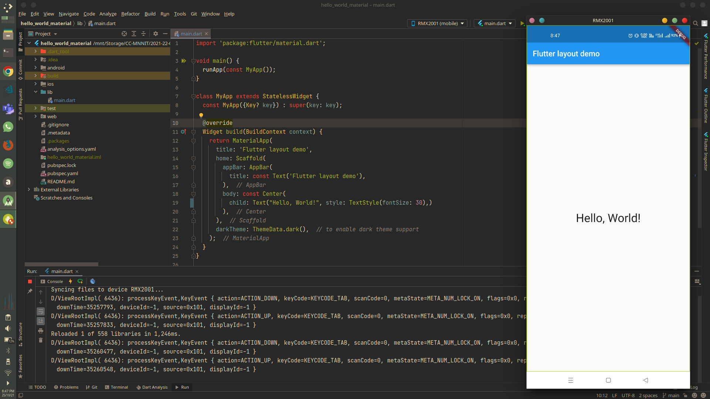

# hello_world_material

A simple `Hello, World!` Flutter project with `MaterialApp` as the root Widget.

Visit: [https://github.com/CC-MNNIT/2021-22-Classes/tree/main/Android/2021_10_25_FlutterClass-1/hello_world_material/](https://github.com/CC-MNNIT/2021-22-Classes/tree/main/Android/2021_10_25_FlutterClass-1/hello_world_material/) for the source code.

## Outcome:

