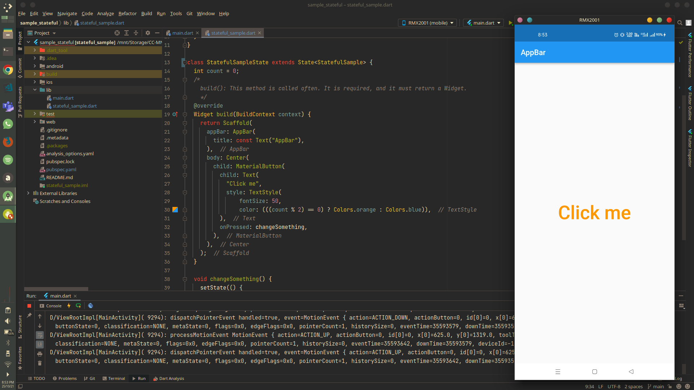

# sample_stateful

A simple Flutter project demonstrating `StatefulWidget`. The color of the "Click Me' button changes with the count of number of clicks being odd or even.

Visit: [https://github.com/CC-MNNIT/2021-22-Classes/tree/main/Android/2021_10_25_FlutterClass-1/sample_stateful/](https://github.com/CC-MNNIT/2021-22-Classes/tree/main/Android/2021_10_25_FlutterClass-1/sample_stateful/) for the source code.

## Outcome:

