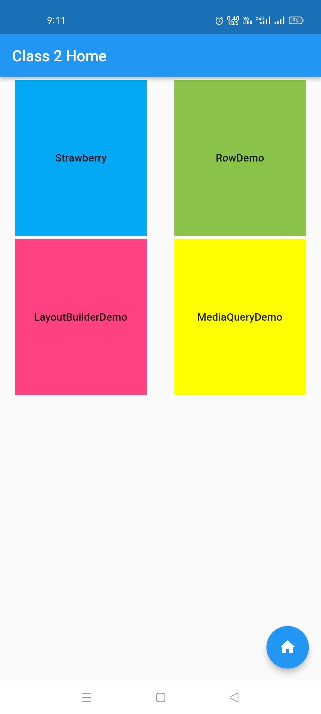

# flutter_class_2

An app with a homescreen navigating to following demos:
        - Showing a hierarchy of `Row` and `Column` widgets.
        - Showing a hierarchy of `Row` and `Column` and `Image` widgets.
        - Showing use of `LayoutBuilder` widget.
        - Showing use of `MediaQuery` widget.
        - The homescreen itself shows unnamed route navigation.

Visit: [https://github.com/CC-MNNIT/2021-22-Classes/tree/main/Android/2021_11_20_FlutterClass-2/flutter_class_2/](https://github.com/CC-MNNIT/2021-22-Classes/tree/main/Android/2021_11_20_FlutterClass-2/flutter_class_2/) for the source code.

## Outcome:

