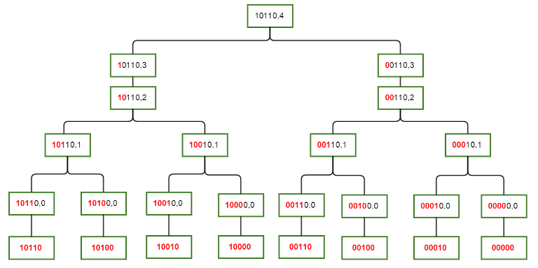

# Sum over Subsets Dynamic Programming

## Pre-requisites
- Dynamic Programming
- Bitmasks
  
  
## Introduction

SOS DP is one of the most feared yet one of the most beautiful techniques out there. It helps solve problems involving bitmasks which are out of the scope of regular bitmask dp. To understand the technique we'll use a problem. We'll figure out the shortcomings of the brute force and optimize it using the observations we make. Just like Knapsack problem, focus on the details of the technique rather than focusing on the details of the problem. Ok so lets start.

## Problem

```
Given an array A of integers of size N, we need to calculate ∀x ∈ [0 , 2^N) function F(x) = Sum of all the subsets of the subset of A represented by the bitmask x. In other words if G(x) = ΣA[i] ∀i such that ith bit is set in x, then F(x) = ΣG(i) ∀i such that x&i == i i.e., i is a sub mask of x.
```

In simpler words we need to find the array B of size 2^N, where B[i] = Sum of all the subsets of the ith subset of A.

For ease of further calculations we'll pre calculate the array G as follows:

```c++
    vector<int> G((1 << N) , 0);
    for(int mask = 0 ; mask < (1 << N) ; mask++) {
        for(int i = 0 ; i < N ; i++) {
            if(mask & (1 << i)) {
                G[mask] += A[i];
            }
        }
    }
```

## Brute Force

The most naive approach to this problem is simply doing what the problem asks, i.e., iterate over all the masks in the domain. For each mask, iterate over all the masks again. If the inner mask is the sub mask of the outer mask, then add its contents to the answer.

#### Code

```c++
for(int outer_mask = 0 ; outer_mask < (1<<N) ; ++outer_mask){
	for(int inner_mask = 0 ; inner_mask < (1<<N) ; ++inner_mask){
        // checking if i is sub mask of mask
		if((ouer_mask & inner_mask) == inner_mask){
			dp[outer_mask] += G[inner_mask];
		}
	}
}
```

#### Complexity analysis

It's quite straightforward. Two nested loops are used so the complexity is O(2^N * 2^N) = O(4^N).

## Shortcomings of Brute Force

For every mask we are going over all the masks again and again and using if condition we are checking if we need to use them. If somehow we only iterate over the required submasks for each mask, then we can avoid a lot of unnecessary loop iterations. 

## Sub optimal solution

Using the above shortcoming the following code would be more optimal then the brute force.

```c++
// Pseudo code
for(int mask = 0 ; mask < (1<<N) ; ++mask){
	for(sub_masks of mask){
		dp[mask] += G[i];
	}
}
```

So how do we generate all the submasks efficiently? We can do it in the following way:

```c++
for(int sub_mask = mask ; ; sub_mask = (sub_mask - 1) & mask) {
    // Use sub mask
    if(!sub_mask) break;
}
```

#### Why does this work?
Well this is because subtracting 1 from the the ```sub_mask``` unsets the leftmost set bit and sets all the zeroes after it. Using ```& mask``` we make sure that the new number obtained is indeed a sub mask of ```mask```.

#### Complexity Analysis
There are ```C(n , k)``` masks having ```k``` set bits. For each of such masks there are ```2^k``` sub masks for them. So the total number of iterations are as follows:

```
Σ (C(n , k) * 2^k) for each k from 0 to N.
```

This expression evaluates to (1 + 2)^N = ```3^N``` using ```binomial theorem```.


## Shortcomings in the sub optimal solution

A noticeable flaw in our previous approach is that an index A[x] with x having K off bits is visited by 2^K masks. Thus there is repeated recalculation. We can avoid this repeated calculation using a smart DP, which is called SOS DP.

## SOS DP

Lets define another function ```fun(mask , i)``` which returns the sum of all the subsets of mask such that the submasks only differ in the first (i+1) bits.

The transitions would be as follows:

```c++
    if(i == -1) {
        return G[mask];
    }
    if(mask & (1 << i)) {
        // ith bit is set
        return fun(mask , i) = fun(mask , i-1) + fun(mask ^ (1 << i) , i-1);
    }
    else {
        return fun(mask , i) = fun(mask , i-1);
    }
```



#### Complexity Analysis

As already discussed complexity of DP problems = ```O(number of states * complexity of one transition)```. Thus time complexity of SOS DP is ```O(N * 2^N)```.

## Space optimised solution

If the order in which states are visited is optimal then we don't even need the second state in our dp array.

```c++
    for(int i = 0 ; i < (1 << N) ; ++i)
	dp[i] = G[i];
    
    for(int i = 0 ; i < N ; ++i) 
        for(int mask = 0 ; mask < (1 << N) ; ++mask) {
            if(mask & (1<<i))
                dp[mask] += F[mask^(1<<i)];
        }
```

This helps us achieve a space complexity of ```O(2^N)```.

## Practice Problem

[Compatible Numbers](https://codeforces.com/contest/165/problem/E)

## Links for further studying

- [CF blog](https://codeforces.com/blog/entry/45223)
- [Submask enumeration](https://cp-algorithms.com/algebra/all-submasks.html)