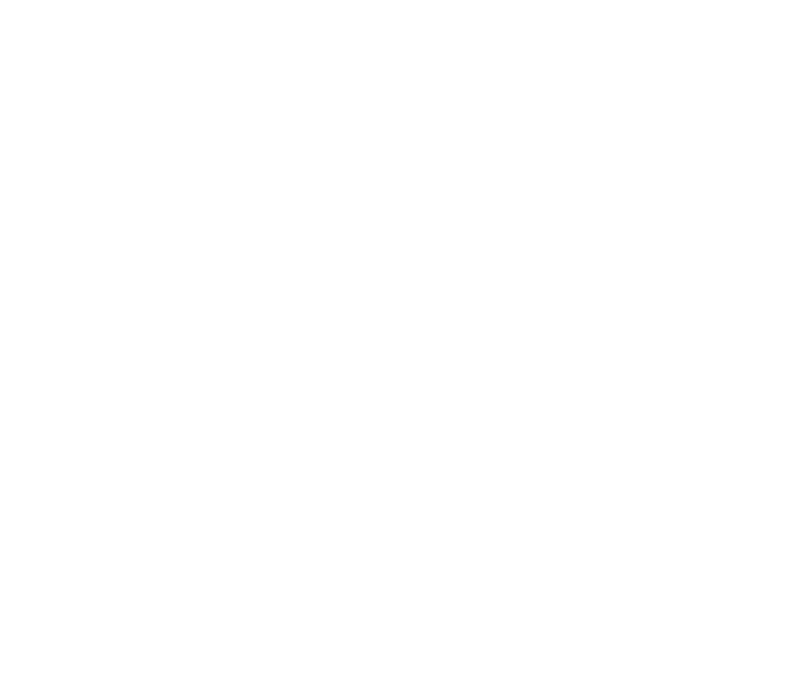

# Avishkar 2021

## CyberQuest
- [CyberQuest](https://www.facebook.com/cyberquest.avishkar/)

### Event wise Facebook Pages

- [MNNIT CC Queries](https://www.facebook.com/groups/ccqueries/)
- [SoftaBlitz](https://www.facebook.com/groups/softablitz/)
- [DroidRush](https://www.facebook.com/groups/droidrush)
- [Webster](https://www.facebook.com/groups/webster.avishkar)
- [Logical Rhythm](https://www.facebook.com/Logthm/)
- [TuxWars and Revengg](https://www.facebook.com/groups/tuxwarsmnnit/)
- [Operaomnia](https://www.facebook.com/operaomnia.cyberquest/)
- [TechMaiden](https://www.facebook.com/techmaiden.mnnit/)
- [Code Warrior](https://www.facebook.com/groups/mnnitcodewarriors/)
- [Insomnia, Code of the Day, Mathrush](https://www.facebook.com/coderushmnnit)

### Problem Statements

- [Droidrush](PS_Droidrush.pdf)

### Event Details

- [Cyberquest Events PPT](CyberQuest2k21PPT.pdf)