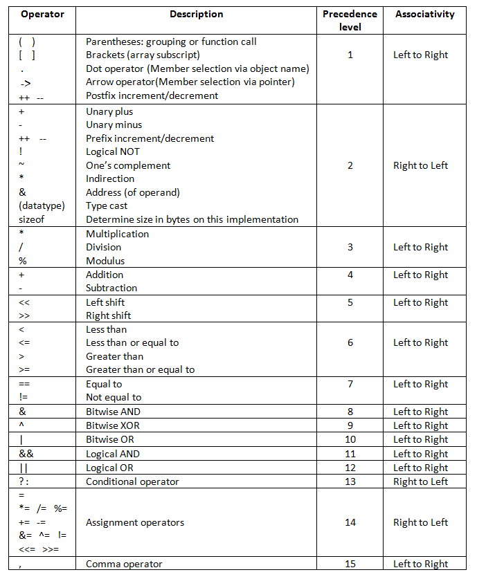

# C Class 4

## Class recording: [Here](https://drive.google.com/file/d/1lkecY1mCdsprEkdE5mJNpRUkZAetPmny/view?usp=sharing)
## PPT: [Here](CC_FirstYe_Class4.pdf)

January 30th, 2022

## Tasks

### Offline

#### Warmup

1. Write a program (WAP) to accept an year from the user and check whether it is a leap year or not. [Rules to check leap year](https://www.timeanddate.com/date/leapyear.html#:~:text=Leap%20Year%20Rules%3A%20How%20to%20Calculate%20Leap%20Years).
2. Write a program with two integer variables a = 5 and b = 8. Swap the values of the two numbers by using a temporary variable such that the value of a is now 8 and the value of b is now 5.
3. Do problem 1 without using a temporary variable.
4. Finish [last day's tasks](../2022_01_29_CClass-3/README.md#Tasks).

#### Switch-case

1. WAP to accept a number from 1 to 7 and display the corresponding day of the week.
2. WAP to accept two numbers and a operator (+, -, *, /, %) from user and perform the operation on the two numbers as per the operator entered and display the result.
3. Write a menu driven program to accept a choice from user and as per the choice perform the following operations:
    - Area of a circle
    - Area of a rectangle
    - Area of a triangle (Heron's formula)
    - Volume of a sphere
4. WAP to acept an alphabet from user and display whether it is a vowel or consonant.
5. Write a munu driven program to accept a choice from user and as per the choice perform the following operations:
    - Convert Decimal to [Binary](https://en.wikipedia.org/wiki/Binary_number)
    - Convert Binary to Decimal
    - Convert Decimal to [Hexadecimal](https://en.wikipedia.org/wiki/Hexadecimal)
    - Convert Hexadecimal to Decimal
    - Convert Decimal to [Octal](https://en.wikipedia.org/wiki/Octal)
    - Convert Octal to Decimal

#### Loops

1. WAP to display all **even** numbers from 1 to 100.
2. WAP to display all **odd** numbers between two number entered by user.
3. WAP to print all **alphabets** from a to z.
4. WAP to accept a number from user and display the **factorial** of that number.
5. WAP to accept a number from user and display whether it is an **[Armstrong](https://en.wikipedia.org/wiki/Narcissistic_number)** number or not.
6. WAP to accept a number frm user and display its **multiplication table**.
7. WAP to accept a number from user and display the **number of digits** in that number.
8. WAP to accept a number from user and display the **sum of digits** in that number.
9. WAP to accept a number from user and display the **product of digits** in that number.
10. WAP to accept a number from user and display the **reverse** of that number.
11. WAP to accept a number from user and display whether it is a **palindrome** or not.
12. WAP to accept a number from user and display whether it is a **prime number** or not.
13. WAP to display all **prime numbers** between 1 to 100.
14. WAP to accept two numbers from user and display the **[Greatest Common Divisor (GCD)](https://en.wikipedia.org/wiki/Greatest_common_divisor)** (or the Highest Common Factor (HCF)) of those two numbers.
15. WAP to accept two numbers from user and display the **[Least common multiple (LCM)](https://en.wikipedia.org/wiki/Least_common_multiple)**  of those two numbers.
16. WAP to accept two numbers from user and display the **[nCr](https://en.wikipedia.org/wiki/Combination)** of those two numbers.
17. WAP to print numbers from 1 to 100 with their binary and octal representation.
18. Print all letter combinations from AA to ZZ using a single for loop, i.e., AA, AB, AC, ..., BA, BB, BC, ..., ZZ.

#### Operator precedence

1. Learn operator precedence (click on image to enlarge):

    
    
    You can take help of [this Mnemonic](./C_operator_precedence_mnemonic.md).
2. Practice operator precedence questions from [C in Depth](../) book.

### HackerRank:

1. [For Loop in C](https://www.hackerrank.com/challenges/for-loop-in-c/problem?isFullScreen=true)
2. [Sum of Digits of a Five Digit Number](https://www.hackerrank.com/challenges/sum-of-digits-of-a-five-digit-number/problem?isFullScreen=true)
3. **Read and do [Bitwise Operators](https://www.hackerrank.com/challenges/bitwise-operators-in-c/problem?isFullScreen=true)**.

### Quizzes

1. [If Else Statement Quiz in C](https://www.knowprogram.com/c-quiz/if-else-statement-quiz-c/)
2. [Quiz on Increment and Decrement Operators in C](https://www.knowprogram.com/c-quiz/increment-decrement-quiz-c/)
