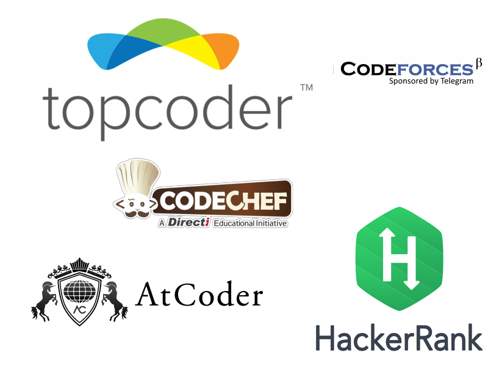

# CP Class 2

[.. Previous Page](..)

## Class recording: [Here](https://drive.google.com/file/d/1zyVEDe4RnJ8fvtfCgEnQ5KF-Rclc7gw-/view?usp=sharing)

## PPT: [Here](Finding%20Primes.pptx)

March 06th, 2022

## Tutorials

- [HackerEarth Number Theory Notes](https://www.hackerearth.com/practice/notes/number-theory-1/)
- [Mathematics For TopCoders](https://www.topcoder.com/community/data-science/data-science-tutorials/mathematics-for-topcoders/)
- [Sieve of Eratosthenes](http://codeforces.com/blog/entry/3519)
- [Segmented Sieve Self Read](https://www.geeksforgeeks.org/segmented-sieve/)
- [Euler Totient Function](https://www.geeksforgeeks.org/eulers-totient-function/)
- [GCD Complexity Proof](https://leimao.github.io/blog/Euclidean-Algorithm/)

## Tasks

- *First complete [last class tasks](../2022_03_05_CPClass-1/).*

- [Codeforces: Almost Prime](http://codeforces.com/problemset/problem/26/A)
- [SPOJ: LASTDIG](https://www.spoj.com/problems/LASTDIG/)
- [Codeforces: T-primes](https://codeforces.com/problemset/problem/230/B)
- [Spoj: PRIME1 - Prime Generator](https://www.spoj.com/problems/PRIME1/)
- [Codechef: Count K-Primes](https://www.codechef.com/problems/KPRIME)
- [Codechef: Primality Test](https://www.codechef.com/problems/PRB01)
- [Spoj: PRIME1 - Prime Generator](https://www.spoj.com/problems/PRIME1/) (Segmented Sieve)
- [Spoj: ALICESIE - Alice Sieve](https://www.spoj.com/problems/ALICESIE/)
- [HackerEarth: Chandu and his Interns](https://www.hackerearth.com/problem/algorithm/chandu-and-his-interns/description/)
- [HackerEarth Code Monk Number Theory](https://www.hackerearth.com/challenge/competitive/code-monk-number-theory-i/problems/)
- [Spoj ZSUM - Just Add It](https://www.spoj.com/problems/ZSUM/)
- [Spoj ENIGMATH - PLAY WITH MATH](https://www.spoj.com/problems/ENIGMATH/)
- [Spoj CRDS - Cards](https://www.spoj.com/problems/CRDS/)
- [GCD2](https://www.spoj.com/problems/GCD2/)


