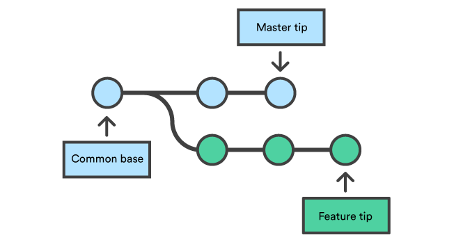

# Git Class - III

April 22nd, 2021

<div align="center"></div>

<hr>

*    ### Merge and Merge Conflicts

     The `git merge` command lets you take the independent lines of development created by `git branch` and integrate them into a single branch.<br>
     Git merge will combine multiple sequences of logically unrelated commits into one unified history. In the most frequent use cases, `git merge` is used to combine two branches.<br>
     Remember merge is also a commit<br>
     Since merge is a commit with n parents (generally 2) (here parent refer to the previous branches) it stores info about all the commits
     <br>
     *  Say we have a new branch feature that is based off the _master_ branch. We now want to merge this feature branch into _master_.

     
     <br>
     *  Invoking the `git merge` command will merge the specified branch feature into the current branch, we'll assume master. Git will determine the merge algorithm automatically.
     

     *  To merge a branch into master, 1st checkout into master and then invoke merge:<br>
          ```bash
          git checkout master
          git merge new-feature
          ```

     #### Merge Conflicts

     *  Version control systems are all about managing contributions between multiple authors with distributed load ( usually developers ). Sometimes multiple developers may try to edit the same content. If "Developer A" tries to edit code that "Developer B" is editing a conflict may occur. To reduce the occurrence of conflicts developers will work in separate isolated branches. The git merge command's primary responsibility is to combine separate branches and resolve any conflicting edits.

     *  Conflicts generally arise when two people have changed the same lines in a file, or if one developer deleted a file while another developer was modifying it. In these cases, Git cannot automatically determine what is correct

     *  A merge conflict generally looks like:

          ```
          <<<<<<< HEAD
          this is some content to mess with
          content to append
          (this section is the code of your current branch, ie code you have added)
          =======
          totally different content to merge later
          (this section is the changed code)
          >>>>>>> new_branch_to_merge_later
          same code in both files
          (this section is the unchanged code present in both the files)
          ```

     *  Think of these new lines as "conflict dividers". The `=======` line is the "center" of the conflict. All the content between the center and the `<<<<<<< HEAD` line is content that exists in the current branch which the HEAD is pointing to. Alternatively all content between the center and `>>>>>>> new_branch_to_merge_later` is content that is present in merging branch.

     * To stop a merge in a scenario when you are not ready to resolve merge conflicts but wants to do other operations/editing without any error message coming in your way, you use `git merge --abort`.

     * To know more about merge conflicts, refer [this article](https://www.atlassian.com/git/tutorials/using-branches/merge-conflicts).


*    ### Remotes

     *  Remotes are used to link to other repositories on a server.
     *  They provide convenient names that can be used to reference a not-so-convenient URL for your repositroy on the server.

     *  To add a remote to repo: `git remote add <name> <URL>`
     *  To list remote connections: `git remote`
     *  To view remotes along-with URL details: `git remote -v`

     <br>
     When you want to link your already created local git repo to a repo on GitHub, you need to add a remote referring to the GitHub repo.

     Eg:

     ```bash
     git remote add origin https://github.com/<your-username>/<name-of-the-repo-on-GitHub>
     ```

     Additionally you also need to specify which exact branch are you uploading when you, for the first time try to push (upload) your code into the repository. This could be done by the following command `git push --set-upstream origin master`. Since github requires atleast one branch in a repository, we by convention use the _master_ branch as our uploading branch.


*    ### Clone, Fetch, Pull, Push

     *    #### Clone
          *  `git clone <URL of the repo on github>`
          <br>The above command is used to copy a github Repository onto the local machine with all history attached to it.
          *  When you directly clone a GitHub repository, you do not need to explicitly add remote to it. The default remotes are configured automatically.

     *    #### Fetch
          The git fetch command downloads commits, files, and refs from a global repository (like from github) into your remote repository. Fetching is what you do when you want to see what everybody else has been working on. It doesn’t force you to actually merge the changes into your repository. Git isolates fetched content and it has absolutely no effect on your local development work.

          *  `git fetch`: Fetch all branches from global repository (like github).


     *    #### Pull
          The git pull command first runs git fetch which downloads content from the specified global repository. Then a git merge is executed to merge the remote content refs and heads into a new local merge commit.

          *  `git pull <remote>`: Fetch the specified remote’s copy of the current branch and immediately merge it into the local copy. This is the same as 
               ```bash
               git fetch <remote>
               git merge origin/<current-branch>
               ```

          *  When downloading content from a remote repo, git pull and git fetch commands are available to accomplish the task. You can consider git fetch the 'safe' version of the two commands. It will download the content but not update your local repo's working state, leaving your current work intact. git pull is the more aggressive alternative, it will download the content for the active local branch and immediately execute git merge to create a merge commit for the new content. If you have pending changes in progress this will cause conflicts and kickoff the merge conflict resolution flow.

     *    #### Push

          *  The git push command is used to upload local repository content to a remote repository. Pushing is how you transfer commits from your local repository to a remote repo.

          *  `git push <remote> <branch>`: Push the specified branch to *\<remote\>*, along with all of the necessary commits and internal objects.
          <br>`git push`: on local master branch will push the master branch to origin/master which in turn act as a pipe to store your commits to the global repository (like a one on github).

     For further discussion on _fetch, pull, push_ refer [this](https://www.atlassian.com/git/tutorials/syncing/git-fetch).


*    ### Pull Requests

     *  Pull requests let you tell others about changes you've pushed to a branch in a repository on GitHub. Once a pull request is opened, you can discuss and review the potential changes with collaborators and add follow-up commits before your changes are merged into the base branch.

     *  Know More: [About pull requests](https://help.github.com/en/articles/about-pull-requests), [Creating Pull Requests](https://help.github.com/en/articles/creating-a-pull-request).

*    ### Stash
     Think when you are in a branch and you have made lots and lots of changes but you are still not ready to commit them and you need to switch to another branch to do a quick bug fix or something else.

     When we are in a branch and make changes but don't commit them, then when we switch branch those changes are still present. This could be a big problem as these branches make the working directory unclean. Commands like `git status` will always record their existence but since you don't want them to commit what should you do?

     Stash is the answer to all you questions.

     Think of stash as a reverse bucket when you want to change branches while working on something in your current branch just put those changed files in the stash bucket and git won't dare to touch this bucket, when you are done on the other branch come back and empty the contents of the bucket back.

     Command to put changes in the bucket: `git stash`
     Command to empty the bucket i.e. take out the changes from the bucket: `git stash apply`

*    ### Reset
     *  The git reset command is a complex and versatile tool for undoing changes.
     *  Helps to reach a previous state, or helps to go back to previous checkpoints/versions.
     <br> [Know More](https://www.atlassian.com/git/tutorials/undoing-changes/git-reset)

*    ### Issues on Github

     *  Used to track ideas, enhancements, tasks, or bugs for work on GitHub.
     <br> [Know More](https://help.github.com/en/articles/about-issues)


*    ### Resources for further study
     *    [Class Presentation](Lecture-2.pdf)
     *    [Git Practice Resources](https://try.github.io/)
     *    [Git Cheat Sheet](git-cheat-sheet.pdf)
     *    [Progit Book](progit.pdf)
     *    [Udacity Course: How to Use Git and GitHub?](https://classroom.udacity.com/courses/ud775-india)
     *    [Git Internals](https://www.freecodecamp.org/news/git-internals-objects-branches-create-repo/)
     *    [Git Visualised using animations](https://dev.to/lydiahallie/cs-visualized-useful-git-commands-37p1)
