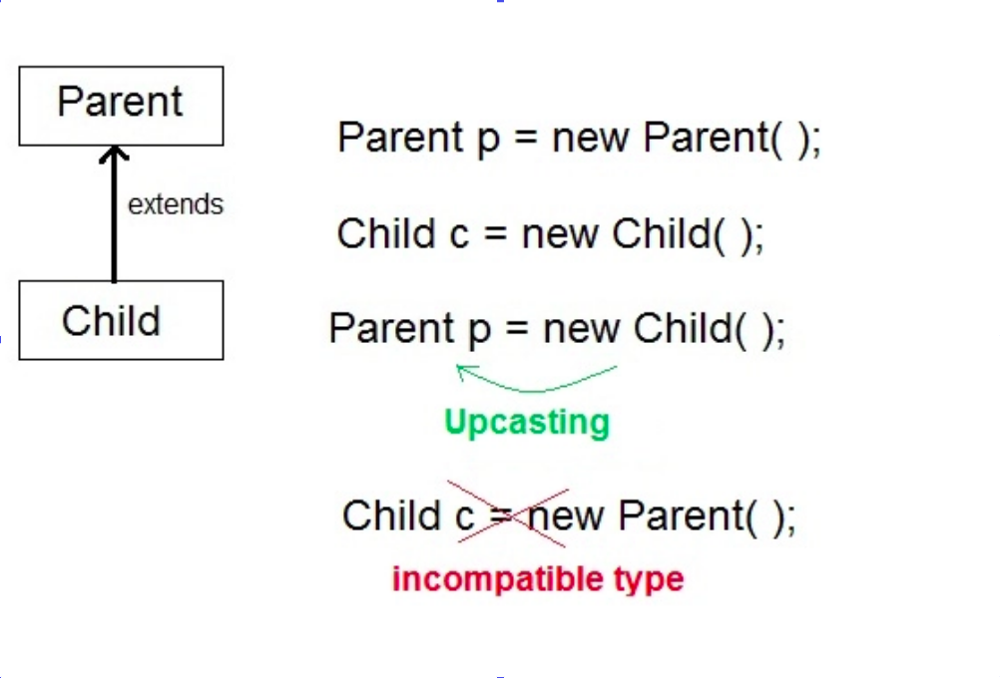
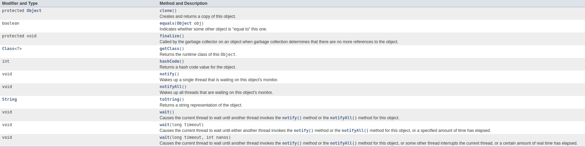

# Java Class - II


#### April 25, 2021

<div align="center"></div>

<hr>


## Class Content:

### Clarification regarding class name and file name in java :-
- We are allowed to **use any name for a filename only when class is not public**. In the case of a public class, we can’t use a different file name.
- The filename must have the same name as the public class name in that file, which is the way to tell the JVM that this is an entry point. Suppose when we create a program in which more than one class resides and after compiling a java source file, it will generate the same number of the .class file as classes reside in our program. In this condition, we will not able to easily identify which class need to interpret by java interpreter and which class containing Entry point for the program.
- As a consequence of above point we can have **only one public class in a single java file**. If you want yous software to have multiple public classes then they have to be in different files.
- As a practice what we do is keep only the main class (Class having main function) Public for JVM to access and rest of the classes are kept as default access specifies or private until and unless it needs to be public.
- For Example:
  If you put the below code in a single file:

    ```java
    public class Employee
    {
        public static void main()
        {
        
        }
    }
    class Manager
    {
            
    }
    ```
  Then you need to name the file as Employee.java only

### Encapsulation :-
- Encapsulation in Java and many OOP languages is the process of wrapping information and functionality in a class and providing methods of accessing them in order to provide a simple way for users to access the information and make use of the functionality of the class.
- Through encapsulation, you can control what parts of a program can access the members of a class. By controlling
access, you can prevent misuse. For example, allowing access to data only through a welldefined set of methods, you can prevent the misuse of that data.
- A class creates a *black box* which may be used, but the inner workings of which are not open to tampering.

#### **[1.java](1.java)**
```java
// This class defines an integer stack that can hold 10 values. 
class Stack {
    /* Now, both stck and tos are private.  This means
        that they cannot be accidentally or maliciously
        altered in a way that would be harmful to the stack.
    */
    private int stck[] = new int[10];
    private int tos;
    
    // Initialize top-of-stack
    Stack() {
        tos = -1;
    }

    // Push an item onto the stack
    void push(int item) {
        if(tos==9) 
        System.out.println("Stack is full.");
        else 
        stck[++tos] = item;
    }

    // Pop an item from the stack
    int pop() {
        if(tos < 0) {
        System.out.println("Stack underflow.");
        return 0;
        }
        else 
        return stck[tos--];
    }
}
class TestStack {
    public static void main(String args[]) {
        Stack mystack1 = new Stack();
        Stack mystack2 = new Stack();

        // push some numbers onto the stack
        for(int i=0; i<10; i++) mystack1.push(i);
        for(int i=10; i<20; i++) mystack2.push(i);

        // pop those numbers off the stack
        System.out.println("Stack in mystack1:");
        for(int i=0; i<10; i++) 
        System.out.println(mystack1.pop());

        System.out.println("Stack in mystack2:");
        for(int i=0; i<10; i++) 
        System.out.println(mystack2.pop());

        // these statements are not legal
        // mystack1.tos = -2;
        // mystack2.stck[3] = 100; 
    }
}
```

### Static Keyword :-
- When a member is declared static, it can be accessed before any objects of its class are created, and without reference to any object.
- You can declare both methods and variables to be static. The most common example of a static member is ```main( )```. ```main( )``` is declared as static because it must be called before any objects exist.
- When objects of its class are declared, no copy of a static variable is made. Instead, all instances of the class share the same static variable.
- Outside of the class in which they are defined, static methods and variables can be used independently of any object. 
- 	 For Static Methods,
    - They can only directly call other static methods.
    - They can only directly access static data.
    - They cannot refer to this or super in any way.

#### **[2.java](2.java)**
```java
class StaticDemo {
    static int a = 42;
    int c;
    static int b = 99;
    static void callme() {
        System.out.println("a = " + a);
    }
}

class StaticByName {
    public static void main(String args[]) {
        StaticDemo.callme();
        StaticDemo a = new StaticDemo();
        StaticDemo b = new StaticDemo();
        int x = a.c;
        int y = StaticDemo.a;

        System.out.println("b = " + StaticDemo.b);
    }
}
```

### final keyword :-

- A field can be declared as final. Doing so prevents its contents from being modified. 
- You must initialize a final field when it is declared. You can do this in one of two ways: 
    - First, you can give it a value when it is declared.
    - Second, you can assign it a value within a constructor.

#### **[3.java](3.java)**
```java
final int FILE_NEW = 1;
final int FILE_OPEN = 2;
final int FILE_SAVE = 3;
final int FILE_SAVEAS = 4;
final int FILE_QUIT = 5;
```

### Inheritance :-

- Using inheritance, you can create a general class that defines traits common to a set of related items.
- To inherit a class, you simply incorporate the definition of one class into another by using the **extends** keyword.
- Although a subclass includes all of the members of its superclass, it cannot access those members of the superclass that have been declared as private.
- Once you have created a superclass that defines the general aspects of an object, that superclass can be inherited to form specialized classes. Each subclass simply adds its own unique attributes. This is the essence of inheritance.

#### **[4.java](4.java)**
```java
// This program uses inheritance to extend Box.
class Box {
    double width;
    double height;
    double depth;

    // construct clone of an object
    Box(Box ob) { // pass object to constructor
        width = ob.width;
        height = ob.height;
        depth = ob.depth;
    }

    // constructor used when all dimensions specified
    Box(double w, double h, double d) {
        width = w;
        height = h;
        depth = d;
    }

    // constructor used when no dimensions specified
    Box() {
        width = -1;  // use -1 to indicate
        height = -1; // an uninitialized
        depth = -1;  // box
    }

    // constructor used when cube is created
    Box(double len) {
        width = height = depth = len;
    }

    // compute and return volume
    double volume() {
        return width * height * depth;
    }
}

// Here, Box is extened to include weight.
class BoxWeight extends Box {
    double weight; // weight of box

    // constructor for BoxWeight
    BoxWeight(double w, double h, double d, double m) {
        width = w;
        height = h;
        depth = d;
        weight = m;
    }    
}

class RefDemo {
    public static void main(String args[]) {
        BoxWeight weightbox = new BoxWeight(3, 5, 7, 8.37);
        Box plainbox = new Box();
        double vol;

        vol = weightbox.volume();
        System.out.println("Volume of weightbox is " + vol);
        System.out.println("Weight of weightbox is " + weightbox.weight);
        System.out.println();

        // assign BoxWeight reference to Box reference
        plainbox = weightbox;

        vol = plainbox.volume(); // OK, volume() defined in Box
        System.out.println("Volume of plainbox is " + vol);

        /* The following statement is invalid because plainbox
        does not define a weight member. */
    //  System.out.println("Weight of plainbox is " + plainbox.weight);
    }
}

```


### super keyword

- Whenever a subclass needs to refer to its immediate superclass, it can do so by use of the keyword super.
- super has two general forms. 
    - The first calls the superclass’ constructor.
    #### **[5.java](5.java)**
    ```java
    // BoxWeight now uses super to initialize its Box attributes.
    class BoxWeight extends Box {
        double weight; // weight of box

        // initialize width, height, and depth using super()
        BoxWeight(double w, double h, double d, double m) {
            super(w, h, d); // call superclass constructor
            weight = m;
        }    
    }
    ```
    - The second is used to access a member of the superclass that has been hidden by a member of a subclass.
    #### **[6.java](6.java)**
    ```java
    // Using super to overcome name hiding.
    class A {
        int i;
    }

    // Create a subclass by extending class A.
    class B extends A {
        int i; // this i hides the i in A

        B(int a, int b) {
            super.i = a; // i in A
            i = b; // i in B
        }

        void show() {
            System.out.println("i in superclass: " + super.i);
            System.out.println("i in subclass: " + i);
        }
    }
    
    class UseSuper {
        public static void main(String args[]) {
            B subOb = new B(1, 2);
            subOb.show();
        }
    }
    ```
- In a class hierarchy, constructors complete their execution in order of derivation, from superclass to subclass. 
- Further, since super( ) must be the first statement executed in a subclass’
constructor, this order is the same whether or not super( ) is used.
- If super( ) is not used, then the default or parameterless constructor of each superclass will be executed. 

#### **[7.java](7.java)**
```java
// Demonstrate when constructors are called.

// Create a super class.
class A {
    A() { 
        System.out.println("Inside A's constructor.");
    }
}

// Create a subclass by extending class A.
class B extends A {
    B() {
        System.out.println("Inside B's constructor.");
    }
}

// Create another subclass by extending B.
class C extends B {
    C() {
        System.out.println("Inside C's constructor.");
    }
}
  
class CallingCons {
    public static void main(String args[]) {
        C c = new C();
    }
}
```
### Method Overriding :-
- In a class hierarchy, when a method in a subclass has the same name and type signature as a method in its superclass, then the method in the subclass is said to override the method in the superclass.
- When an overridden method is called from within its subclass, it will always refer to the version of that method defined by the subclass. The version of the method defined by the superclass will be hidden.
- Method overriding occurs only when the names and the type signatures of the two methods are identical. If they are not, then the two methods are simply overloaded.
- Static Methods are never overrided, they are simply hidden.

#### **[8.java](8.java)**
```java
// Method overriding.
class A {
    int i, j;

    A(int a, int b) {
        i = a;
        j = b;
    }

    // display i and j
    void show() {
        System.out.println("i and j: " + i + " " + j);
    }
}

class B extends A {
    int k;

    B(int a, int b, int c) {
        super(a, b);
        k = c;
    }

    // display k -- this overrides show() in A
    void show() {
        System.out.println("k: " + k);
    }
}
  
class Override {
    public static void main(String args[]) {
        B subOb = new B(1, 2, 3);

        subOb.show(); // this calls show() in B
    }
}
```

#### **[9.java](9.java)**
```java
// Methods with differing type signatures are overloaded -- not overridden.
class A {
    int i, j;

    A(int a, int b) {
        i = a;
        j = b;
    }

    // display i and j
    void show() {
        System.out.println("i and j: " + i + " " + j);
    }
}

// Create a subclass by extending class A.
class B extends A {
    int k;

    B(int a, int b, int c) {
        super(a, b);
        k = c;
    }

    // overload show()
    void show(String msg) {
        System.out.println(msg + k);
    }
}
  
class Override {
    public static void main(String args[]) {
        B subOb = new B(1, 2, 3);

        subOb.show("This is k: "); // this calls show() in B
        subOb.show(); // this calls show() in A
    }
}
```

### Dynamic Method Dispatch :-
- Dynamic method dispatch is the mechanism by which a call to an overridden method is resolved at run time, rather than compile time.
- Dynamic method dispatch is important because this is how Java implements run-time polymorphism.
- A superclass reference variable can refer to a subclass object.
    
- It is the type of the object being referred to (not the type of the reference variable) that determines which version of an overridden method will be executed. 
- It allows a general class to specify methods that will be common to all of its derivatives, while allowing subclasses to define the specific implementation of some or all of those methods.

#### **[10.java](10.java)**
```java
// Using run-time polymorphism.
class Figure {
    double dim1;
    double dim2; 

    Figure(double a, double b) {
        dim1 = a;
        dim2 = b;
    }

    double area() {
        System.out.println("Area for Figure is undefined.");
        return 0;
    }
}

class Rectangle extends Figure {
    Rectangle(double a, double b) {
        super(a, b);
    }

    // override area for rectangle
    double area() {
        System.out.println("Inside Area for Rectangle.");
        return dim1 * dim2;
    }
}

class Triangle extends Figure {
    Triangle(double a, double b) {
        super(a, b);
    }

    // override area for right triangle
    double area() {
        System.out.println("Inside Area for Triangle.");
        return dim1 * dim2 / 2;
    }
}

class FindAreas {
    public static void main(String args[]) {
        Figure f = new Figure(10, 10);
        Rectangle r = new Rectangle(9, 5);
        Triangle t = new Triangle(10, 8);
        
        Figure figref;

        figref = r;
        System.out.println("Area is " + figref.area());
        
        figref = t;
        System.out.println("Area is " + figref.area());
        
        figref = f;
        System.out.println("Area is " + figref.area());
    }
}
```

### Object Class :-

- **Object** class is the parent of every class in Java. All other classes are subclasses of Object. That is, Object is a superclass of all other classes. 
- A reference variable of type Object can refer to an object of any other class.
    
- The `equals( )` method compares two objects. It returns true if the objects are equal, and false otherwise. The precise definition of equality can vary, depending on the type of objects being compared. 
- The `toString( )` method returns a string that contains a description of the object on which it is called. Also, this method is automatically called when an object is output using `println( )`. Many classes override this method. Doing so allows them to tailor a description specifically for the types of objects that they create.

#### **[11.java](11.java)**
```java
class Student{  
    int rollno;  
    String name;  
    String city;  
    
    Student(int rollno, String name, String city){  
        this.rollno=rollno;  
        this.name=name;  
        this.city=city;  
    }  
    
    public String toString(){//overriding the toString() method  
        return rollno+" "+name+" "+city;  
    }

    public static void main(String args[]){  
        Student s1=new Student(101,"Raj","lucknow");  
        Student s2=new Student(102,"Vijay","ghaziabad");  
        
        System.out.println(s1);//compiler writes here s1.toString()  
        System.out.println(s2);//compiler writes here s2.toString()  
    }  
} 
```


### Wrapper Class :-

- Java provides type wrappers, which are classes that encapsulate a primitive type within an object.
- The type wrappers are **Double**, **Float**, **Long**, **Integer**, **Short**, **Byte**, **Character**, and **Boolean**.
- These classes offer a wide array of methods that allow you to fully integrate the primitive types into Java’s object hierarchy.

    #### **[12.java](12.java)**
    ```java
    // Demonstrate a type wrapper.
    class Wrap {
        public static void main(String args[]) {
            Integer iOb = new Integer(100);
            int i = iOb.intValue();
            System.out.println(i + " " + iOb); // displays 100 100
        }
    }
    ```

- Autoboxing is the process by which a primitive type is automatically encapsulated (boxed) into its equivalent type wrapper whenever an object of that type is needed. There is no need to explicitly construct an object.
- Auto-unboxing is the process by which the value of a boxed object is automatically extracted (unboxed) from a type wrapper when its value is needed.

    #### **[13.java](13.java)**
    ```java
    // Demonstrate autoboxing/unboxing.
    class AutoBox {
        public static void main(String args[]) {
            Integer iOb = 100; // autobox an int
            int i = iOb; // auto-unbox
            System.out.println(i + " " + iOb);// displays 100 100
        }
    }
    ```
    


### Abstract Class

- You can require that certain methods be overridden by subclasses by specifying the abstract type modifier. A subclass must override them—it cannot simply use the version defined in the superclass.
- Any class that contains one or more abstract methods must also be declared abstract.
- There can be no objects of an abstract class.
- Any subclass of an abstract class must either implement all of the abstract methods in the superclass, or be declared abstract itself. 
- Although abstract classes cannot be used to instantiate objects, they can be used to create object references, because Java’s approach to run-time polymorphism is implemented through the use of superclass references 

#### **[14.java](14.java)**
```java
// Using abstract methods and classes.
abstract class Figure {
    double dim1;
    double dim2; 

    Figure(double a, double b) {
        dim1 = a;
        dim2 = b;
    }

    // area is now an an abstract method 
    abstract double area();
}

class Rectangle extends Figure {
    Rectangle(double a, double b) {
        super(a, b);
    }

    // override area for rectangle
    double area() {
        System.out.println("Inside Area for Rectangle.");
        return dim1 * dim2;
    }
}

class Triangle extends Figure {
    Triangle(double a, double b) {
        super(a, b);
    }

    // override area for right triangle
    double area() {
        System.out.println("Inside Area for Triangle.");
        return dim1 * dim2 / 2;
    }
}

class AbstractAreas {
    public static void main(String args[]) {
    // Figure f = new Figure(10, 10); // illegal now
        Rectangle r = new Rectangle(9, 5);
        Triangle t = new Triangle(10, 8);
        
        Figure figref; // this is OK, no object is created

        figref = r;
        System.out.println("Area is " + figref.area());
        
        figref = t;
        System.out.println("Area is " + figref.area());
    }
}
```
