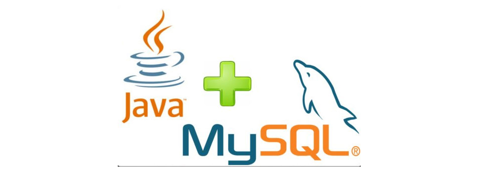
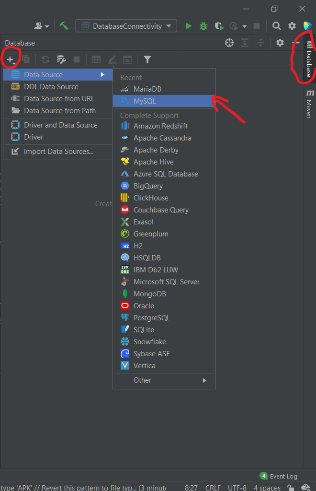
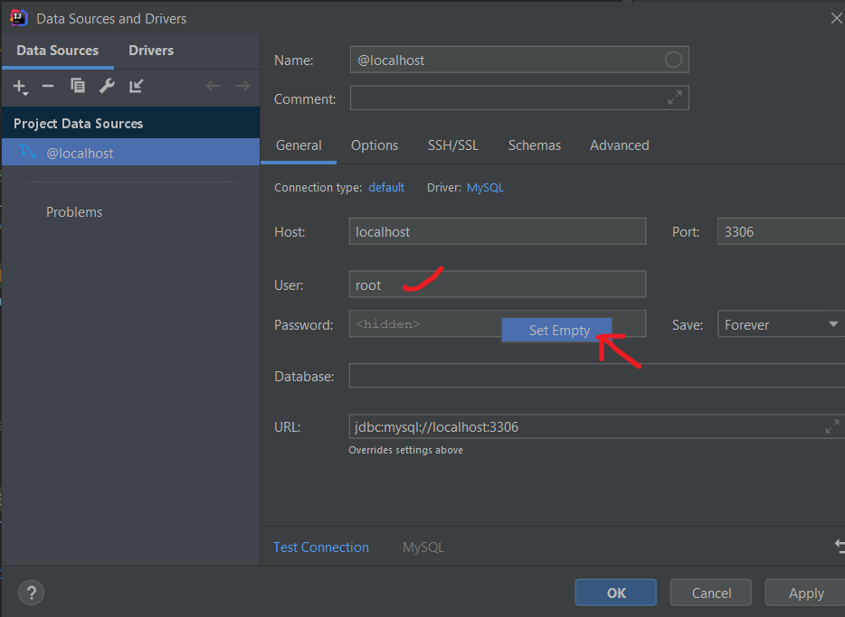
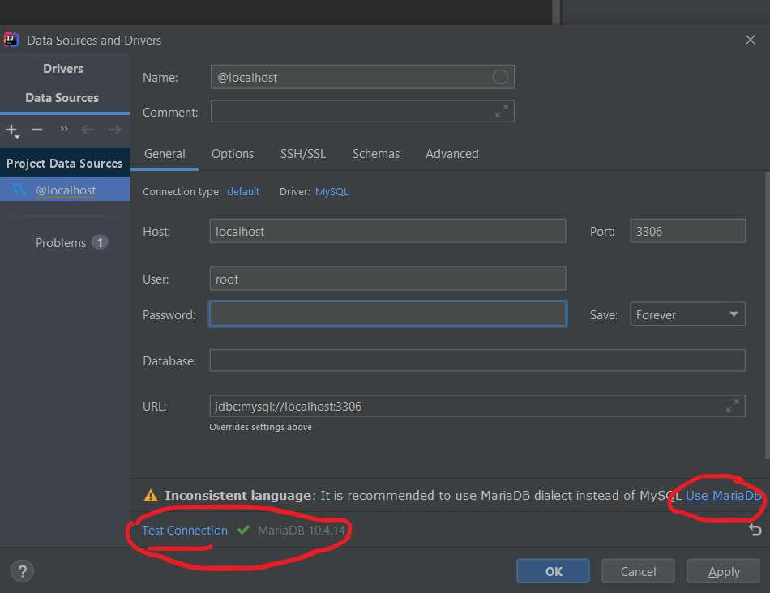
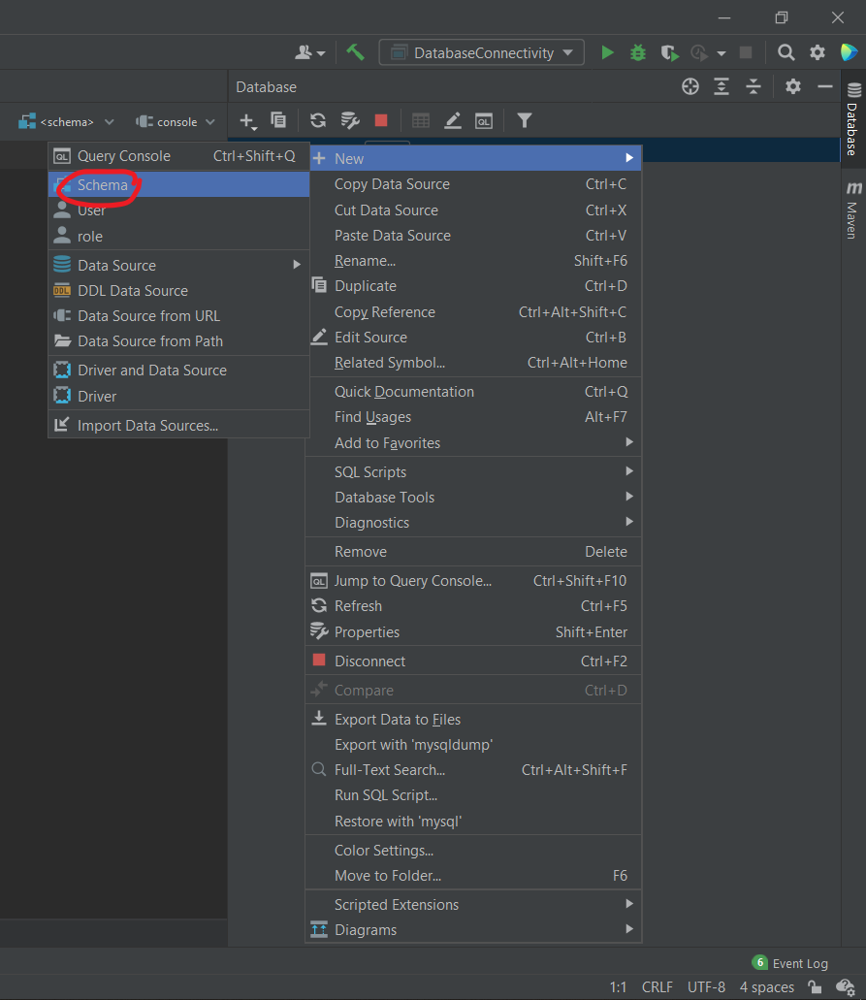
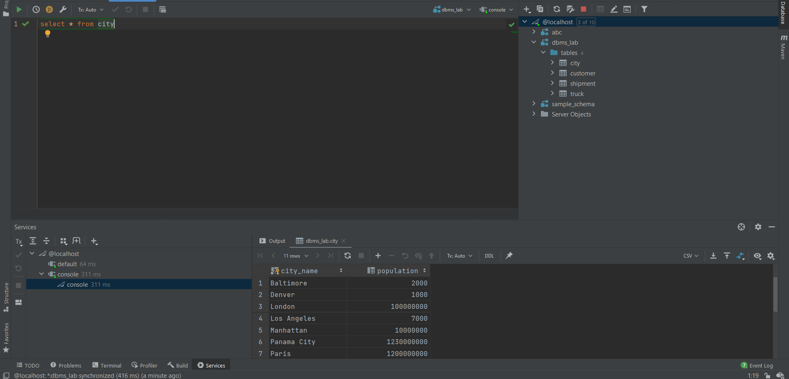
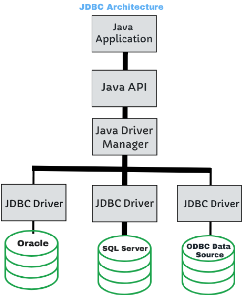
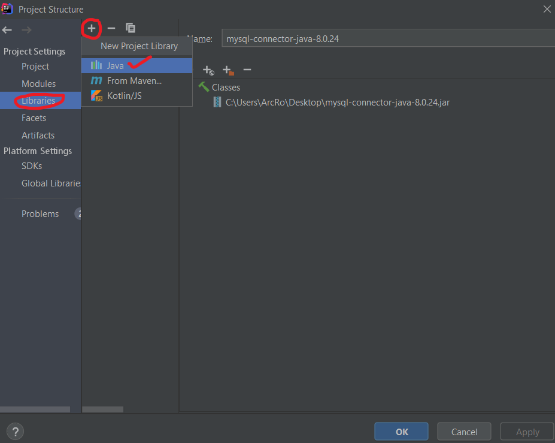

# Connecting Java project with MySQL database

<div align="center"></div>

## Prerequisites:
* Must have XAMPP installed on your machine and MySQL server running on localhost:3306.
* Knowledge of some basic SQL syntax
* Recommended to go through the notes and/or recording of [4th class of Web Development](https://cc-mnnit.github.io/2021-22-Classes/WebDev/2021_05_01_WebClass-4/) (https://cc-mnnit.github.io/2021-22-Classes/WebDev/2021_05_01_WebClass-4/)
* Java 8 (or any other version if not building JavaFX app) and IntelliJ must be installed, of course.

## Accessing your database from IntelliJ
As we know, IntelliJ is an <b>Integrated</b> Development Environment, so naturally, we would like to access our SQL schemas/databases from within IntelliJ itself, instead of phpMyAdmin. So let's look at how to setup IntelliJ to work with our database.

* ### Step 1:
Open IntelliJ. Select the Database option at the right side of the window. Then, click the '+' icon, then select MySQL.
<div align="center"></div>

* ### Step 2:
In the dialog box, first of all, if IntelliJ asks to download any drivers, download them. Then set User as 'root' and for Password, right-click and select 'Set Empty'. (This is the default setting in XAMPP, if changed by you, set accordingly)
<div align="center"></div>

* ### Step 3:
Click on 'Test Connection'. A success balloon should pop-up. Notice that it shows MariaDB instead of MySQL. This is because XAMPP uses that by default. This is not a cause of concern, as MariaDB is just a fork of MySQL and all syntax is identical. Select 'Use MariaDB'. Then press 'OK' to finalize.
<div align="center"></div>

* ### Step 4:
A console tab will open up. In there, select 'schema', then select your already created schema from the list (Here we have already made a 'test1' schema, with which we will be working). You can also create a new schema by right-clicking on '@localhost' and selecting New->Schema. Then enter a schema name, press OK.
<div align="center"></div>

Once you have selected your schema in your console tab, you can run various SQL commands there. A sample shot is provided:

<div align="center"></div>

Now try to further explore the various database features in IntelliJ.

## Adding JDBC to your IntelliJ project
<hr>
JDBC (Java Database Connectivity) is a driver provided by MySQL and other databases, in order to serve as a bridge between the database server and your Java client application.

<div align="center"></div>
<br>
<b>To add JDBC to your project, there are 2 possible scenarios:</b><br><br>

### For project without Maven or Gradle:
 At first you need to download its JAR file. Here's the [direct download link](https://dev.mysql.com/get/Downloads/Connector-J/mysql-connector-java-8.0.24.zip). Extract it and you will get a JAR file with name: <b>mysql-connector-java-8.0.24.jar</b>.
<br><br>
Now open up your IntelliJ project, select File->Project Structure. Select 'Libraries', then click on '+' then select Java. Finally in the new dialog, select the JAR file that you had extracted previously.
<div align="center"></div>

Select OK to add the library to your project. Now JDBC is successfully added to your project. 

### For project with Maven or Gradle:

It is very simple to add JDBC. Just add its dependency to pom.xml (for Maven) or build.gradle (for Gradle). Get them from [here](https://mvnrepository.com/artifact/mysql/mysql-connector-java/8.0.24). For convenience's sake, we're also pasting them here:
### Maven :
```xml
<!-- https://mvnrepository.com/artifact/mysql/mysql-connector-java -->
<dependency>
    <groupId>mysql</groupId>
    <artifactId>mysql-connector-java</artifactId>
    <version>8.0.24</version>
</dependency>
```
### Gradle :
```gradle
// https://mvnrepository.com/artifact/mysql/mysql-connector-java
implementation group: 'mysql', name: 'mysql-connector-java', version: '8.0.24'
```
<hr>

## Finally, some code

Following is a simple Java code which uses JDBC to connect to a MySQL database named 'test1' (implied in the URL), creates a table STUDENT, if not already present, containing columns 'name', 'regno', 'branch'. Then it inserts a row into the table, then finally, we print all the rows contained in the table. I've commented the code extensively for easy understanding.

```java
import java.sql.*;

/**
 * @author Aritra Chatterjee
 * JDBC sample program
 */

public class DatabaseConnectivity {

    public static void main(String[] args) throws SQLException {

        String url = "jdbc:mysql://localhost:3306/test1"; //URL of database to be connected
        Connection myConn = DriverManager.getConnection(url, "root", ""); //Connect to database (Requires JDBC) [Default username:root, pw empty]
        Statement statement= myConn.createStatement(); //Create a Statement object to run SQL statements on DB

        String query0="CREATE TABLE IF NOT EXISTS STUDENT ("+  // Initial query to create table if not already present in DB
                "name VARCHAR(30) NOT NULL," +
                "regno INT(8) PRIMARY KEY," +
                "branch VARCHAR(30) NOT NULL" +
                ")";

        statement.executeUpdate(query0); //executeUpdate(statement) is used to run DDL (e.g. CREATE) or DML (e.g INSERT) commands


            String query1 = "INSERT INTO STUDENT VALUES (?, ?, ?)";
            PreparedStatement preStat = myConn.prepareStatement(query1); //PreparedStatement is a subclass of Statement that supports data substitution and can execute a statement multiple times
            preStat.setString(1, "Aritra"); //Using the setter methods to substitute values corresponding to the ?s
            preStat.setInt(2, 20184196);
            preStat.setString(3, "CSE");
            preStat.executeUpdate(); //Executing the statement using executeUpdate()


        String query2 = "SELECT * FROM STUDENT;";

        ResultSet result = statement.executeQuery(query2); //executeQuery(statement) is used to run DQL command (i.e. SELECT) and returns a ResultSet object

        while(result.next()) { //Now iterating over the ResultSet object to print the results of the query. next() returns false after all rows exhausted, else returns true
            int regno = result.getInt("regno"); //Getters extract corresponding data from column names
            String name = result.getString("name");
            String branch = result.getString("branch");
            System.out.println("Name - " + name);
            System.out.println("Branch - " + branch);
            System.out.println("Registration number - " + regno);
        }
    }
}
```

<br>
<hr>

## Content contributor:
- [Aritra Chatterjee](https://github.com/Arc29)


