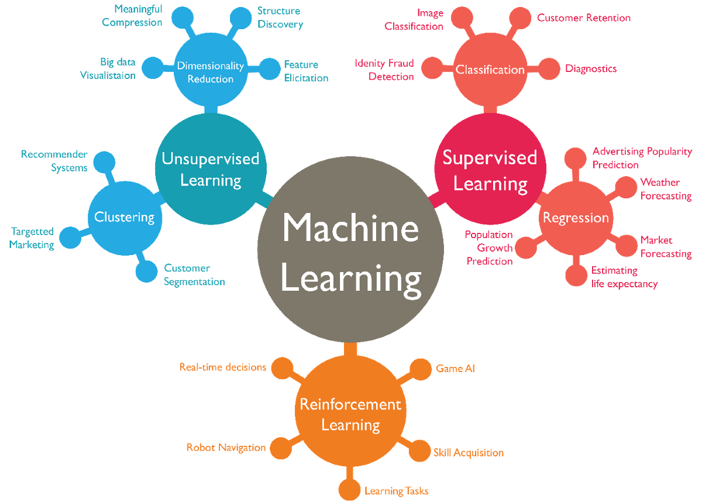

# Machine Learning Class resources

## Table of Contents

- [Classes Held](#classes-held)
- [Machine Learning Resources](#machine-learning-resources)
- [Data Visualization Guide](#data-visualization-guide)
- [Python Language Guide](#python-language-guide)

## Classes Held

- [Class 1: held on 29 April, 2021](./2021-04-29_ML-Class-1)
- [Class 2: held on 3 May, 2021](./2021-05-03_ML-Class-2)

## Machine Learning Resources

- [Machine Learing by Andrew NG](https://www.youtube.com/playlist?list=PLLssT5z_DsK-h9vYZkQkYNWcItqhlRJLN)
- [Fundamentals of ML by Sanjay Dasgupta](https://www.edx.org/course/machine-learning-fundamentals-2)

## Data Visualization Guide

- [Data visualization using Matplotlib and Seaborn](https://github.com/deepanshu-Raj/Data_Visualization)

## Python Language Guide

- [Python Installaton Guide](https://www.youtube.com/watch?v=4Rx_JRkwAjY)
- [Python Playlist for ML(videos 1-70)](https://www.youtube.com/playlist?list=PLsyeobzWxl7poL9JTVyndKe62ieoN-MZ3)
