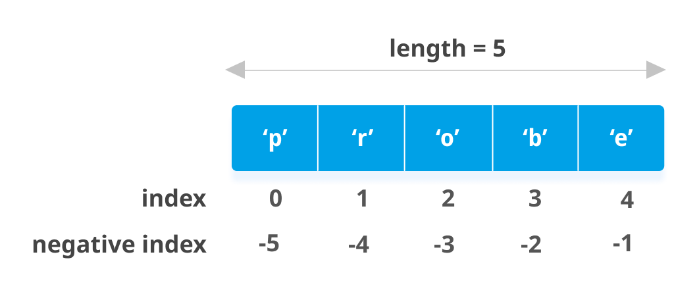
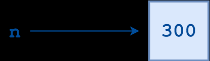
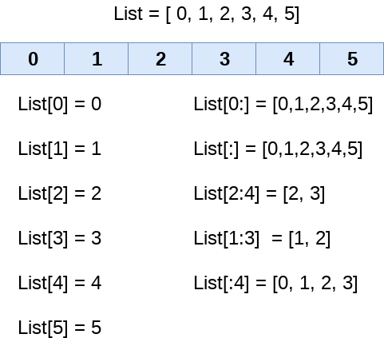

# Python Class - I

## Python Class - I recording: [Here](https://drive.google.com/file/d/1ntme_POLPZy0psYOXax7mrFYsX-1myjl/view?usp=sharing)

#### May 06, 2021

<div align="center"></div>

<hr>

### What is Python?
* Python is a **general-purpose**, **interpreted**, **object-oriented**, and **high-level** programming language.
* It was created by **Guido van Rossum** during **1985- 1990**. 
* Python's source code is also available under the GNU General Public License (GPL).

### Strings and Printing in Python


```python
print("Hello World!")
print("I like typing this.")
print("_-"*40)

string0 ='Welcome to first class of python'
string1 ="Welcome to first class of python"
string2 = """Welcome to first
class
of
python"""

print(string0)
print("_-"*40)
print(string1)
print("_-"*40)
print(string2)
```

    Hello World!
    I like typing this.
    _-_-_-_-_-_-_-_-_-_-_-_-_-_-_-_-_-_-_-_-_-_-_-_-_-_-_-_-_-_-_-_-_-_-_-_-_-_-_-_-
    Welcome to first class of python
    _-_-_-_-_-_-_-_-_-_-_-_-_-_-_-_-_-_-_-_-_-_-_-_-_-_-_-_-_-_-_-_-_-_-_-_-_-_-_-_-
    Welcome to first class of python
    _-_-_-_-_-_-_-_-_-_-_-_-_-_-_-_-_-_-_-_-_-_-_-_-_-_-_-_-_-_-_-_-_-_-_-_-_-_-_-_-
    Welcome to first
    class
    of
    python

### Indexing and slicing

In python, indexing starts from 0.

<div align="center"></div>

```python
name ="asdfghj"
print(name[0])        # Char at index 0
print(name[-1])
print(name[0:4])      # Substring from index 0 to 3
print(name[2:])       # Substring from index 2 to end of string
print(name[:3])       # Substring from start to index 2 
print(name[:])        # Substring from start to end
print(name[2:5:2])    # Characters from index 2 to 4 in steps of 2
print(name[::-1])     # Complete string taking a step of -1
```

    a
    j
    asdf
    dfghj
    asd
    asdfghj
    dg
    jhgfdsa


### Built-in functions

**len()** function is an inbuilt function in Python programming language that returns the length of the string. 

**find( )** function returns the index value of the given data that is to found in the string. If it is not found it returns -1. One can also input find( ) function between which index values it has to search.

**index( )** works the same way as find( ) function the only difference is find returns '-1' when the input element is not found in the string but index( ) function throws a ValueError


```python
print(len(name))

print(name.find("df"))      # First index where "dy" is found
print(name.find("ty"))      # Returns -1 if not found
print(name.find("df",2,5))  # finds string from index 2 to 4
print(name.find("df",4,6))

print(name.index('df'))
print(name.index('ty'))     # error
```

    7
    2
    -1
    2
    -1
    2


    ---------------------------------------------------------------------------

    ValueError                                Traceback (most recent call last)

    <ipython-input-21-e6c75499e80c> in <module>
          7 
          8 print(name.index('df'))
    ----> 9 print(name.index('ty'))     #error
    

    ValueError: substring not found


**capitalize( )** is used to capitalize the first element in the string.

**lower( )** converts any capital letter to small letter.

**upper( )** converts any small letter to capital letter.

**endswith( )** function is used to check if the given string ends with the particular character(s) which is given as input.

**count( )** function counts the number of char in the given string. The start and the stop index can also be specified or left blank.


```python
print(name.capitalize())
print(name.lower())
print(name.upper())
print(name)

print(name.endswith('j'))
print(name.endswith('a'))

print(name.count('a',0,7)) # Start and end index mentioned
print(name.count('a'))
print(name.count('b'))
```

    Asdfghj
    asdfghj
    ASDFGHJ
    asdfghj
    True
    False
    1
    1
    0


### end and sep parameters in print()
**end** - 
* The **end** parameter is used to append any string at the end of the output of the print statement in python.
* By default, the print method ends with a **newline** (**'\n'**). 
    
**sep** - 
* It is used to add a **separator** between strings to be printed.
* The default value for sep is **whitespace**.


```python
print("Hello Again!", end="")
print("I like typing this.")

print("\n", "_-"*40, '\n')

# Printing multiple strings using single print statement
print("CC", "classes")
print("CC", "classes", sep = ' & ')

print("\n", "_-"*40, '\n')

print("End","and","sep","together","in", sep = " _ ", end=" _print")
```

    Hello Again!I like typing this.
    
     _-_-_-_-_-_-_-_-_-_-_-_-_-_-_-_-_-_-_-_-_-_-_-_-_-_-_-_-_-_-_-_-_-_-_-_-_-_-_-_- 
    
    CC classes
    CC & classes
    
     _-_-_-_-_-_-_-_-_-_-_-_-_-_-_-_-_-_-_-_-_-_-_-_-_-_-_-_-_-_-_-_-_-_-_-_-_-_-_-_- 
    
    End _ and _ sep _ together _ in _print

### Variables and Datatypes
* Python is **Dynamically Typed Language** i.e. the type of variable is checked during **run-time**.
* Variables in Python **refer** to a value.
* Some of the datatypes in python are - 
    * str
    * int
    * float
    * bool

<div align="center"></div>

```python
# Integer - int
a = 10
print(a, type(a))

# String - str
b = "Computer Coding Club"
print(b, type(b))

# Float - float
num = 3.244
print(num, type(num))

# Boolean - bool
flag = False
print(flag, type(flag))
```

    10 <class 'int'>
    Computer Coding Club <class 'str'>
    3.244 <class 'float'>
    False <class 'bool'>


### Python Arithmetic Operators
* Addition Operator (**+**)
* Substraction Operator (**-**)
* Multiplication Operator (__*__)
* Division Operator (**/**)
* Modulus Operator (**%**)
* Exponentiation Operator (__**__)
* Floor Division (**//**)


```python
print("Addition: ", 2 + 3, ",", 3.4 + 5.677)

print("Substraction: ", 2 - 3, ",", 10 - 2.43)

print("Multiplication", 3 * 4, ",", 4.3 * 5.1)

print("Division: ", 12 / 5, ",", 10 / 2)

print("Modulus: ", 20 % 10, ",", 23 % 6)

print("Exponentiation: ", 5**3, ",", 2**4)

print("Floor Division: ", 12 // 5, ",", 10 // 2)
```

    Addition:  5 , 9.077
    Substraction:  -1 , 7.57
    Multiplication 12 , 21.929999999999996
    Division:  2.4 , 5.0
    Modulus:  0 , 5
    Exponentiation:  125 , 16
    Floor Division:  2 , 5


### Comments in Python
* **#** is used for single line comment.
* **""" ... """** is used for multi-line comment.


```python
# Comments in python
# Comment  -> 
# This is a comment

"""
multiple comment
print("Python" + "Class")
"""
```

### Data Structures in Python
We will talk about 4 basic data structures.

### 1. **List** - 
* A list in Python is a **heterogeneous container** for items.
* It is **mutable** - it is possible to reassign and delete individual items as well.
* **[** and **]** are used to define list.
* We can use built-in methods like - **pop()**, **append()**, **remove()**, **reverse()**, etc.
* Visit [this](https://www.w3schools.com/python/python_ref_list.asp) link to explore all the built-in methods.


```python
# List of strings
prog_langs = ["C++", "C", "Python", "JS"]
hetero_list = ["Foo", 23, True, 3.46, "Is this possible?"]

# Printing List
print(prog_langs)
print(hetero_list)

# Accessing single item from list (indexing)

# Positive Indexing
lang1 = prog_langs[0] 
lang2 = prog_langs[2]
print("Lang1: ", lang1)
print("Lang2: ", lang2)

# Negative Indexing
lang3 = prog_langs[-1]
lang4 = prog_langs[-2]
print("Lang3: ", lang3)
print("Lang4: ", lang4)

# Lists are mutable
prog_langs[0] = "Java"
print(prog_langs)

# Adding an element to existing list
prog_langs.append("C#")
print("After appending: ", prog_langs)

# Length of list
print("Length: ", len(prog_langs))

# Deleting an element from list
del prog_langs[1] # Deleting 'C'
print("After deleting: ", prog_langs)
```

    ['C++', 'C', 'Python', 'JS']
    ['Foo', 23, True, 3.46, 'Is this possible?']
    Lang1:  C++
    Lang2:  Python
    Lang3:  JS
    Lang4:  Python
    ['Java', 'C', 'Python', 'JS']
    After appending:  ['Java', 'C', 'Python', 'JS', 'C#']
    Length:  5
    After deleting:  ['Java', 'Python', 'JS', 'C#']

<div align="center"></div>

<br/>

### 2. **Tuple** - 
* A tuple in Python is a **heterogeneous container** for items.
* It is **immutable** - it NOT is possible to reassign and delete individual items as well.
* **(** and **)** are used to define tuple.


```python
# Tuple of Strings
colors = ("Red", "Blue", "Green")
print(colors)
# Heterogenous tuple
hetero_tuple = ("Possible?", 2.3, 4, True, [1, "Again"], (2, 5.67, "CC Classes"))
print(hetero_tuple)

print("Positive Indexing: ", hetero_tuple[2])
print("Negative Indexing: ", hetero_tuple[-1])
```

    ('Red', 'Blue', 'Green')
    ('Possible?', 2.3, 4, True, [1, 'Again'], (2, 5.67, 'CC Classes'))
    Positive Indexing:  4
    Negative Indexing:  (2, 5.67, 'CC Classes')


```python
# Tuple is Immuatable - trying to reassign
colors[0] = "Purple" # This will give error
```


    ---------------------------------------------------------------------------

    TypeError                                 Traceback (most recent call last)

    <ipython-input-23-036b598c976c> in <module>
          1 # Tuple is Immuatable
    ----> 2 colors[0] = "Purple" # This will give error
    

    TypeError: 'tuple' object does not support item assignment


```python
# Tuple is Immutable - trying to delete
del colors[2] # Again error
```


    ---------------------------------------------------------------------------

    TypeError                                 Traceback (most recent call last)

    <ipython-input-24-2fe37e6741af> in <module>
          1 # Tuple is Immutable - trying to delete
    ----> 2 del colors[2] # Again error
    

    TypeError: 'tuple' object doesn't support item deletion

### 3. **Set** - 
* A set, in Python, is just like the mathematical set.
* It does not hold duplicate values and is unordered.
* It is **mutable**.
* **{** and **}** are used to define set.
* We cannot use indexing to access or delete any element of set as it is unordered.
* We can use built-in methods like - **add()**, **pop()**, **remove()**, **discard()**, etc.
* Visit [this](https://www.w3schools.com/python/python_ref_set.asp) link to explore all built-in methods.


```python
myset = {3,2,1}
fruits = {"apple", "banana", "cherry"}
print(myset)
print(fruits)

myset.add(4)
myset.add(8)
myset.add(4)
print("After adding: ", myset)

myset.pop()
print("After popping: ", myset)

myset.remove(3)
print("After removing 3: ", myset)

myset.discard(2)
print("After discarding 2: ", myset)
```

    {1, 2, 3}
    {'apple', 'banana', 'cherry'}
    After adding:  {1, 2, 3, 4, 8}
    After popping:  {2, 3, 4, 8}
    After removing 3:  {2, 4, 8}
    After discarding 2:  {4, 8}


#### Difference in remove() and discard()
**remove()** raises an error if element to be removed is not present in the set whereas **discard()** does not raise error even if element to be discarded is not present.

### 4. **dictionary** - 
* A Python dictionary holds **key-value pairs**.
* It is similar to real world dictionary which holds **word-meaning pairs**.
* **{** and **}** are used to define dictionary.
* Dictionaries are mutable.
* Dictionaries cannot have two items with the same key
* We can use built-in methods like - **get()**, **pop()**, **keys()**, **update()**, etc.
* Visit [this](https://www.w3schools.com/python/python_ref_dictionary.asp) link to explore all built-in methods.


```python
thisdict = {
  "brand": "Ford",
  "model": "Mustang",
  "year": 1964
}
print(thisdict)

# Accessing value using key
print("Brand: ", thisdict["brand"])
print("Model: ", thisdict.get("model"))

# Adding a key value pair to dictionary
thisdict["electric"] = False
thisdict.update({"color": "green"})
print("After updating: ", thisdict)

# Printing all keys of dictionary
print("Keys: ", thisdict.keys())

# Deleting a key-value pair
thisdict.pop("color")
print("After popping: ", thisdict)
```

    {'brand': 'Ford', 'model': 'Mustang', 'year': 1964}
    Brand:  Ford
    Model:  Mustang
    After updating:  {'brand': 'Ford', 'model': 'Mustang', 'year': 1964, 'electric': False, 'color': 'green'}
    Keys:  dict_keys(['brand', 'model', 'year', 'electric', 'color'])
    After popping:  {'brand': 'Ford', 'model': 'Mustang', 'year': 1964, 'electric': False}


### Control Statements - if, elif, else
To write the statements inside if or elif or else, we first have to give **indentation**. Press **tab** for that.


```python
# If-Else conditions Syntax

# if condition :
#      statements
# elif condition:
#      statements
# else:
#      statements

age = 13
if age < 18:
    print("You cannot vote!")

# Use of "is" operator
#name = "Foo"
name = "Bar"
if name is "Foo":
    print("Hey there Foo")
elif name == "Bar":
    print("What's up Bar!")
else:
    print("Please sign up for the site!")
    
# Use of "in" operator
students = ["Alice", "Bob", "Foo", "Bar"]
stu_name = "Bob"
if stu_name in students:
    print("Hello", stu_name, "You are enrolled")
else:
    print("You are not enrolled!")
    
# Use of "and" operator
user_name = "abc"
password = "123"
if user_name is "abc" and password = "123":
    print("Access granted")
else:
    print("Access denied")

# Use of "or" operator
age = 30
if age <10 or age >25:
    print ("Not golden years")
else:
    print("Golden years")
```

    You cannot vote!
    What's up Bar!
    Hello Bob You are enrolled
    Access granted
    Not golden years

### Loops in Python - for, while


```python
# For loop
# from 0 to 9
for x in range(10):
    print(x, end=",")

print("")

# from 5 to 11
for x in range(5, 12):
    print(x, end=",")

print("")

# from 10 to 40 (not included), increment value 5
for x in range(10, 40, 5):
    print(x, end=",")

print("")

# While loop
i = 5
while i < 10:
    print(i, end=",")
    i += 1

print("")

# Adding elements to an empty list
mylist = []
for x in range(10, 20, 3):
    mylist.append(x)

print("My List: ", mylist)
```

    0,1,2,3,4,5,6,7,8,9,
    5,6,7,8,9,10,11,
    10,15,20,25,30,35,
    5,6,7,8,9,
    My List:  [10, 13, 16, 19]


```python
# Iterating over list in Python
colors = ["Red", "Green", "Blue", "White", "Black"]
for color in colors:
    print(color)

print("")
# Iterating over a dictionary
thisdict = {
  "brand": "Ford",
  "model": "Mustang",
  "year": 1964
}

for key in thisdict.keys():
    print("Key:", key, "| Value:", thisdict[key])

print("")

for key, value in thisdict.items():
    print("Key:", key, "| Value:", value)
```

    Red
    Green
    Blue
    White
    Black
    
    Key: brand | Value: Ford
    Key: model | Value: Mustang
    Key: year | Value: 1964
    
    Key: brand | Value: Ford
    Key: model | Value: Mustang
    Key: year | Value: 1964


### Functions

**Basic Syntax**

def function_name(parameters):<br>
 >     """docstring"""        (optional) 
      statement(s)
      return statement (optional)

 **Syntax of return statement**

    return [expression_list]


```python
# Funciton without parameters

# Defining function
def func():
    print('Hello')

# Calling function    
func()
```

    Hello


```python
# Function with parameters
def purchase(egg_count):
  print(egg_count)

purchase(10)
```

    10


```python
# Funcgtion with default parameters
def purchase(egg_count=10):
  print(egg_count)

purchase()
purchase(20)

def greet(name, msg = "Good morning!"):
    print(name,msg)
    
greet("Alice")
greet("Foo Bar")
greet("Bob", "Good Afternoon!")
```

    10
    20
    Alice Good morning!
    Foo Bar Good morning!
    Bob Good Afternoon!


```python
# SyntaxError: non-default argument follows default argument
def greet(msg = "Good morning!", name):
    print(name,msg)
    
greet("Alice")
```


      File "<ipython-input-27-0dc9fc45140b>", line 2
        def greet(msg = "Good morning!", name):
                 ^
    SyntaxError: non-default argument follows default argument


```python
# Function with return statement
def purchase(egg_count=10):
  return 10 * egg_count

answer = purchase()
print(answer)

answer = purchase(15)
print(answer)
```

**Note**: Rest of the content have been moved to next class [here](../2021_05_08_PythonClass-2).

### Content Contributors

* [Kshitiz Srivastava](https://github.com/pirateksh/)
* [Sidhant Agarwal](https://github.com/sidhantagar/)

### Materials

* [W3Schools Python Tutorial](https://www.w3schools.com/python/)
* [Learn Python in 1 Video](https://www.youtube.com/watch?v=qHJjMvHLJdg) (Hindi)
* [Python Tutorials for Beginners Video Playlist](https://www.youtube.com/watch?v=YYXdXT2l-Gg&list=PL-osiE80TeTskrapNbzXhwoFUiLCjGgY7) (English) _[For basics, watch Video 1 - 8]_
* For those of you who prefer reading books - [Python for Absolute beginners](https://drive.google.com/file/d/1_zCsrSLewaIHb0hQOnenexVLukbGw1xn/view?usp=sharing)
