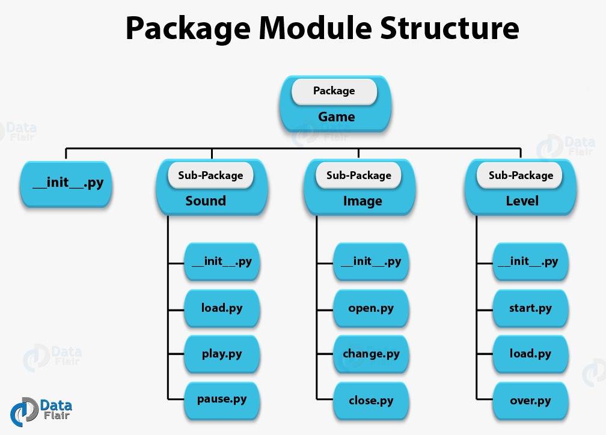

# Python Class - II

## Python Class - II recording: [Here](https://drive.google.com/file/d/11oAuU7pmKDEl1zwIYZ2apZEUe4tfxy8B/view?usp=sharing)

#### May 08, 2021

<div align="center"></div>

<hr>

### Taking input from terminal
* In python, user input can be taken using **input()** function.
* As a parameter of input(), we can pass a string which we want to be displayed during this process.
* **Example** -

```python
a = input("Enter you name:")
print("Hello",a)

a = input("Enter a number.")
print(a, type(a))

a = int(input("Enter a number"))
b = int(input("Enter another number"))
print("Sum of both the numbers is: ", a+b)
```

### Functions (continued)

```python
#keyword argument
def func(n, m):
    print("n = " + str(n))
    print("m = " + str(m))

func(5, 10)
print('\n')

# We can mess with the default order of arguments while calling the funciton if we use keyword arguments
func(m=5, n=10) 
```

    n = 5
    m = 10
    
    
    n = 10
    m = 5


### Recursion (factorial)


```python
def factorial(num):
    if num == 1:      #base case
        return 1
    return num * factorial(num - 1)

print(factorial(5))
```

    120


### args and kwargs
* **args** - It is used to pass variable number of arguments to a function.
* **kwargs** - It is used to pass variable number of keyword arguments to a function.


```python
# variable no. of arguments (*args)
def func(*args):
    # args is tuple with the argument
    for i in args:
        print(i)
func('hello', 'to', 'python', 'class', 'for', 'first', 'years')

print()

def my_print(*not_necessarily_args):
    for i in not_necessarily_args:
        print(i)
        
my_print('hello', 'my', 'name', 'is', 'bin'+'bash')
```

    hello
    to
    python
    class
    for
    first
    years
    
    hello
    my
    name
    is
    binbash

```python
# variable no. of keyword arguments (**kwargs)
def func(**kwargs):
    for key, values in kwargs.items():
        print(key, values)

func(hello='to', python='class', year='first')

print("-"*40)

def kw_args_func(**not_necessarily_kwargs):
    for key, value in not_necessarily_kwargs.items():
        print('key:', key, ' ', 'value:', value)
        
kw_args_func(sep='/', end='*', name='bin')
```

    hello to
    python class
    year first
    ----------------------------------------
    key: sep   value: /
    key: end   value: *
    key: name   value: bin

```python
# This will give a error
def ff(*args, **kwargs, name):
    for arg in args:
        print(args)
    for key,value in kwargs.items():
        print(key, ": ", value)
    print("Name: ", name)
    
ff(10, "Hello", ran=20, "Foo Bar")
```

      File "<ipython-input-39-938320840b18>", line 2
        def ff(*args, **kwargs, name):
                                   ^
    SyntaxError: invalid syntax


### Lambda Function

* Syntax of Lambda Function in python

> ```lambda arguments: expression```

* Lambda functions can have any number of arguments but only one expression. 
* The expression is evaluated and returned. 
* Lambda functions can be used wherever function objects are required.
* We use lambda functions when we require a **nameless function** for a short period of time.
* In Python, we generally use it as an argument to a higher-order function (a function that takes in other functions as arguments). 
* Lambda functions are used along with built-in functions like **filter(), map()** etc.


```python
# Program to show the use of lambda functions

double = lambda x: x * 2

# Output: 10
print(double(5))
```

    10

```python
# Program to filter out only the even items from a list using filter()

my_list = [1, 5, 4, 6, 8, 11, 3, 12]

new_list = list(filter(lambda x: (x%2 == 0) , my_list))

# Output: [4, 6, 8, 12]
print(new_list)
```

    [4, 6, 8, 12]

```python
# Program to double each item in a list using map()

my_list = [1, 5, 4, 6, 8, 11, 3, 12]

new_list = list(map(lambda x: x * 2 , my_list))

# Output: [2, 10, 8, 12, 16, 22, 6, 24]
print(new_list)
```

    [2, 10, 8, 12, 16, 22, 6, 24]

<br/>
<div align="center"><h3>Modules and Packages in Python</h3></div>
<hr/>

<div align="center"></div>

* A python module is a python file. It contains functions that are put together to be used again and again.
* A package is like a directory/folder that holds sub-packages and modules. 
* A package is a **special** directory in which Python identifies as package. 
* A package lets us hold similar modules in one place.
* A directory must hold the file **__init__.py** for python to treat it like a regular package.
* A **library** is a collection of **packages.**

### import and from keywords 

* We use, **import *module_name***, to import a module
* You can’t import a function present inside a module using the dot operator(.) 
* For that, you must use **from**: `from Game.Sound.load import volume_up`.

```python
# Program to generate a random number between 0 and 9
# importing the random module
import random

print(random.randint(0,9))
```

<br/>
<div align="center"><h3>Classes and Instances</h3></div>
<hr/>

* Classes are used to create user-defined data structures.
* Class is a **blueprint** that is exhibited by all of objects belonging to it.
* Classes define variables called **attributes/properties/data-members**, which holds information about the object created from the class.
* Classes define functions called **methods/member-methods**, which decide the behaviors and actions that an object created from the class can perform with its data.
* While the class is the blueprint, an **instance** is an object that is built from a class and contains data specific to this newly created object.
* **class** keyword is used to define a class. 
* **Minimal Example** - 

```python
	### Minimal Example Class
	class Car:
		pass

	c1 = Car()

	c1.name = "Model 3"
	c1.company = "Tesla"

	print(c1)
	print(c1.name)
	print(c1.company)
```

* **Example 2** - 

```python
	class Car:
  		def __init__(self, car_model, car_company, car_color):
			# Initialising Propertis Specific to the object.
			self.model = car_model
			self.company = car_company
			self.color = car_color
		
		def get_color(self):
			# Instance Method
			return self.color

		def set_color(self, new_color):
			# Instance Method
			self.color = new_color

	# Instantiating an Object or Creating an Object
	my_car = Car("Model S", "Tesla", "Maroon") # my_car is an instance/object of Car Class.

```

## Instance Variables and Class Variables

* These are the two Types of variables used to define a class.
* **Instance variables:** properties/attributes unique to a particular objects of the class.
* **Class variables:-** variables shared among for all the objects made by the class i.e. it is applied for all objects. Good for optimizing memory.
* `__fun__()`: **"dunder"** syntax in python means some special variable/method in python. **Example** -  `__init__()`, `__str__()` method, `__file__`, `__dict__` property etc.
* `__init__()`: constructor method of a class. A method to specify properties/attributes of an object along with declarationn of the object. In other words `__init__()` method sets the initial state of the object by assigning the values of the object’s properties.
* **self** is reference to the current instances of the class. 
* **self** is NOT a keyword, but it is used by convention.

```python
class Car:
	wheels = 4 # Class Variable/attribute
	def _init_(self, company): # Constructor method
		self.company = company

	def get_company(self): # Instance Method
		return self.company
 
	def get_wheels(self): # Instance methods
		return Car.wheels

my_car = Car("Tesla")
my_car = Car("Tesla")
print(my_car._dict_) # Print the Properties associated with an object as a dictionary

print(my_car.get_company()) # Actually Treated as:- print(Car.get_company(my_car))
print(my_car.get_wheels())
```
## Three Types of methods defined inside a Class.

### 1. Instance Methods/Regular Methods:

* Methods which can only be called from an instance of a class.
* They must have `instance` reference as their first positional argument. Which is automatically passed when we call an instance method. **Example** - `obj_name.instance_method()` is treated as `ClassName.instance_method(obj_name)`.
* Generally this position argument is taken as `self` argument. So, we can access the instance variable using `self.var_name` inside a method.

### 2. Class Methods:

* Just like Class Variable, we have classmethods in python which are common to all objects of a class.
* `@classmethod` decorator over a function definition is used to define a class method.
* We can call a classmethod as:- ClassName.class_mehthod_name()
* Like Instance methods, these methods also must have `class` as their first positional argument. Which is automatically passed when we call a class-method. e.g. ClassName.class_method_name()
* Generally this position argument is taken as `cls` argument. So, we can access the Class variable using cls.var_name inside a method.

```python
### Car Class Example
class Car:
	wheels = 4 # Class Variable/attribute
	def _init_(self, company): # Constructor method
		self.company = company

	def get_company(self): # Instance Method
		return self.company
 
	def get_wheels(self): # Instance methods
		return Car.wheels

	@classmethod
	def about(cls): # Class Method
		return "This is the Blue-Print of a Car having " + str(cls.wheels) + " wheels."
print(Car.about()) 
# You can call a class-method using an instance but as an instance never stores a classmethod. So, Car.about() is called.
print(my_car.about()) 
```

### 3. Static Methods:
* Do not operate on instance/object or class i.e. none of the both is passed.
* These Methods don't accepts any mandatory positional arguments unlike instance and classmethods.  
* They are generally used to create utility functions for a class.
* Static method knows nothing about the class variable and just deals with the parameters passed to the method itself.
* They can be called using both ClassName and InstanceName. **Example** - `ClassName.static_method_fun()`, `InstanceName.static_method_fun()`.
* Static Methods are not overridden in Subclasses.

```python
# Static Methods
class Car:
	wheels = 4 # Class Variable/attribute
	def _init_(self, company):
		print(self)
		self.company = company

	def get_company(self): # Instance Method
		return self.company
 
	def get_wheels(self): # Instance methods
		return Car.wheels

	@classmethod
	def about(cls):
		return "This is the Blue-Print of a Car having " + str(cls.wheels) + " wheels."

	@staticmethod
	def calculate_fuel_amount(cost_per_litre, amount_paid):
		# A uitility Function.
		return amount_paid/cost_per_litre


my_car = Car("Tesla")
fuel_amount = Car.calculate_fuel_amount(90, 900)
# fuel_amount = my_car.calculate_fuel_amount(90, 900)
print(fuel_amount, "Litres")
```

<div align="center"><h3>File Handling</h3></div>

In this, we will talk about files that store data.

There are two types of data files:

- **Text File**: It stores data in the form of ASCII characters.
  (each line is terminated with a special delimiter **"\n"**, computer first translates then reads).
- **Binary File**: It stores data in same format as it is stored in memory.
  (there's no delimiter and no translations for program to read).

### File Object/Handle

- File object allows us to **read** and **write** in the file.
- It takes the reference of the file and open it in diffrent modes we want.
- File object is the **connector** between us and the file.
- When an object is created, we work as if the object is the file.

### File Object Attributes

| Attribute   | Description                                      |
| ----------- | ------------------------------------------------ |
| file.closed | Returns true if file is closed, false otherwise. |
| file.mode   | Returns access mode with which file was opened.  |
| file.name   | Returns name of the file.                        |

### Opening Files

To open a file in our program we have a function named open().
* **Syntax** - 

```python
  <file_objectname> = open(<filename>)
  <file_objectname> = open(<filename>, <mode>)
```
* **Example** - 

```python
    a = open("myFile.txt", "r") # File Opened in read mode
    b = open("list.txt", "w") # File opened in the write mode
```
* **Note**: default mode is read mode


### File Access Modes
| Text Files | Binary Files | Function | Description |
| ----------- | ----------- | ----------- | ----------- |
| 'r' | 'rb' | read | File must exist, else error |
| 'w' | 'wb' | write | If file exist overwrite, else create new file|
| 'r+' | 'r+b' or 'rb+' | read and write | File must exist, else error. Both read and write works |
| 'w+' | 'w+b' or 'wb+' | write and read | If file exist overwrite, else not create new file. Both read and write works |
| 'a' | 'ab' | append | Same as 'write', data is not overwritten. It's appended. |
| 'a+' | 'a+b' or 'ab+' | append and read | Same as 'write' data is not overwritten. It's appended. Both read and write works |

### Reading a file

- The read() function:
  returns n bytes from the file. If n not given, returns all the bytes from the file

```python
f = open("list.txt") # file is opened
result = f.read()
print(result) # will print the whole file.
result = f.read(10)
print(result) # will print only the first 10 bytes i.e 10 characters of the file.
```
* **Note**: 1 character has size of 1 bytes.


- The readline() function:
  returns n bytes from the file.
  if n not given, returns all the bytes from one line.

```python
  f = open("list.txt") # file is opened
  result = f.readline()
  print(result) # will print the first line
  result = f.realine(3)
  print(result) # will print first 3 characters of second line.
  result = f.readline()
  print(result) # will print the remaining part of second line.
```
* **Note**: readline() automatically add "\n" on the end of every string that it returns


- The readlines() function:
  return all the lines in a from of list

```python
  f = open("list.txt")
  result = f.readlines()
  print(result) # will print list of lines
```

There's an alternate way to read line by line

```python
  f = open("list.txt)
  for i in f:
    print(i) # i iterates till "\n", which was the delimiter.
  
  # It's same as:
  s = f.readline()
  while s:
    print(s)
    s = f.readline()
```

- using **_with_** keyword

```python
with open("file.txt", 'w') as f:
  f.write("Hello World!!)
```

### What's special about the with keyword?

When you open a file python creates an file object i.e some memory has been allocated to the file object if we forgot to clean this memory it can cause memory leak (we clean this memory by calling close() method i.e f.close()). But in case of with keyword when the code comes out the block scope of the with keyword it will automatically close the file object i.e clean the memory which was allocated to the file

### Writing in a file

1. The write(<str>) function:

writes string <str> in the file associated with file object.

```python
  f = open("list.txt", 'w')
  f.write("Hello World!")
```
* **Note**: Notice the access mode is write, all old data in the file will be deleted.


2. The writelines(<L>) function:

writes all string from the list <L> in the file associated with file object.

```python
  f = open("list.txt", 'w')
  todo = ["Coding", "Binge Watching", "Football"]
  f.writelines(todo)
```

### File Pointers
A file pointer tells the current position in the file where reading or writing will take place.

<div align="center"><h3>Exception Handling</h3></div>

### What is Exception?

* An exception is an event, which occurs during the execution of a program that **disrupts the normal flow of the program's instructions**. 
* In general, when a Python script encounters a situation that it cannot cope with, it raises an exception. 
* An exception is a **Python object** that represents an error.
* When a Python script raises an exception, it must either handle the exception immediately otherwise it terminates and quits.

### Exception Handling

* If you have some suspicious code that may raise an exception, you can defend your program by placing the suspicious code in a `try:` block. 
* After the try: block, include an `except:` statement, followed by a block of code which handles the problem as elegantly as possible.
* **Syntax** - Here is simple syntax of **try....except...else** blocks −

```python
try:
   # Runs first
   < code >
except:
  # If there is exception, then execute this block.
   < code >
else:
  # If there is no exception then execute this block.
  <code>
finally:
  # This code always executes
  < code >
```

* **Example** - Division by zero

```python
def divide(a,b):
	try:
		ans = a / b
	except ZeroDivisionError:
		print("Trying to divide by zero")
		ans = float("Inf")
	finally:
		print("Division successful")
	return ans
```

### Content Contributors

* [Aman Tibrewal](https://github.com/amantibrewal310)
* [Ankit Sangwan](https://github.com/ankitsangwan1999/)
* [Kshitiz Srivastava](https://github.com/pirateksh/)

### Materials

* [W3Schools Python Tutorial](https://www.w3schools.com/python/)
* [Python OOPs Video Tutorial](https://www.youtube.com/watch?v=ZDa-Z5JzLYM&list=PL-osiE80TeTsqhIuOqKhwlXsIBIdSeYtc) (English)
* [File Handling](https://www.tutorialspoint.com/python/python_files_io.htm)
* [Exception Handling](https://www.tutorialspoint.com/python/python_exceptions.htm)
* For those of you who prefer reading books - [Python for Absolute beginners](https://drive.google.com/file/d/1_zCsrSLewaIHb0hQOnenexVLukbGw1xn/view?usp=sharing)
