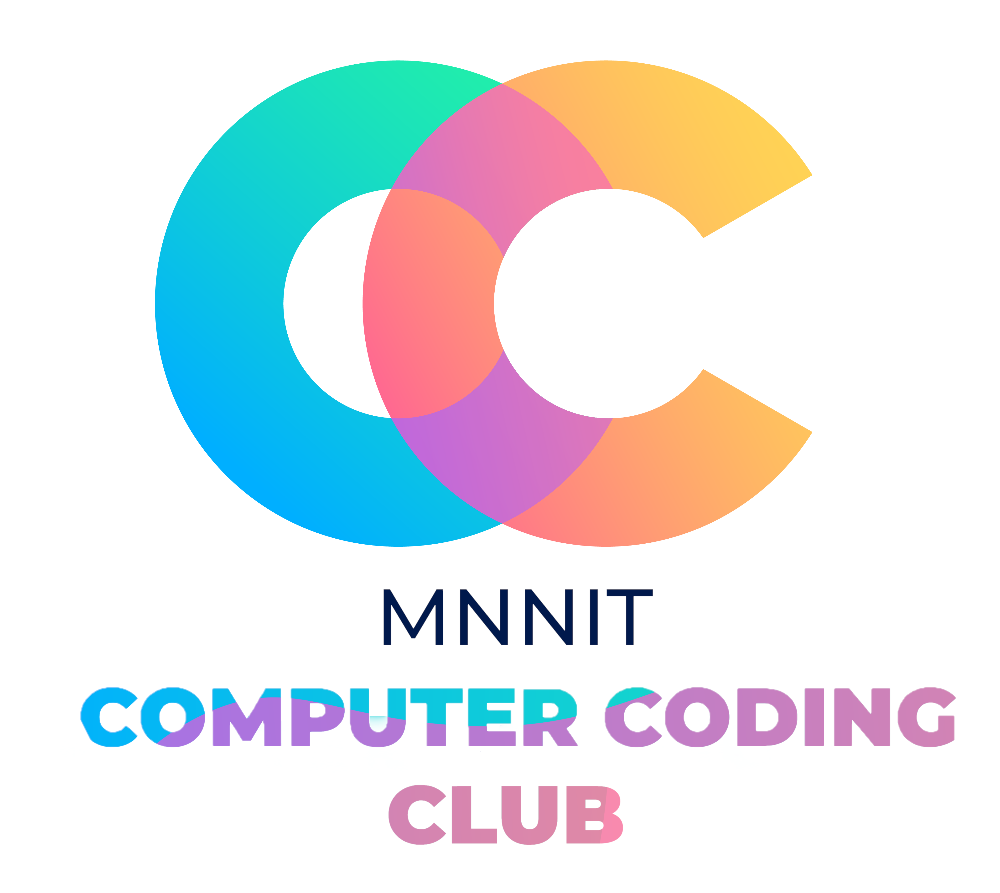

<head>
    <meta property='og:image' content='{{site.url}}/{{page.image}}'/>
    <meta property='og:type' content='website' />
</head>

# MNNIT Computer Coding Club

    

This repository contains the codes, support links and other relevant materials for every class under Computer Coding Club, MNNIT Allahabad, Prayagraj.

This repository is only open for PRs by CC-MNNIT-admins/members (hereafter called CC-Admins). Please DO NOT make a PR otherwise.

## Table of Contents

- [MNNIT Computer Coding Club](#mnnit-computer-coding-club)
  - [Table of Contents](#table-of-contents)
  - [About](#about)
  - [Events](#events)
  - [Resources](#resources)
  - [Announcements](#announcements)
  - [Previous Years Resources](#previous-years-resources)
  - [Contribute](#contribute)
  - [Contributors](#contributors)
  - [Contact](#contact)

## About

We are an educational club at [Motilal Nehru National Institute Of Technology, Allahabad, Prayagraj](http://www.mnnit.ac.in/) an Institute of National Importance. MNNIT Computer Coding Club as we call it is an official student organisation under Student Activity Centre (SAC) of our college.

We host several events in the domain of Computer Science And Engineering for which we also conduct classes on regular basis. Students from various courses actively participate in these events and classes throughout the year.

Join our Facebook Group [MNNIT CC Queries](https://www.facebook.com/groups/ccqueries/) for classes schedule and other details.
If you are a part of MNNIT join us on Microsoft Team [MNNIT CC Queries Official](https://bit.ly/ccqueriesteam).

## Events

- [Weekend of Code 4.0](WeekendOfCode)
- [CyberQuest 2k21](CyberQuest2k21)

## Resources

- [Classes taken for freshers by last year seniors](https://github.com/CC-MNNIT/2020-21-Classes/tree/master/Freshers), find recordings [here](https://drive.google.com/drive/folders/1T4PSadZL0A7pgWy3v-9plHNP-OpJgc6S?usp=sharing).

- [Competitive Programming classes](CompetitiveProgramming)
    - [Previously held CP classes](https://github.com/CC-MNNIT/2020-21-Classes/tree/master/Freshers/First_Year_Competitive_Programming), get recordings [here](https://drive.google.com/drive/folders/1yyjYXB__RQWaOCL739X_96e6FHsqJcPQ?usp=sharing).
    - [Competitive Programming Class-1](CompetitiveProgramming/2021_05_05_CPClass-1)
    - [Competitive Programming Class-2](CompetitiveProgramming/2021_08_01_CPClass-2)
    - [Competitive Programming Class-3](CompetitiveProgramming/2021_08_08_CPClass-3)
    - [Competitive Programming Class-4](CompetitiveProgramming/2021_08_15_CPClass-4)
    - [Competitive Programming Class-5](CompetitiveProgramming/2021_08_21_CPClass-5)
    - [Competitive Programming Class-6](CompetitiveProgramming/2021_10_27_CPClass-6)
    - [Competitive Programming Class-7](CompetitiveProgramming/2021_10_31_CPClass-7)
    - [Competitive Programming Class-8](CompetitiveProgramming/2021_11_18_CPCLass-8)

- [Freshers' classes](Freshers)
    - [Introductory Briefing](Freshers/Introduction)
    - [C classes](Freshers/C)
        - [C Class-1](Freshers/C/2022_01_22_CClass-1)
        - [C Class-2](Freshers/C/2022_01_23_CClass-2)
        - [C Class-3](Freshers/C/2022_01_29_CClass-3)
        - [C Class-4](Freshers/C/2022_01_30_CClass-4)
        - [C Class-5](Freshers/C/2022_02_06_CClass-5)
        - [C Class-6](Freshers/C/2022_02_12_CClass-6)
        - [C Class-7](Freshers/C/2022_02_13_CClass-7)
        - [C Class-8](Freshers/C/2022_02_19_CClass-8)
        - [C Class-9](Freshers/C/2022_02_20_CClass-9)
        - [C Class-10](Freshers/C/2022_02_26_CClass-10)

- [Git/GitHub classes](Git-GitHub)
    - [Git Class-1](Git-GitHub/2021_04_20_GitClass-1)
    - [Git Class-2](Git-GitHub/2021_04_21_GitClass-2)
    - [Git Class-3](Git-GitHub/2021_04_22_GitClass-3)

- [Java/OOP classes](Java)
    - [Java Class-1 (OOP-1)](Java/2021_04_22_JavaClass-1)
    - [Java Class-2 (OOP-2)](Java/2021_04_25_JavaClass-2)
    - [Java Class-3 (JavaFX-1)](Java/2021_04_27_JavaClass-3)
    - [Java Class-4 (OOP-3)](Java/2021_04_30_JavaClass-4)
    - [Softablitz Class-1](Java/2021_11_02_SoftablitzClass-1)
    - [Softablitz Class-2](Java/2021_11_24_Softablitz_Class-2)
    - [Connecting Java project with MySQL database](Java/JavaMySQLNotes)

- [Android and Flutter Development classes](Android)
    - [AndroidDev Class-1](Android/2021_05_09_AndroidClass-1)
    - [AndroidDev Class-2](Android/2021_05_11_AndroidClass-2)
    - [AndroidDev Class-3](Android/2021_05_13_AndroidClass-3)
    - [Flutter Class-1](Android/2021_10_25_FlutterClass-1)
    - [Flutter Class-2](Android/2021_11_20_FlutterClass-2)
    - [More reading resources, including Flutter](Android/MoreResources.md)

- [Python classes](Python)
    - [Python Class-1](Python/2021_05_06_PythonClass-1)
    - [Python Class-2](Python/2021_05_08_PythonClass-2)

- [Web Development classes](WebDev)
    - [WebDev Class-1 (HTML)](WebDev/2021_04_24_WebClass-1)
    - [WebDev Class-2 (HTML + CSS)](WebDev/2021_04_26_WebClass-2)
    - [WebDev Class-3 (JS)](WebDev/2021_04_28_WebClass-3)
    - [WebDev Class-4 (SQL)](WebDev/2021_05_01_WebClass-4)
    - [WebDev Class-5 (Django-1)](WebDev/2021_05_10_WebClass-5)
    - [WebDev Class-6 (Django-2)](WebDev/2021_05_12_WebClass-6)
    - [WebDev Class-7 (Django-3)](WebDev/2021_05_14_WebClass-7)
    - [WebDev Class-8 (Advanced JS)](WebDev/2021_10_29_WebClass-8)
    - [WebDev Class-9 (React-1)](WebDev/2021_11_17_WebClass-9)
    - [WebDev Class-10 (React-2)](WebDev/2021_11_19_WebClass-10)

- [Machine Learning classes](MachineLearning)
    - [Machine Learning Class-1](MachineLearning/2021-04-29_ML-Class-1)
    - [Machine Learning Class-2](MachineLearning/2021-05-03_ML-Class-2)
    - [Machine Learning Class-3](MachineLearning/2021-10-30_ML-Class-3)

- [Linux classes](Linux)
    - [Linux Class-1](Linux/2021_09_05_LinuxClass-1)
    - [Linux Class-2](Linux/2021_10_08_LinuxClass-2)

- [Capture the Flag (Revengg)](Capture-the-Flag)
    - held on 10 October, 2021

- [Code Warriors](CodeWarrior)
    - [Code Warriors Class-1](CodeWarrior/2021_10_09_CodeWarrior-Class-1)
    - [Code Warriors Class-2](CodeWarrior/2021_10_11_CodeWarrior-Class-2)

- Class recordings
    - [All the recodings of classes held on MS Teams (Drive link)](https://drive.google.com/drive/folders/14UTduGJfnltoc5sEgNX4Qrq4mCEJdz2K?usp=sharing)

- Placements and Internships
	- [Guide to Placement](Placements)

- For Academic Resources refer to [Shaurya Kumar's Guide](https://shauryashares.weebly.com/)

## Announcements

- ***Hold your horses and wait for [Hack36](https://www.hack36.com).** Sponsors are invited, contact at hackathon@mnnit.ac.in.*

## Previous Years Resources

- [CC-MNNIT-2020-21](https://cc-mnnit.github.io/2020-21-Classes/), [class recordings of the year 2020-21 (Drive link)](https://drive.google.com/drive/folders/1VKNH9mT945nq6hFZDk9kSN4ibQhWfj_L?usp=sharing)
- [CC-MNNIT-2018-19](https://cc-mnnit.github.io/2018-19-Classes/)
- [CC-MNNIT-2019-20](https://cc-mnnit.github.io/2019-20-Classes/)

## Contribute

Follow the [contribution guide](./CONTRIBUTING.md). Add the class folder link in `README.md`

## Contributors

* [Nishchal Siddharth Pandey](https://github.com/nisiddharth/)
* [Kshitiz Srivastava](https://github.com/pirateksh/)
* [Ashutosh Chitranshi](https://github.com/ashu12chi/)
* [Ankit Sangwan](https://github.com/ankitsangwan1999/)
* [Sidhant Agarwal](https://github.com/sidhantagar/)
* [Mridul Bhatt](https://github.com/embiway/)
* [Aritra Chatterjee](https://github.com/Arc29/)
* Our beloved seniors.

## Contact

We love to hear out suggestions. Reach out to us at [<strong>computer.club@mnnit.ac.in</strong>](mailto:computer.club@mnnit.ac.in)
