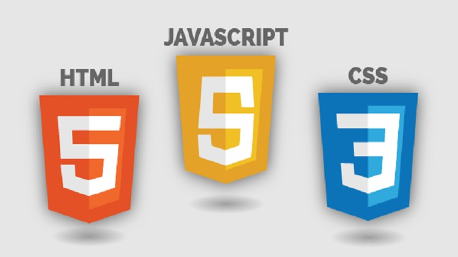

# Web Development Class - I

#### April 24, 2021

<div align="center"></div>

<hr>


<div align="center"><h2>HTML</h2></div>

*	### What is HTML?
	* HTML stands for **Hyper Text Markup Language**.
	* HTML is used to create web pages and web applications.
	* We can create a static website by HTML only.
	* Technically, HTML is a **Markup language** (helps to format the overall view of a page and the data it contains) rather than a programming language.


*	### Basic Structure of HTML file
	* `<!DOCTYPE html>` tag indicates **HTML 5** document.
	* `<html>` tag is the container for all other HTML elements (except `<!DOCTYPE html>`).
	* The `<head>` element is a container for metadata (data about data) and is placed between the `<html>` tag and the `<body>` tag.
	* Metadata typically define the document title, character set, styles, scripts, and other meta information.
	* The `<body>` element contains all the contents of an HTML document, such as headings, paragraphs, images, hyperlinks, tables, lists, etc.

	#### [1.html](./1.html)
	```html
	<!DOCTYPE html>
	<html>
	   <head>
	      <title>This is document title</title>
	   </head>	
	   <body>
	      <h1>This is a heading</h1>
	      <p>Hello World!</p>
	   </body>	
	</html>
	```

*	### HTML Tags
	* HTML tags are like keywords which defines that how web browser will format and display the content.
	* With the help of tags, a web browser can distinguish between an HTML content and a simple content.
	* *Generally*, HTML tags contain three main parts: **opening tag**, **content** and **closing tag**.
	* *Example*:
	```html
	<p> This is an HTML tutorial </p>
	```
	* Some tags need not be closed. Example: `<br>`, `<hr>`, etc.
	* Some **attributes** are present in each tag which define properties of that tag.

*	### HTML Heading
	* There are **six** different HTML headings which are defined with the `<h1>` to `<h6>` tags.
	* **h1** is the largest heading tag and **h6** is the smallest one.

*	### HTML Paragraph
	* HTML **paragraph** or HTML **p** tag is used to define a paragraph in a webpage.
	* A browser itself adds an empty line before and after a paragraph.

*	### HTML Anchor
	* The HTML anchor tag defines a **hyperlink** that *links one page to another page*.
	* It can create hyperlink to other web page as well as files, location, or any URL.
	*	#### href attribute
		* It stands for **Hypertext REFerence**.
		* Address of file is given here.

	#### [2.html](./2.html)
	```html
	<!DOCTYPE html>
	<html>
	   <head>
	      <title>Heading, Paragraph and Hyperlink demo</title>
	   </head>	
	   <body>
	      <h1>This is heading 1</h1>
	      <h2>This is heading 2</h2>
	      <h3>This is heading 3</h3>
	      <h4>This is heading 4</h4>
	      <h5>This is heading 5</h5>
	      <h6>This is heading 6</h6>
	      <h1> This is again Heading 1 and you will find a few paragraphs below</h1>
	      <p>This is first paragraph.</p>
	      <p>This is second paragraph.</p>
	      <p>This is third paragraph.</p>
	      <a href="https://www.facebook.com/wocmnnit">Weekend of Code</a>
	      <a href="1.html">HTML Structure File</a>    
	   </body>	
	</html>
	```

*	### HTML Image
	* HTML **img** tag is used to display image on the web page.
	*	#### src attribute
		* Path of image file is specified here.
	*	#### alt attribute
		* Alternative Text to be displayed if image does not load.
	* It is an *empty tag*.
	* Explore other attributes of `` like **width**, **height**, etc.

*	### HTML Horizontal Rule and Line Break
	* The `<hr>` tag is used to draw a horizontal line in a HTML document.
	* The `<br>` tag in HTML document is used to create a line break in a text.
	* Both `<hr>` and `<br>`tags are *empty tags*.
	* *Note*: Explore attributes of `<hr>`.

*	### HTML Comments
	* Comments are some text or code written in your code to give an explanation about the code.
	* Comments are not visible to the user (*Really?*).
	* `<!-- ... -->` tag is used for comments.

	#### [3.html](./3.html)
	```html
	<!DOCTYPE html>
	<html>
	   <head>
	      <title>Image, HR, BR and Comment demo</title>
	   </head>	
	   <body>
	      
	      <br>
	      <br>
	      <hr>
	      
	      <hr>
	      <br>
	      <p>This is a paragraph</p>
	      <hr>
	      <!-- This is a comment. Tell me whether it's visible to you or not. -->
	   </body>	
	</html>
	```

*	### HTML Table
	* HTML `<table>` tag is used to display data in *tabular form (row * column)*.
	* 	#### HTML Table tags
		* `<table>` - It defines a table.
		* `<tr>` - It defnies a row in a table.
		* `<th>` - It defines header cell in a table.
		* `<td>` - It defines a cell in a table.
		* Explore other table related tags like `<caption>`, `<colgroup>`, `<col>`, etc.
	* **border** attribute is used to specify border of the table.
	* Read more about HTML table [here](https://www.javatpoint.com/html-table).

* ### HTML Lists
	* HTML Lists are used to specify lists of information.
	* There are three different types of HTML lists - 
		* Ordered List or Numbered List (`<ol>`)
		* Unordered List or Bulleted List (`<ul>`)
		* Description List or Definition List (`<dl>`)
	* `<li>` tag is used to specify list elements.
	* Explore various attributes of `<ol>`, `<ul>` and `<dl>`.
	* Read more about HTML Lists [here](https://www.javatpoint.com/html-lists).

* ### HTML Form
	* An HTML form facilitates the user to enter data that is to be sent to the server for processing such as name, email address, password, etc.
	* It can contain - 
		* text fields, password fields, 
		* checkboxes, radio buttons, 
		* submit button, menus, etc.
	*	**`<form>` tag** - It is used to define a form.
		* 	**action attribute** - It is used to specify the server's URL (where data is to be sent when Submit button is clicked).
		*	**method attribute** - It specifies the method (*GET*, *POST*, etc) that will be used to send the data.
	* *Syntax* - 
		```
		<form action="server url" method="get|post">  
		  //input controls e.g. textfield, textarea, radiobutton, button  
		</form>  
		```
	*	**`<input>` tag** - It is used to create various types of input fields.
		*	**type attribute** - It's value can be *"text"*, *"password"*, etc.
		*	**name attribute** - Useful for backend integration (will be explained later).
	*	**`<label>` tag** - It defines a label for an input element.
	*	**`<textarea>` tag** - Used when we need to take large texts/paragraphs as input.
	*	**`<select>` tag** - Used to create drop - down list.
	*	**`<option>` tag** - Used to define an option in a drop - down list.
	*	**`<button>` tag** - It defines a clickable button.
		*	**type attribute** - It defines functionality of button.
			* submit - Clicking the button will submit the form.
			* reset - Clicking the button will reset the form.
	* Read more about HTML form [here](https://www.javatpoint.com/html-form).

*	#### HTML Div
	* The HTML `<div>` tag is used to *group the large section of HTML elements together*.
	* `<div>` tag is just like a **container** unit which is used to *encapsulate* other page elements and divides the HTML documents into sections.
	* It is generally used by web developers to *group HTML elements together* and *apply CSS styles to many elements at once*.
	* Read more about HTML div [here](https://www.javatpoint.com/html-div-tag).

*	#### HTML Span
	* HTML `<span>` tag is used as a generic container of inline elements.
	* The `<span>` tag does not have any default meaning or rendering.
	* The `<span>` tag can be useful for the following task:
		* To change the language of a **part of the text**.
		* To change the color, font, background of a **part of text** using CSS.
		* To apply the scripts to the particular **part of the text**.
	* Read more about HTML span [here](https://www.javatpoint.com/html-span-tag).

<br>
<div align="center"><h2>CSS</h2></div>

*	### What is CSS?
	* CSS stands for **Cascading Style Sheets**.
	* CSS describes how HTML elements are to be displayed on screen, paper, or in other media.
	* CSS saves a lot of work. 
	* It can control the layout of multiple web pages all at once.
	* External stylesheets are stored in CSS files.

*	### CSS Syntax

	<div align="center"></div>

*	### Types of CSS
	* External (create a file and use its path in the `<link>` element in the file).
	* Inline (using **style** attribute in tags).
	* Internal (using `<style>` tag).

*	### CSS Selectors
	* They are used to select HTML element(s).
	* Simple selectors
		* Element of html
		* **id** selector
		* **class** selector
		* Universal selectors
	* Combinator Selectors
	* Pseudo class selectors
	* Pseudo-element selectors
	* Element selector

*	### CSS Comments
	* Comments are used to explain the code, and may help when you edit the source code at a later date.
	* `/* ... */` is used for adding comments.

*	### CSS Units
	* 	#### Absolute Lengths
		* cm(centimeters)
		* mm(millimeters)
		* px(pixels)
		* in(inches)                       
	*	#### Relative Lengths
		* em(relative to font-size)
		* rem(relative to font-size of root element)
		* vw(relative to 1% viewport width)
		* vh(relative to 1% viewport height)

*	### CSS Text Properties
	* color :- to set the colour of the text
	* text-align :- aligns text with respect to its parent
	* text-decoration :- used to set or remove decoration from text
	* text-transform :- transform text to lowercase or uppercase or capitalize the first letter of each word
	* text-indent :- used to specify the indentation of the first line of a text
	* letter-spacing :- used to specify the space between the characters in a text
	* word-spacing :-  used to specify the space between the words in a text
	* line-height :- used to specify the space between lines

*	### CSS Box Properties
	* margin :- to create space around elements(space with respect to parent)
	* padding :- to create space around an element's content
	* width :-  to set width of the element
	* height :- to set height of the element
	* border :- to create border around an element

*	### CSS Links Properties
	* link :- unvisited link
	* hover :-  when the user mouses over it
	* active :- the moment it is clicked
	* visited :- visited link

*	### CSS Layout Properties 
    Margin,padding,height,width,position,float,border

* 	### CSS Images Properties 

	#### [4.html](./4.html)
	```html
	<!DOCTYPE html>
	<!-- Declaration represents document type.it appears at the top of page -->
	<html lang="en">
	<head>
	    <meta charset="UTF-8">
	    <meta name="viewport" content="width=device-width, initial-scale=1.0">
	    <title>Document</title>
	    <style>
	        /* cooment */
	        /* css syntax */
	        /* selector {
	            property:value;
	        } */
	        /* css units 
	           1) absolute length ex:- cm,mm,px,in(inches)
	           2) relative length ex:- em(relative to font-size),rem(relative to font-size of root element),
	                                   vw(relative to 1% viewport width),vh(relative to 1% viewport height)
	        */
	        /* css text  */
	        p {
	            /* sets the colour of the text */
	            color: darkcyan;
	            /* aligns text with respect to its parent 
	               text-align:center|left|right|
	            */
	            text-align: center;
	            /* used to set or remove decoration from text
	               text-decoration:none|underline|overline|line-through;
	             */
	            text-decoration: none;
	            /* size of font */
	            font-size: 20px;
	            /* transform text to lowercase or uppercase or capitalize the first letter of each word
	               text-transform:lowercase|uppercase|capitalize;
	             */
	            text-transform: capitalize;
	            /* used to specify the indentation of the first line of a text */
	            text-indent: 20px;
	            /* used to specify the space between the characters in a text */
	            letter-spacing: 2px;
	            /* used to specify the space between the words in a text */
	            word-spacing: 2px;
	            /* used to specify the space between lines */
	            line-height: 20px;
	        }
	        /* ..... */
	        /* css box model */
	        div {
	            /* to create space around elements(space with respect to parent)
	               margin:top right down left;
	               margin:50px; === margin:50px 50px 50px 50px;
	             */
	            margin: 50px;
	            /* to create space around an element's content
	               padding:top right down left;
	               padding:50px; === padding:50px 50px 50px 50px;
	             */
	            padding: 50px;
	            /* to set width of the element */
	            width: 450px;
	            /* to set height of the element */
	            height: 100px;
	            /* to create border around an element
	               border:border-width,border-style,border-colour
	             */
	            border: 2px solid blue;
	        }
	        /* ..... */
	        /* css link */
	        /* unvisited link */
	        a {
	            color: blue;
	            /* removes text decoration */
	            text-decoration: none;
	        }
	        /* when the user mouses over it */
	        a:hover {
	            color: green;
	        }
	        /* the moment it is clicked */
	        a:active {
	            color: black;
	        }
	        /* visited link */
	        a:visited {
	            color: red;
	        }
	        /* ..... */
	        /* css layout  */
	        /* to hide an element */
	        .d-none{
	            display:none;
	        }
	        /* to display an element as block */
	        .d-block{
	            display: block;
	        }
	        /* to display elements in line */
	        .d-inline{
	            display: inline;
	        }
	        /* ..... */
	    </style>
	</head>
	<body>
	    <!-- css text  -->
	    <p>Lorem ipsum dolor sit amet, consectetur adipisicing elit. In, placeat? Iusto veniam illum atque voluptatum
	        voluptates repellendus accusantium necessitatibus laudantium! Sequi asperiores molestiae sit aut illum nesciunt
	        in earum cum.</p>
	    <!-- css box model  -->
	    <div>
	        Lorem ipsum dolor sit amet consectetur adipisicing elit. Harum ipsam, autem exercitationem sunt numquam error.
	        Aliquam, quidem similique soluta consequatur quae veniam qui eius? Asperiores quisquam quis quaerat dicta
	        quibusdam?
	    </div>
	    <!-- css links  -->
	    <a href="https://www.google.com">Go to google.com</a>
	    <!-- css layout  -->
	    <!-- css display  -->
	    <!-- display:none  -->
	    <h1>Visible</h1>
	    <h1 class="d-none">Hidden</h1>
	    <!-- display:block  -->
	    <span>Lorem</span> <span> ipsum</span>
	    <br>
	    <span class="d-block">Lorem</span> <span class="d-block"> ipsum</span>
	    <!-- display:inline  -->
	    <p>lorwm</p><p>epsum</p><p>dolor</p>
	    <p class="d-inline">lorwm</p><p class="d-inline">epsum</p><p class="d-inline">dolor</p>
	</body>
	</html>
	```


