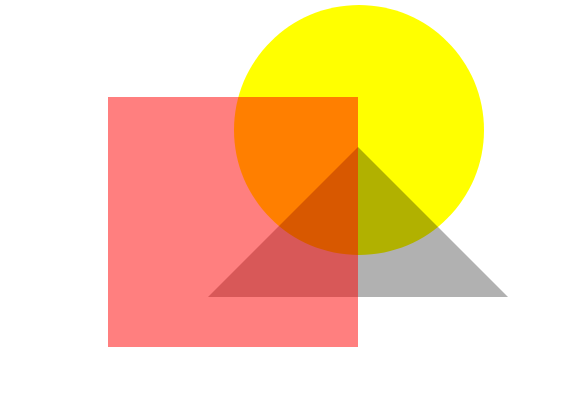

# Web Development Assignment - 2

**Note:** This is for your own practice and need not be submitted anywhere. If you encounter any problem or error, please consider asking us in the next class or message us directly.

1.	## Try to make shapes like square, triangle and circle in the webpage using CSS.
	* **Hint** - If you are finding it difficult, refer to [this](https://www.w3schools.com/howto/howto_css_shapes.asp).

2.	## Try to make following shape in a webpage using HTML and CSS.
	* Try to make the shapes responsive.
	* **Hint** -  Read out more about *positioning, borders, opacity, z-index*.

	

3.	## Choose any website of your choice and try to make a clone of it's frontend. 
	* You can see this [facebook login page clone](./facebook_demo_html_css) (incomplete) for reference.
	

4.	## Make your portfolio website using HTML and CSS and deploy it on Github Pages.
	* Refer to last page of [PPT of GitClass-1](https://github.com/CC-MNNIT/2021-22-Classes/blob/main/Git-GitHub/2021_04_20_GitClass-1/Lecture-1.pdf) for instructions.