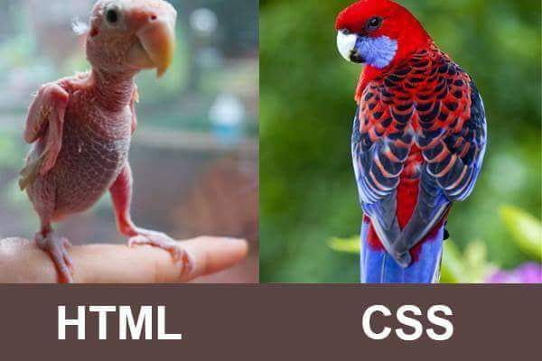

# Web Development Class - II

#### April 26, 2021

<div align="center"></div>

<hr>


<div align="center"><h2>HTML (continued)</h2></div>

*	### HTML File Paths
	*	#### Absolute File Paths
		* **``** - Absolute path of *picture.jpg* file located in *my_website* folder in Desktop.
		* **``** - Absolute address of an image present on internet.
		* **Disadvantage** - In case of images (or files) stored on your local file system, this won't work properly on any other system as Abosulte paths change on changing systems or folders.
		* **Advantage** - Useful if we want to add image (or files) directly from internet instead of local file system.

	*	#### Relative File Paths
		* **``** or **``** - The *picture.jpg* file is located in the *same folder as the current page*.
			* *Example directory structure* - 
			```
			|_ Desktop/
			     |_ my_website/
			         |_html/
			             |_ my_webpage.html
			             |_ picture.jpg
			```

		* **``** - The *picture.jpg* file is located in the *images folder in the current folder*.
			* *Example directory structure* - 
			```
			|_ Desktop/
			     |_ my_website/
			         |_ html/
			             |_ my_webpage.html
			             |_ images/
			                  |_ picture.jpg
			```

		* **``** - The *picture.jpg* file is located in the *folder one level up from the current folder*.
			* *Example directory structure* - 
			```
			|_ Desktop/     
			     |_ my_website/
			         |_ html/
			             |_ my_webpage.html
			         |_ picture.jpg
			```

		* **``** - The *picture.jpg* file is located in the *images folder which is located **one** level up from the current folder*.
			* *Example directory structure* - 
			```
			|_ Desktop/
			     |_ my_website/
			         |_ html/
			             |_ my_webpage.html
			         |_ images/
			              |_ picture.jpg
			```

		* **``** - The *picture.jpg* file is located in the *images folder which is located **two** level up from the current folder*.
			* *Example directory structure* - 
			```
			|_ Desktop/
			     |_ my_website/
			         |_ html/
			             |_ my_webpage.html
			     |_ images/
			          |_ picture.jpg
			```

*	### HTML Block and Inline Elements
	* Every HTML element has a default display value, depending on what type of element it is.
	* There are two display values: **block** and **inline**.
	*	##### Block-level Elements
		* A block-level element always starts on a new line.
		* A block-level element always takes up the full width available (stretches out to the left and right as far as it can).
		* A block level element has a top and a bottom margin, whereas an inline element does not.
		* *Example*: `<div>`, `<h1>..<h6>`, `<p>`, etc.
	*	##### Inline Elements
		* An inline element does not start on a new line.
		* An inline element only takes up as much width as necessary.
		* *Example*: `<span>`, `<a>`, `<button>`, `<input>`, etc.
	* Read more about HTML Block and Inline Elements [here](https://www.w3schools.com/html/html_blocks.asp).

*	### HTML Div
	* The HTML `<div>` tag is used to *group the large section of HTML elements together*.
	* `<div>` tag is just like a **container** unit which is used to *encapsulate* other page elements and divides the HTML documents into sections.
	* It is generally used by web developers to *group HTML elements together* and *apply CSS styles to many elements at once*.
	* It is a **block-level** element.
	* Read more about HTML div [here](https://www.javatpoint.com/html-div-tag).

*	### HTML Span
	* HTML `<span>` tag is used as a generic container of inline elements.
	* The `<span>` tag does not have any default meaning or rendering.
	* The `<span>` tag can be useful for the following task:
		* To change the language of a **part of the text**.
		* To change the color, font, background of a **part of text** using CSS.
		* To apply the scripts to the particular **part of the text**.
	* * It is an **inline** element.
	* Read more about HTML span [here](https://www.javatpoint.com/html-span-tag).

*	### HTML iframe
	* It stands for **Inline FRAME**.
	* HTML Iframe is used to display a **nested webpage** (a webpage within a webpage).
	* An HTML iframe embeds another document within the current HTML document in the *rectangular region*.
	* Youtube video, Google Map, etc can be embedded into webpage using Iframe.
	* Read more about HTML Iframe [here](https://www.javatpoint.com/html-iframes).

	#### [1.html](./1.html)
	```html
	<!DOCTYPE html>
	<html>
		<head>
		    <title>iframe demo</title>
		</head>
		<body>
		    <p>
		        <h1>
		            iframe tag:
		        </h1>
		        <ul>
		            <li>
		                Used to Show Nested WebPages.
		            </li>
		        </ul>
		    </p>
		    <h2 style="text-decoration:underline;">Example: </h2>
		    <div>
		        <h3>This is 4.html</h3>
		        <iframe src="4.html"></iframe>
		        <h3>This is WOC HomePage</h3>
		        <iframe src="https://woc2k21.github.io/" width="800" height="600"></iframe>
		        <h3>Google Calendar Example</h3>
		        <iframe src="https://calendar.google.com/calendar/embed?title=Calendar_Title_Goes_Here" width="800" height="600" ></iframe>
		    </div>
		    <p>
		        <h1>
		           Other Example Usages:
		        </h1>
		        <ul>
		            <li>
		                <span>Embed Google Map for a location. </span>
		            </li>
		        </ul>
		    </p>
		</body>
	</html>
	```

*	### HTML Marquee
	* It is used to scroll a image or text horizontally or vertically.
	* Explore various attributes of `<marquee>`.
	* Read more about HTML marquee [here](https://www.javatpoint.com/marquee-html).
	#### [2.html](./2.html)
	```html
	<!DOCTYPE html>
	<html>
		<head>
		    <title>Marquee demo</title>
		</head>
		<body>
		    <marquee>
		        <span style="color: red">ATTENTION: Text Going Left</span>
		    </marquee>
		    <hr/>
		    <marquee direction="up" width="200" height="100">
		        Text Going Up
		    </marquee>
		    <hr/>
		    <marquee direction="right">
		        Text Going Right
		    </marquee>
		    <hr/>
		    <marquee scrollamount="20">
		        Text Going Left
		     </marquee>
		</body>
	</html>
	```

*	### HTML id attribute
	* It is used to specify a **unique id** for an HTML element.
	* The value of the *id* attribute must be unique within the HTML document.
	* The *id* attribute is used by **CSS and JavaScript** to style/select a specific element.
	* The value of the id attribute is **case sensitive**.
	* The id attribute is also used to create **HTML bookmarks**.
	* JavaScript can access an element with a specific id with the `getElementById()` method.
	* Read more about *id* attribute [here](https://www.w3schools.com/html/html_id.asp).

*	### HTML class attribute
	* The HTML *class* attribute specifies one or more class names for an element.
	* Classes are used by CSS and JavaScript to select and access specific elements.
	* The *class* attribute can be used on any HTML element.
	* The class name is **case sensitive**.
	* Different HTML elements can point to the same class name.
	* JavaScript can access elements with a specific class name with the `getElementsByClassName()` method.
	* Read more about HTML class attribute [here](https://www.w3schools.com/html/html_classes.asp).

<br>

<div align="center"></div>

<div align="center"><h2>CSS</h2></div>

*	### What is CSS?
	* CSS stands for **Cascading Style Sheets**.
	* CSS describes how HTML elements are to be displayed on screen, paper, or in other media.
	* CSS saves a lot of work. 
	* It can control the layout of multiple web pages all at once.
	* External stylesheets are stored in CSS files.

*	### CSS Syntax

	<div align="center"></div>

*	### Types of CSS
	* External (create a file and use its path in the `<link>` element in the file).
	* Inline (using **style** attribute in tags).
	* Internal (using `<style>` tag).

*	### CSS Selectors
	* They are used to select HTML element(s).
	* Simple selectors
		* Element of html
		* **id** selector - **#** is pre-pended to id of element.
		* **class** selector - **.** is pre-pended to class of elements.
		* Universal selectors
	* Combinator Selectors
	* Pseudo class selectors
	* Pseudo-element selectors
	* Element selector

*	### CSS Comments
	* Comments are used to explain the code, and may help when you edit the source code at a later date.
	* `/* ... */` is used for adding comments.

*	### Viewport
	* It is the area visible to user in a screen.

*	### CSS Units
	* 	#### Absolute Lengths
		* cm(centimeters)
		* mm(millimeters)
		* px(pixels)
		* in(inches)                       
	*	#### Relative Lengths
		* em(relative to font-size)
		* rem(relative to font-size of root element)
		* vw(relative to 1% viewport width)
		* vh(relative to 1% viewport height)

*	### CSS Text Properties
	* color :- to set the colour of the text
	* text-align :- aligns text with respect to its parent
	* text-decoration :- used to set or remove decoration from text
	* text-transform :- transform text to lowercase or uppercase or capitalize the first letter of each word
	* text-indent :- used to specify the indentation of the first line of a text
	* letter-spacing :- used to specify the space between the characters in a text
	* word-spacing :-  used to specify the space between the words in a text
	* line-height :- used to specify the space between lines

*	### CSS Box Properties
	* margin :- to create space around elements(space with respect to parent)
	* padding :- to create space around an element's content
	* width :-  to set width of the element
	* height :- to set height of the element
	* border :- to create border around an element

*	### CSS Links Properties
	* link :- unvisited link
	* hover :-  when the user mouses over it
	* active :- the moment it is clicked
	* visited :- visited link

*	### CSS Layout Properties 
    Margin,padding,height,width,position,float,border

* 	### CSS Images Properties 

	#### [3.html](./3.html)
	```html
	<!DOCTYPE html>
	<!-- Declaration represents document type.it appears at the top of page -->
	<html lang="en">
	<head>
	    <meta charset="UTF-8">
	    <meta name="viewport" content="width=device-width, initial-scale=1.0">
	    <title>CSS tutorial</title>
	    <style>
	        /* comment */
	        /* css syntax */
	        /* selector {
	            property:value;
	        } */
	        /* css units 
	           1) absolute length ex:- cm,mm,px,in(inches)
	           2) relative length ex:- em(relative to font-size),rem(relative to font-size of root element),
	                                   vw(relative to 1% viewport width),vh(relative to 1% viewport height)
	        */
	        /* css box model */
	        .box-model {
	            /* to create space around elements(space with respect to parent)
	               margin:top right down left;
	               margin:50px; === margin:50px 50px 50px 50px;
	             */
	            margin: 50px;
	            /* to create space around an element's content
	               padding:top right down left;
	               padding:50px; === padding:50px 50px 50px 50px;
	             */
	            padding: 50px;
	            /* to set width of the element */
	            width: 450px;
	            /* to set height of the element */
	            height: 100px;
	            /* to create border around an element
	             */
	            border-style: dotted solid dashed none;
	            border-width: 10px 20px 5px 0px;
	            border-color: blue green black white;
	        }
	        /* ..... */
	        /* css background */
	        .bg {
	            width: 500px;
	            height: 1000px;
	        }
	        .color {
	            /* specifies the background color of an element */
	            background-color: tomato;
	        }
	        .image {
	            /* specifies an image to use as the background of an element. */
	            background-image: url("./images/tree.jpg");
	            /* repeats an image either horizontally(repeat-x) or vertically(repeat-y) or no-repeat . */
	            background-repeat: no-repeat;
	            /* specifies the position of image in the container */
	            background-position: left top;
	            /* specifies whether the background image should scroll or be fixed  */
	            background-attachment: fixed;
	        }
	        /* ..... */
	        /* css text  */
	        .text {
	            /* sets the colour of the text */
	            color: darkcyan;
	            /* aligns text with respect to its parent 
	               text-align:center|left|right|
	            */
	            text-align: center;
	            /* used to set or remove decoration from text
	               text-decoration:none|underline|overline|line-through;
	             */
	            text-decoration: none;
	            /* transform text to lowercase or uppercase or capitalize the first letter of each word
	               text-transform:lowercase|uppercase|capitalize;
	             */
	            text-transform: capitalize;
	            /* used to specify the indentation of the first line of a text */
	            text-indent: 20px;
	            /* used to specify the space between the characters in a text */
	            letter-spacing: 2px;
	            /* used to specify the space between the words in a text */
	            word-spacing: 2px;
	            /* used to specify the space between lines */
	            line-height: 20px;
	            /* In CSS there are five generic font families:
	            1) Serif fonts have a small stroke at the edges of each letter. They create a sense of formality and elegance.
	            2) Sans-serif fonts have clean lines (no small strokes attached). They create a modern and minimalistic look.
	            3) Monospace fonts - here all the letters have the same fixed width. They create a mechanical look. 
	            4) Cursive fonts imitate human handwriting.
	            5) Fantasy fonts are decorative/playful fonts. */
	            font-family: 'Courier New', Courier, monospace;
	            /* how thick or thin characters in text should be displayed. */
	            font-weight: bold;
	            /* size of font */
	            font-size: 20px;
	            /* font-style:oblique|normal|italic; */
	            font-style: italic;
	        }
	        /* ..... */
	        /* css link */
	        /* unvisited link */
	        a {
	            color: blue;
	            /* removes text decoration */
	            text-decoration: none;
	        }
	        /* when the user mouses over it */
	        a:hover {
	            color: green;
	        }
	        /* the moment it is clicked */
	        a:active {
	            color: black;
	        }
	        /* visited link */
	        a:visited {
	            color: red;
	        }
	        /* ..... */
	        /* css overflow */
	        .overflow {
	            width: 300px;
	            height: 90px;
	            background-color: tomato;
	            /* specifies whether to clip the content or to add scrollbars when the content of an element is too big to fit in the specified area. */
	            overflow: hidden;
	        }
	        .overflow:hover {
	            overflow: visible;
	        }
	        /* ..... */
	        /* css display  */
	        .d-none {
	            /* to hide an element */
	            display: none;
	        }
	        .d-block {
	            /* to display an element as block */
	            display: block;
	        }
	        .d-inline {
	            /* to display elements in line */
	            display: inline;
	        }
	        /* ..... */
	        /* css positioning */
	        .box {
	            width: 90vw;
	            height: 200vh;
	            background-color: gray;
	            z-index: 0;
	            position: relative;
	        }
	        .p-static {
	            width: 300px;
	            height: 300px;
	            background-image: url("./images/tree.jpg");
	            background-repeat: no-repeat;
	            position: static;
	            left: 50px;
	            bottom: 30px;
	        }
	        .p-relative {
	            width: 300px;
	            height: 300px;
	            background-image: url("./images/tree.jpg");
	            background-repeat: no-repeat;
	            position: relative;
	            left: 300px;
	            top: -20px;
	        }
	        .p-fixed {
	            width: 300px;
	            height: 300px;
	            background-image: url("./images/tree.jpg");
	            background-repeat: no-repeat;
	            position: fixed;
	            left: 500px;
	        }
	        .p-absolute {
	            width: 300px;
	            height: 300px;
	            background-image: url("./images/tree.jpg");
	            background-repeat: no-repeat;
	            position: absolute;
	            left: 100px;
	            top: -20px;
	        }
	        /* ..... */
	    </style>
	</head>
	<body>
	    <!-- css box model  -->
	    <!-- <div class="box-model">
	        Lorem ipsum dolor sit amet consectetur adipisicing elit. Harum ipsam, autem exercitationem sunt numquam error.
	        Aliquam, quidem similique soluta consequatur quae veniam qui eius? Asperiores quisquam quis quaerat dicta
	        quibusdam?
	    </div> -->
	    <!-- ..... -->
	    <!-- css colors  -->
	    <!-- <p>Same as color name "DodgerBlue":</p>
	    <h1 style="background-color:rgb(30, 144, 255);">rgb(30, 144, 255)</h1>
	    <h1 style="background-color:#1e90ff;">#1e90ff</h1>
	    <h1 style="background-color:hsl(209.6,100%,55.9%);">hsl(209.6,100%,55.9%)</h1>
	    <p>Same as color name "DodgerBlue", but 50% transparent:</p>
	    <h1 style="background-color:rgba(30, 144, 255,0.5);">rgba(30, 144, 255,0.5)</h1>
	    <h1 style="background-color:hsla(209.6,100%,55.9%,0.5);">hsla(209.6,100%,55.9%,0.5)</h1>
	    <p>In addition to the predefined color names, colors can be specified using RGB, HEX, HSL, or even transparent
	        colors using RGBA or HSLA color values.</p> -->
	    <!-- ..... -->
	    <!-- css background  -->
	    <!-- <div class="bg color">
	    </div>
	    <div class="bg image">
	relative
	    </div> -->
	    <!-- ..... -->
	    <!-- css text  -->
	    <!-- <p class="text">Lorem ipsum dolor sit amet, consectetur adipisicing elit. In, placeat? Iusto veniam illum atque
	        voluptatum
	        voluptates repellendus accusantium necessitatibus laudantium! Sequi asperiores molestiae sit aut illum nesciunt
	        in earum cum.</p> -->
	    <!-- ..... -->
	    <!-- css links  -->
	    <!-- <a href="https://www.google.com">Go to google.com</a> -->
	    <!-- ..... -->
	    <!-- css overflow -->
	    <!-- <div class="overflow">
	        Lorem ipsum dolor sit amet consectetur adipisicing elit. Neque unde eos, in minima itaque provident facere
	        dolorem tempore. Neque cumque incidunt voluptatum libero alias odit, dolorem ratione. Incidunt, quis
	        expedita!
	    </div> -->
	    <!-- ..... -->
	    <!-- css display  -->
	    <!-- <h1>Visible</h1>
	    <h1 class="d-none">Hidden</h1>
	    <span>lorem</span> <span> ipsum</span>
	    <br>
	    <span class="d-block">lorem</span> <span class="d-block"> ipsum</span>
	    <p>lorem</p>
	    <p>ipsum</p>
	    <p>dolor</p> -->
	    <!-- paragraph is a block-level element making it inline -->
	    <!-- <p class="d-inline">lorem</p>
	    <p class="d-inline"> ipsum</p>
	    <p class="d-inline"> dolor</p> -->
	    <!-- ..... -->
	    <!-- css Positioning  -->
	    <div class="box">
	        <!-- position static -->
	        <!-- Static positioned elements are not affected by the top, bottom, left, and right properties.they are  positioned according to the normal flow of the page -->
	        <div class="p-static">
	        </div>
	        <!-- position relative -->
	        <!-- Setting the top, right, bottom, and left properties of a relatively-positioned element will cause it to be adjusted away from its normal position. Other content will not be adjusted to fit into any gap left by the elemen -->
	        <div class="p-relative">
	        </div>
	        <!-- position fixed -->
	        <!-- An element with position: fixed; is positioned relative to the viewport, which means it always stays in the same place even if the page is scrolled. The top, right, bottom, and left properties are used to position the element. -->
	        <div class="p-fixed">
	        </div>
	        <!-- position absolute -->
	        <!-- An element with position: absolute; is positioned relative to the nearest positioned ancestor (instead of positioned relative to the viewport, like fixed).However; if an absolute positioned element has no positioned ancestors, it uses the document body, and moves along with page scrolling. -->
	        <div class="p-absolute">
	        </div>
	    </div>
	    <!-- ..... -->
	</body>
	</html>
	```

### Content Contributors

* [Kshitiz Srivastava](https://github.com/pirateksh/)
* [Ankit Sangwan](https://github.com/ankitsangwan1999/)
* [Sujeet Kushwaha](https://github.com/su050300)
* [Aman Tebriwal](https://github.com/amantibrewal310) 

### Material

* [JavatPoint HTML Tutorial](https://www.javatpoint.com/html-tutorial).
* [W3Schools HTML Tutorial](https://www.w3schools.com/html/).
* [W3Schools CSS Tutorial](https://www.w3schools.com/css/).
* See a full demo of HTML with external CSS [here](./html_css_demo_complete).
* Facebook Login/Signup Page like frontend demo (incomplete) [here](./facebook_demo_html_css). 