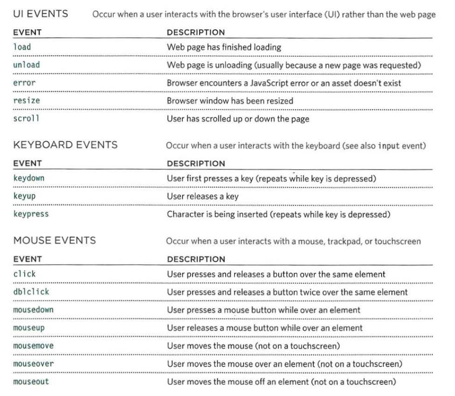
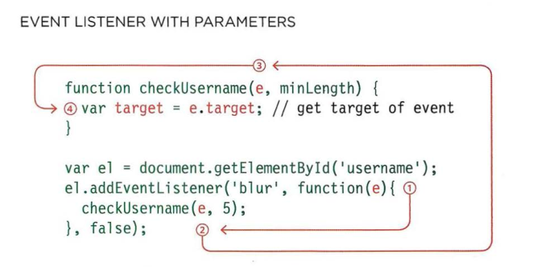

## Events

- When you browse the web, your browser registers different types of events. It's the browser's way of saying, "Hey, this just happened." Your script can then respond to these events.

- Scripts often respond to these events by updating the content of the web page (via the Document Object Model) which makes the page feel more interactive.

#### Differents Type of Events




#### TERMINOLOGY

_EVENTS FIRE OR ARE RAISED_

- When an event has occurred, it is often described as having fired or been raised . In the diagram on the right, if the user is tapping on a link, a click event would fire in the browser.


_EVENTS TRIGGER SCRIPTS_

- Events are said to trigger a function or script. When the click event fires on the element, it could trigger a script that enlarges the selected item.

#### How events trigger JS code

When the user interacts with the HTML on a web page, there are three steps involved in getting it to trigger some JavaScript code. Together these steps are known as **event handling**.

Steps:

1. Select the **element** node(s) you want the script ot respond to.
2. Indicate which **event** on the selected node(s) will trigger the response.
3. State the _code_ you want to run when the event occurs.

Three Ways to bind an event to an element:

1. HTML Event Handlers (_Bad Practice_)
2. Traditional DOM Event Handlers
3. Event Listeners

**HTML Event Handlers**

```
  <input type="button" onclick="alert('Click!')" value="Button">
```

**_Why Bad Practice?_**

- An HTML-attribute is not a convenient place to write a lot of code, so we’d better create a JavaScript function and call it there.

**Traditional DOM Event Handlers**


```
<input type="button" id="button" value="Button">
<script>
  button.onclick = function() {
    alert('Click!');
  };
</script>
```

In the first example, the HTML attribute is used to initialize the button.onclick, while in the second example – the script, that’s all the difference.

**_Note:_** As there’s only one `onclick` property, we can’t assign more than one event handler.

**Event Listeners**

- Event listeners are a more recent approach to handling events. They can deal with more than one function at a time but they are not supported in older browsers.

- Unlike, other two method in this method we can add multiple event listeners and they will execute in the order they are define




- Always first arguement of the function associated with the event listener is **event object**

**The Event Object**

- When an event occurs, the event object tells you information about the event, and the element it happened upon.

- To properly handle an event we’d want to know more about what’s happened. Not just a “click” or a “keydown”, but what were the pointer coordinates? Which key was pressed? And so on.

- When an event happens, the browser creates an event object, puts details into it and passes it as an argument to the handler.

Here’s an example of getting pointer coordinates from the event object:

```
<input type="button" value="Click me" id="elem">

<script>
  elem.onclick = function(event) {
    // show event type, element and coordinates of the click
    alert(event.type + " at " + event.currentTarget);
    alert("Coordinates: " + event.clientX + ":" + event.clientY);
  };
</script>
```

Some properties of `event` object:

- `type`
- `currentTarget`
- `target`
- `preventDefault`
- `stopPropagation`

**_Note:_** What is the difference between `currentTarget` and `target` ?

**Event Flow**

HTML elements nest inside other elements. If you hover or click on a link, you will also be hovering or clicking on its parent elements.

1. Event Bubbling
2. Event Capturing


```
  <body>
    <ul>
      <li><a>Link</a></li>
    </ul>
  </body>

```

**Bubbling**

The bubbling principle is simple.

> When an event happens on an element, it first runs the handlers on it, then on its parent, then all the way up on other ancestors.

**Event Delegation**

- Event delegation tells us that instead of attaching event listener to each child we should think about attaching one event listener to the parent element.
- It is possible because of event bubbling.

- _PROS:_ It help us to optimise the performance of the web page by saving the memory of defining multiple event listeners

- _CONS:_ Not all events are bubbled up like resizing of the window, scrolling, etc.

**Reference**

_Article_

- MDN DOC: https://developer.mozilla.org/en-US/docs/Learn/JavaScript/Building_blocks/Events

- EVENTS: https://javascript.info/events (Must Read)

_Videos:_

- Event Delegation: https://www.youtube.com/watch?v=3KJI1WZGDrg
- Event Bubbling and Capturing: https://www.youtube.com/watch?v=aVSf0b1jVKk
- Event Listeners: https://www.youtube.com/watch?v=XF1_MlZ5l6M
