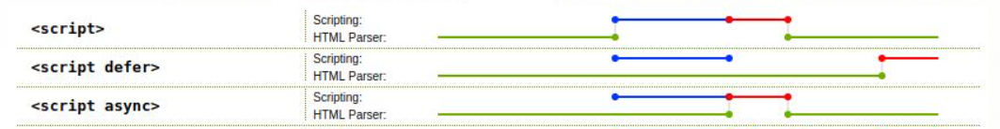
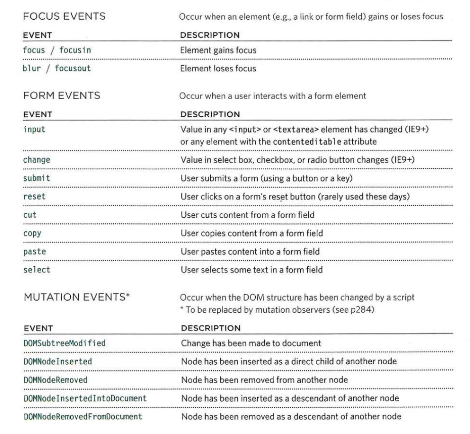
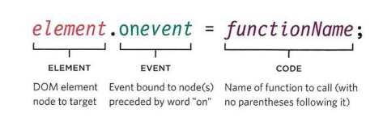
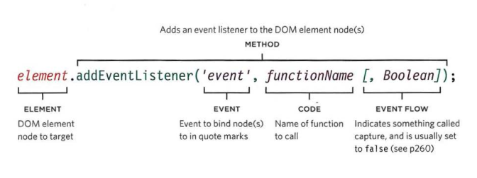
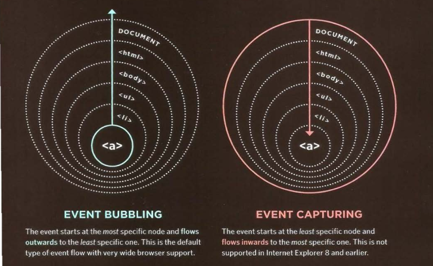

# Web Development Class - III

#### April 28, 2021

<div align="center"></div>

<hr>


<div align="center"><h2>JavaScript</h2></div>

*	### What is JS?
	* JavaScript is a **Scripting Language**, used to make web pages dynamic.
	* If HTML is the *BONES*, then JS is the *MUSCLES* of a webpage.

*	### Scripting Language
	* Basically, all scripting languages are programming languages.
	* Scripting languages are interpreted e.g. JS, PHP, Python. Suitable for purposes where changes in code are more frequent.
	* Programming languages are compiled e.g. Java, C, C++. Suitable for purposes where changes in code are less frequent.
	* But Technically, Scripting languages are not fully interpreted theses days, they are compiled JIT(Just In Time).
	* JIT Compilation -> Byte Code(Intermediate-level Non-Runnable Code) -> Interpretor -> Machine Code(Binary) -> CPU Execution.
	* **Types** - Server-side scripting languages(JS, Python, PHP) and client-side scripting languages(JS).

*   ### JS Engine
	* As per wiki:- "A Computer Program that executes JS code. The first JavaScript engines were mere interpreters, but all relevant modern engines use **just-in-time compilation** for improved performance."
	* **Example** - Google's V8 Engine (Used in Google Chrome, NodeJS runtime environment).

*   ### Where to put JS inside HTML file?
	* Using **script** tag:
		```html
		<script>
			console.log("Hello World!");
		</script>
		```
	* Using **src** attribute of **script** tag:
		Put JavaScript code in a separate _**.js**_ file and include it inside html file.
		```html
		<script src="js_file.js"></script>
		```
	
*   ### Async and Defer Boolean attributes of script tag.
	* **Without *async* or *defer*** -  
		* JavaScript files are fetched (downloaded) and executed in order of their presence in html file.
	* **With *defer*** - 
		* The file gets downloaded **asynchronously** along with HTML Parsing, but executed only when the document parsing is completed. 
		* They are executed in order of their presence in html file.
	* **With *async*** - 
		* The file gets downloaded asynchronously along with HTML Parsing but executed as soon as it’s downloaded. 
		* So, the order of execution is not fixed.
		<div align="center"></div>

*   ### Important JS Primitive Data-types
	* number
	* boolean
	* string
	* undefined
	* null


*   ### JS Objects
	* An object is a collection of properties or key-value pairs. 
	* value can be a primitive value, an other object, a function etc.
	* **dot-notation** is used to access property of an object -  
	```javascript
	objectName.propertyName
	```
	* Unassigned properties of an object are *undefined*.
	* **for-in** loop can be used to access all key-value pairs of an object.


*	### Scope in JS
	* Scope tell the visibility/accessibility of an entity(variable, function, object etc.)
	* **Global Scope** - 
		* Variables which can be accessed using window object. 
		* Entities (variables, functions, objects) defined in this scope can be accessed inside any block or fucntion of the script.
	* **Block Scope** - 
		* Statements written inside a set of {} makes a block. 
		* Variables defined using **let** and **const** are block scoped i.e. they are visible only inside the block where they are defined.
	* **Local Scope** - Variables defined inside a function are visible only inside the function i.e. they are local to that function.

*	### Normal functions vs arrow functions vs anonymous functions
	* One way of defining Functions in JS is using **function** keyword. 
	* Other way is to assign a function to a variable. So, we the variable name becomes name of the function.
	* Arrow functions is another way of defining them using (args) => {} syntax. which make them more concise and dont require using function keyword.

*	### Document Object Model (DOM)
	* When a web page is loaded, the browser creates a Document Object Model of the page.
	* It is the webpage represented in terms of **tree of objects** for easy manipulation in JS code.
	<div align="center"></div>

*	### Dom Manipulation/Query Selection
	
	* `document.getElementById('id_of_element')` => returns a single element
    * `document.getElementsByClassName('class_of_element')` => returns array like structure containing matching elements.
    * `document.getElementsByTagName('tag_of_element')` => returns array like structure containing matching elements.
    * `document.querySelector("#id-name")`, `querySelector(".class-name")`, `querySelector("ul")` => returns single matching element.
    * `document.querySelectorAll('#id-name')` => returns array like structure containing matching elements. 
    * `document.createElement('p')`; 
    * `element.appendChild('li')`;
    * `element.removeChild('li')`;

*	### Events

	* When you browse the web, your browser registers different types of events. It's the browser's way of saying, "Hey, this just happened." Your script can then respond to these events.

	* Scripts often respond to these events by updating the content of the web page (via the Document Object Model) which makes the page feel more interactive.

*	### Differents Type of Events

	<div align="center"></div>
	<div align="center"></div>

*	### TERMINOLOGY

	* _EVENTS FIRE OR ARE RAISED_

	* When an event has occurred, it is often described as having fired or been raised . In the diagram on the right, if the user is tapping on a link, a click event would fire in the browser.

	<div align="center"></div>

	* _EVENTS TRIGGER SCRIPTS_

	* Events are said to trigger a function or script. When the click event fires on the element, it could trigger a script that enlarges the selected item.

*	### How events trigger JS code

	* When the user interacts with the HTML on a web page, there are three steps involved in getting it to trigger some JavaScript code. Together these steps are known as **event handling**.

	* Steps:

		1. Select the **element** node(s) you want the script ot respond to.
		2. Indicate which **event** on the selected node(s) will trigger the response.
		3. State the _code_ you want to run when the event occurs.

	* Three Ways to bind an event to an element:

		1. HTML Event Handlers (_Bad Practice_)
		2. Traditional DOM Event Handlers
		3. Event Listeners

	* **HTML Event Handlers**

		```html
		<input type="button" onclick="alert('Click!')" value="Button">
		```

	* **_Why Bad Practice?_**

		* An HTML-attribute is not a convenient place to write a lot of code, so we’d better create a JavaScript function and call it there.

	* **Traditional DOM Event Handlers**
		<div align="center"></div>

	```
	<input type="button" id="button" value="Button">
	<script>
	  button.onclick = function() {
	    alert('Click!');
	  };
	</script>
	```

	In the first example, the HTML attribute is used to initialize the button.onclick, while in the second example – the script, that’s all the difference.

	* **_Note:_** As there’s only one `onclick` property, we can’t assign more than one event handler.

	* **Event Listeners**

		* Event listeners are a more recent approach to handling events. They can deal with more than one function at a time but they are not supported in older browsers.

		* Unlike, other two method in this method we can add multiple event listeners and they will execute in the order they are define

	<div align="center"></div>
	<div align="center"></div>
	<div align="center"></div>

		* Always first argument of the function associated with the event listener is **event object**

	* **The Event Object**

		* When an event occurs, the event object tells you information about the event, and the element it happened upon.

		* To properly handle an event we’d want to know more about what’s happened. Not just a “click” or a “keydown”, but what were the pointer coordinates? Which key was pressed? And so on.

		* When an event happens, the browser creates an event object, puts details into it and passes it as an argument to the handler.

		* Here’s an example of getting pointer coordinates from the event object:

	```
	<input type="button" value="Click me" id="elem">
	<script>
	  elem.onclick = function(event) {
	    // show event type, element and coordinates of the click
	    alert(event.type + " at " + event.currentTarget);
	    alert("Coordinates: " + event.clientX + ":" + event.clientY);
	  };
	</script>
	```

	* Some properties of `event` object:

		- `type`
		- `currentTarget`
		- `target`
		- `preventDefault`
		- `stopPropagation`

	* **_Note:_** What is the difference between `currentTarget` and `target` ?

	* **Event Flow**

		* HTML elements nest inside other elements. If you hover or click on a link, you will also be hovering or clicking on its parent elements.

			1. Event Bubbling
			2. Event Capturing

		<div align="center"></div>

		```
		<body>
		    <ul>
		    	<li><a>Link</a></li>
		    </ul>
		</body>
		```

	* **Bubbling** - The bubbling principle is simple.

		* When an event happens on an element, it first runs the handlers on it, then on its parent, then all the way up on other ancestors.

	* **Event Delegation**

		* Event delegation tells us that instead of attaching event listener to each child we should think about attaching one event listener to the parent element.
		* It is possible because of event bubbling.
		* _PROS:_ It help us to optimise the performance of the web page by saving the memory of defining multiple event listeners
		* _CONS:_ Not all events are bubbled up like resizing of the window, scrolling, etc.

### Materials

* [W3Schools JS Basics Tutorial](https://www.w3schools.com/js/default.asp).
* [W3Schools JS HTML DOM Tutorial](https://www.w3schools.com/js/js_htmldom.asp).
* [JS Events](https://javascript.info/events) (Must Read)
* [JS Video Tutorial Playlist](https://www.youtube.com/watch?v=cvvwkgp4HBg&list=PLu0W_9lII9ajyk081To1Cbt2eI5913SsL) (Hindi)
* [JS Video Tutorial Playlist](https://www.youtube.com/watch?v=hdI2bqOjy3c&list=PLillGF-RfqbbnEGy3ROiLWk7JMCuSyQtX) (English)
* [Namaste JS Video Tutorial Playlist](https://www.youtube.com/watch?v=pN6jk0uUrD8&list=PLlasXeu85E9cQ32gLCvAvr9vNaUccPVNP) (Hindi)
* [Event Delegation](https://www.youtube.com/watch?v=3KJI1WZGDrg)
* [Event Bubbling and Capturing](https://www.youtube.com/watch?v=aVSf0b1jVKk)
* [Event Listeners](https://www.youtube.com/watch?v=XF1_MlZ5l6M)
* [MDN Doc](https://developer.mozilla.org/en-US/docs/Learn/JavaScript/Building_blocks/Events)
* [Bulb On Off Example](./bulb_on_off)