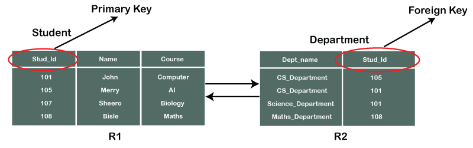
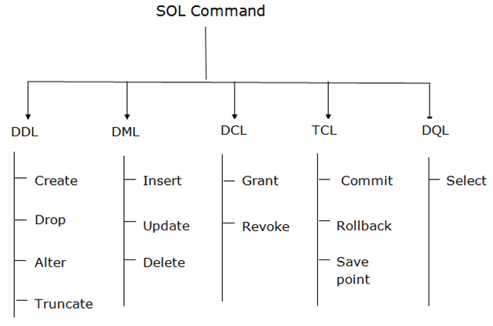
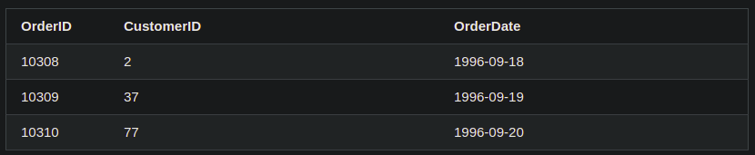
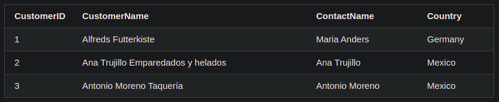
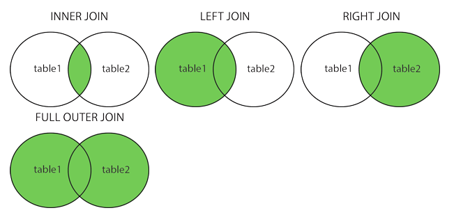

# Web Development Class - IV

#### May 01, 2021

<div align="center"></div>

<hr>

<div align="center"><h2>Database</h2></div>

*   ### What is Data?

    * Data can be defined as a **collection** of facts and records on which we can apply reasoning or can-do discussion or some calculation.
    * Data can exist in form of **graphics, reports, tables, text, etc**. that represents every kind of information, that allows easy retrieval, updating, analysis, and output of data by systematically organized or structured repository of indexed information.

*   ### What is Database?

    * Database is a collection of **interrelated** data.
    * Inside a database, the data is **recorded in a table** which is a collection of rows, columns, etc.

*   ### Why do we need database?

    * Large volumes of data can be stored in one place.
    * Multiple users can **read** and **modify** the data at the same time.
    * Databases are **searchable** and **sortable**, so the data you need can be found quick and easily.

*   ### What is DBMS?

    * It stands for **Database Management Systems**.
    * Database management system is a software which can be used to manage the data by **storing** it on to the database and by **retrieving** and **manipulating** the data from the database.

*   ### Types of Database

    * Databases are broadly divided into **two** types:-
        1. **Relational Database** - one that stores data in **tables**.
        2. **Non-relational Database** - that uses **different keys** where each key is associated with only one value in a collection. Think of it as a **dictionary**.

*   ### RDBMS Components/Terminologies

    * **Table or Relation** - A table is a collection of data represented in rows and columns. Each table has a name in database.
    * **Record or Tuple** - Each row of a table is known as record. It is also known as tuple.
    * **Field or Column Name or Attribute** - An individual piece of data in a record is known as a field, or attribute.
    * **Domain** - A domain is a set of permitted values for an attribute in table.
    * **Instance** - The data stored in database at a particular moment of time is called instance of database.
    * **Schema** - Design of a database is called the schema. Schema is only a structural view(design) of a database.
    * **Keys** - It is used for identifying unique rows from table. It also establishes relationship among tables.

*   ### Types of keys in DBMS
    
    * **Primary Key** – A primary is a column or set of columns in a table that **uniquely** identifies tuples (rows) in that table.
    * **Foreign Key** – Foreign keys are the columns of a table that points to the primary key of another table. They act as a **cross-reference** between tables.

    <div align="center"></div>

<hr>
<div align="center"></div>

<hr> 

<div align="center"><h2>SQL</h2></div>

*   ### What is SQL?
    * SQL stands for **Structured Query Language**.
    * It is designed for managing data in a relational database management system (RDBMS).
    * It is pronounced as **S-Q-L** or sometime **See-Qwell**.
    * SQL is a database language, it is used for database creation, deletion, fetching rows, and modifying rows, etc.
    * SQL is based on relational algebra and tuple relational calculus.

*   ### SQL Datatypes
    * Data types are used to represent the **nature of the data** that can be stored in the database table.
    * For example, in a particular column of a table, if we want to store a **string** type of data then we will have to declare a **string data type** for this column.
    * Some of the MySQL datatypes are - 
        * **CHAR(size)** - Used to specify fixed length string. Size can be from **0 to 255** characters.
        * **VARCHAR(size)** - Used to specify a variable length string. Size can be from **0 to 65535** characters.
        * **INT(size)** - Used for integer value. The **size** parameter specifies the max display width that is 255.
        * **FLOAT(size, d)** - Used to specify a floating point number. Its **size** parameter specifies the total number of digits. The number of digits after the decimal point is specified by **d** parameter.  
        * **DATE** - It is used to specify date format **YYYY-MM-DD**.
    * There are many other datatypes present in SQL. You should explore them according to your needs and use-case.

*   ### SQL Syntax
    * SQL is not case sensitive (*Generally SQL keywords are written in uppercase*).
    * We can place a single SQL statement on one or multiple text lines.
    * SQL statements start with any of the **SQL commands/keywords** like `SELECT`, etc.
    * SQL statements ends with a **semicolon** (**;**). It separates two SQL statements.
    * **Example SQL Statement** - 
    ```sql
    SELECT registration_no FROM students;
    ```

*   ### SQL Commands
    * SQL commands are **instructions**. 
    * They are used to communicate with the database. 
    * They are also used to perform specific tasks, functions, and queries of data.
    * SQL can perform various tasks like **create a table**, **add data to tables**, **drop the table**, **modify the table**, **set permission for users**.
    * **Example** - `SELECT`, `INSERT`, `UPDATE`, `DELETE`, `ALTER`, `DROP` etc.

*   ### Types of SQL Commands
    * There are five types of SQL commands: 
        * **DDL**: Data Definition Language
        * **DML**: Data Manipulation Language
        * **DQL**: Data Query Language
        * **DCL**: Data Control Language
        * **TCL**: Transaction Control Language
    * **Note** - For now, focus only on **DDL**, **DML** and **DQL** commands.

    <div align="center"></div>

*   ### Data Definition Languague (DDL)
    * DDL **changes the structure of the table** like creating a table, deleting a table, altering a table, etc.
    * Some commands under DDL - 
        * **CREATE** - It is used to create a database or a new table in the database.
            * Syntax (creating database) - 
            ```sql
            CREATE DATABASE database_name;
            ```
            * Syntax (creating a table) - 
            ```sql
            CREATE TABLE TABLE_NAME(COLUMN_NAME DATATYPES[,....]);
            ```
            * Example - 
            ```sql
            CREATE TABLE EMPLOYEE(Name VARCHAR(20), Email VARCHAR(100), DOB DATE);
            ```
        * **DROP** - It is used to delete both the *structure* and *records* stored in the table.
            * Syntax - 
            ```sql
            DROP TABLE TABLE_NAME;
            ```
            * Example - 
            ```sql
            DROP TABLE EMPLOYEE;
            ```
        * **ALTER** - It is used to alter the structure of the database. This change could be either to modify the characteristics of an **existing attribute** or probably to **add a new attribute**.
            * Syntax (add a new column) - 
            ```sql
            ALTER TABLE table_name ADD column_name (COLUMN DEFINITION);    
            ```
            * Syntax (modify existing column) - 
            ```sql
            ALTER TABLE table_name MODIFY (COLUMN DEFINITION....);  
            ```
            * Examples - 
            ```sql
            ALTER TABLE STU_DETAILS ADD (ADDRESS VARCHAR2(20));
            ALTER TABLE STU_DETAILS MODIFY (NAME VARCHAR2(20));  
            ```
        * **TRUNCATE** - It is used to delete all the rows from the table. The structure/schema of table is preserved.
            * Syntax - 
            ```sql
            TRUNCATE TABLE table_name;  
            ```
            * Example - 
            ```sql
            TRUNCATE TABLE EMPLOYEE;  
            ```

*   ### Data Manipulation Languague (DML)
    * DML commands are used to **modify the database**.
    * These commands are responsible for all form of changes in the database.
    * Some commands under DML -
        * **INSERT** -  It is used to **insert data** into the **row** of a table.
            * Syntax - 
            ```sql
            INSERT INTO TABLE_NAME (col1, col2, col3,.... col N) VALUES (value1, value2, value3, ...., valueN);  
            ```
            * Example - 
            ```sql
            INSERT INTO students (Name, Subject) VALUES ("Alice", "DBMS");  
            ```
        * **UPDATE** - This command is used to update or modify the value of a column in the table.
            * Syntax - 
            ```sql
            UPDATE table_name SET [column_name1= value1,...column_nameN = valueN] [WHERE CONDITION];
            ```
            * Example - 
            ```sql
            UPDATE students SET Name = 'Bob' WHERE Student_Id = '3';
            ```
        * **DELETE** - It is used to remove one or more row from a table.
            * Syntax - 
            ```sql
            DELETE FROM table_name [WHERE condition];
            ```
            * Example - 
            ```sql
            DELETE FROM students WHERE Name="Bob";  
            ```
*   ### Data Query Language (DQL)
    * DQL is used to **fetch** the data from the database.
    * DQL uses only one command - 
        * **SELECT** - It is used to select the attribute based on the condition described by `WHERE` clause.
            * Syntax - 
            ```sql
            SELECT expressions FROM TABLES WHERE conditions; 
            ```
            * Example - 
            ```sql
            SELECT emp_name FROM employee WHERE age > 20;  
            ```

*   ### SQL Key Constraints
    * **PRIMARY KEY** - 
        * A column or columns is called primary key (PK) that uniquely identifies each row in the table.
        * When multiple columns are used as a primary key, it is known as composite primary key.
        * Example 1 - Primary Key using single column
        ```sql
        CREATE TABLE students  
        (  
            S_Id int NOT NULL,  
            LastName varchar (255) NOT NULL,  
            FirstName varchar (255),  
            Address varchar (255),  
            City varchar (255),  
            PRIMARY KEY (S_Id)  
        )  
        ```
        * Example 2 - Primary Key using multiple columns
        ```sql
        CREATE TABLE students  
        (  
            S_Id int NOT NULL,  
            LastName varchar (255) NOT NULL,  
            FirstName varchar (255),  
            Address varchar (255),  
            City varchar (255),  
            CONSTRAINT pk_StudentID PRIMARY KEY (S_Id, LastName)  
        )  
        ```
    * **UNIQUE KEY** - 
        * A unique key is a set of one or more than one fields/columns of a table that uniquely identify a record in a database table.
        * There is an automatically defined unique key constraint within a primary key constraint.
        * Example - 
        ```sql
        CREATE TABLE students  
        (  
            S_Id int NOT NULL,  
            LastName varchar (255) NOT NULL,  
            FirstName varchar (255),  
            City varchar (255),  
            UNIQUE (S_Id)  
        ) 
        ```
    * **FOREIGN KEY** - 
        * In the relational databases, a foreign key is a field or a column that is used to establish a link between two tables.
        * In simple words you can say that, a foreign key in one table used to **point to the primary key in another table**.
        * Example - 
        ```sql
        CREATE TABLE orders  
        (  
            O_Id int NOT NULL,  
            Order_No  int NOT NULL,  
            S_Id int,  
            PRIMAY KEY (O_Id),  
            FOREIGN KEY (S_Id) REFERENCES Persons (S_Id)  
        ) 
        ```
*   ### SQL Clauses, Functions and Operators
    * **WHERE Clause** - 
        * A `WHERE` clause in SQL is a data manipulation language statement.
        * It filters the records. It returns only those queries which **fulfill the specific conditions**.
        * It uses some conditional selection like `=`, `>`, `<`, `<=`, `>=`, `<>`.
        * `<>`  means **not equal to**.
        * Example - 
        ```sql
        SELECT s_name FROM students WHERE s_age >= 18;
        ```
    * **AND** and **OR Clauses** - 
        * `AND` and `OR` clauses can be used to group multiple conditions.
        * Example - 
        ```sql
        SELECT s_name, s_age FROM students WHERE (s_age >= 18 AND cpi > 7.0);
        ```
    * **IN Operator** - 
        * The `IN` operator allows you to specify multiple values in a `WHERE` clause.
        * It is a shorthand for multiple `OR` conditions.
        * Example - Two statements mentioned below have same effect.
        ```sql
        SELECT s_name FROM students WHERE (s_age=18 OR s_age=19 OR s_age=20);
        SELECT s_name FROM students WHERE s_age IN (18,19,20);
        ```
        * **NOT** Operator can also be used with **IN**.
        * Example - 
        ```sql
        SELECT s_name FROM students WHERE s_age NOT IN (18,19,20);
        ```
    * **BETWEEN Operator** - 
        * It selects values within a given range. The values can be *numbers, text, or dates*.
        * It is inclusive i.e. begin and end values are**included**.
        * Example 1 - 
        ```sql
        SELECT s_name FROM students WHERE s_age BETWEEN 18 AND 20;
        ``` 
        * Example 2 - Using AND, NOT, IN and BETWEEN
        ```sql
        SELECT * FROM Products
        WHERE Price BETWEEN 10 AND 20
        AND CategoryID NOT IN (1,2,3);
        ``` 

    * **LIKE Clause** - 
        * The `LIKE` clause is used to compare a value to **similar values using wildcard operators**.
        * Two wildcard operators are used - 
            * *Percentage sign (**%**)* -  It represents zero, one or multiple characters.
            * *Underscore sign (**_**)* - It represents a single number or character.
        * Example 1 - Find all students whose name start with letter **A**.
        ```sql
        SELECT * FROM students WHERE s_name LIKE "A%";
        ```
        * Example 2 - Find all employess whose salary end with digit **2**.
        ```sql
        SELECT * FROM employees WHERE emp_salary LIKE "%2";
        ```
        * Example 3 - Find all employees whose salary has digit 0 at second and third position from starting.
        ```sql
        SELECT * FROM employees WHERE emp_salary LIKE "_00%";
        ```
    * **ORDER BY Clause** - 
        * It sorts the result-set in **ascending** or **descending** order.
        * It sorts the records in ascending order by default. **ASC** keyword can also be used.
        * **DESC** keyword is used to sort the records in descending order.
        * Syntax - 
        ```sql
        SELECT column1, column2  
        FROM table_name  
        WHERE condition  
        ORDER BY column1, column2... ASC|DESC;  
        ```
        * Example - Find all students and sort them in descending order of age.
        ```sql
        SELECT * FROM students ORDER BY s_age DESC;
        ```
    * **COUNT() Function** - 
        * It is a function that returns the number of rows that matches a specified criterion.
        * NULL values are not counted.
        * Syntax - 
        ```sql
        SELECT COUNT(column_name) 
        FROM table_name 
        WHERE condition;
        ```
    * **AVG() Function** - 
        * It returns the average value of a numeric column.
        * NULL values are ignored. 
        * Syntax - 
        ```sql
        SELECT AVG(column_name)
        FROM table_name
        WHERE condition;
        ```
    * **SUM() Function** - 
        * It returns the total sum of a numeric column.
        * NULL values are ignored.
        * Syntax - 
        ```sql
        SELECT SUM(column_name)
        FROM table_name
        WHERE condition;
        ```
    * **GROUP BY Clause** - 
        * The `GROUP BY` clause **groups rows that have the same values** into summary rows, like "*find the number of customers in each country*".
        * The `GROUP BY` clause is often used with **aggregate functions** (`COUNT()`, `MAX()`, `MIN()`, `SUM()`, `AVG()`) to group the result-set by one or more columns.
        * In a `SELECT` statement, the `GROUP BY` clause follows the `WHERE` clause and precedes the `ORDER BY` clause.
        * Syntax - 
        ```sql
        SELECT column_name(s)
        FROM table_name
        WHERE condition
        GROUP BY column_name(s)
        ORDER BY column_name(s);
        ```
        * Example - List the number of customers in each country.
        ```sql
        SELECT COUNT(CustomerID), Country
        FROM Customers
        GROUP BY Country;
        ```
    * **HAVING Clause** - 
        * The `HAVING` clause was added to SQL because the `WHERE` clause **cannot be used with aggregate functions**.
        * Syntax - 
        ```sql
        SELECT column_name(s)
        FROM table_name
        WHERE condition
        GROUP BY column_name(s)
        HAVING condition
        ORDER BY column_name(s);
        ```
        * Example - List the number of customers in each country (of Asia only). Only include countries with **more than 5 customers**.
        ```sql
        SELECT COUNT(CustomerID), Country
        FROM Customers
        WHERE Continent="Asia"
        GROUP BY Country
        HAVING COUNT(CustomerID) > 5;
        ```

*   ### SQL Aliases
    * SQL aliases are used to give a table, or a column in a table, a temporary name.
    * Aliases are often used to make column names more readable.
    * An alias only exists for the duration of that query.
    * An alias is created with the **AS** keyword.
    * Syntax - Column Name Alias
    ```sql
    SELECT column_name AS alias_name
    FROM table_name;
    ```
    * Syntax - Table Name Alias
    ```sql
    SELECT column_name(s)
    FROM table_name AS alias_name;
    ```

*   ### SQL Join
    * A JOIN clause is used to combine rows from two or more tables, based on a **related column** between them.
    * Matching is always done based on the **related column**.
    * Look at **Orders** table - 
        <div align="center"></div>
    * Look at the **Customers** table - 
        <div align="center"></div>
    * In both these tables, we can clearly see that **CustomerID** is the related column.

*   ### Types of SQL Joins - 
    <div align="center"></div>
    
    * **(INNER) JOIN** - 
        * Returns records that have matching values of related column in both tables.
        * Syntax - 
        ```sql
        SELECT column_name(s)
        FROM table1
        INNER JOIN table2
        ON table1.column_name = table2.column_name;
        ```
    * **LEFT (OUTER) JOIN** - 
        * Returns all records from the left table, and the matched records from the right table.
        * Syntax - 
        ```sql
        SELECT column_name(s)
        FROM table1
        LEFT JOIN table2
        ON table1.column_name = table2.column_name;
        ```
    * **RIGHT (OUTER) JOIN** - 
        * Returns all records from the right table, and the matched records from the left table.
        * Syntax - 
        ```sql
        SELECT column_name(s)
        FROM table1
        RIGHT JOIN table2
        ON table1.column_name = table2.column_name;
        ```
    * **FULL (OUTER) JOIN** - 
        * Returns all records when there is a match in either left or right table.
        * Syntax - 
        ```sql
        SELECT column_name(s)
        FROM table1
        FULL OUTER JOIN table2
        ON table1.column_name = table2.column_name
        WHERE condition;
        ```

    * **SELF JOIN** - 
        * A self join is a regular join, but the table is joined with itself.
        * Example - 
        ```sql
        SELECT A.CustomerName AS CustomerName1, B.CustomerName AS CustomerName2, A.City
        FROM Customers A, Customers B
        WHERE A.CustomerID <> B.CustomerID
        AND A.City = B.City
        ORDER BY A.City;
        ``` 

*   ### Content Contributors
    
    * [Kshitiz Srivastava](https://github.com/pirateksh/)
    * [Harshit Garg](https://github.com/harshit212705)

*   ### Materials
    
    * [W3Schools SQL Tutorial](https://www.w3schools.com/sql/default.asp) (Must Read)
    * For those of you who prefer reading books, [MySQL Tutorial ](https://drive.google.com/file/d/1Ww5de3bH3oYWKigP_fk5scu6zry103a9/view?usp=sharing)
    * [SQL Video Tutorial](https://www.youtube.com/watch?v=HXV3zeQKqGY) (English)