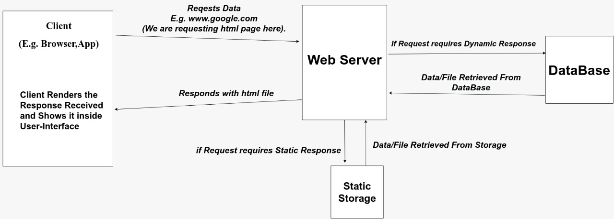
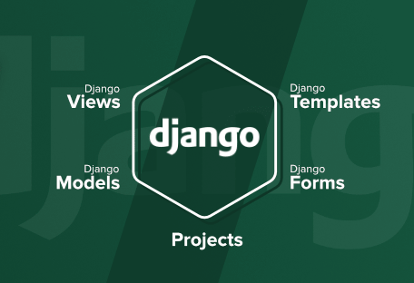
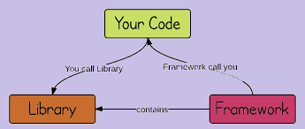
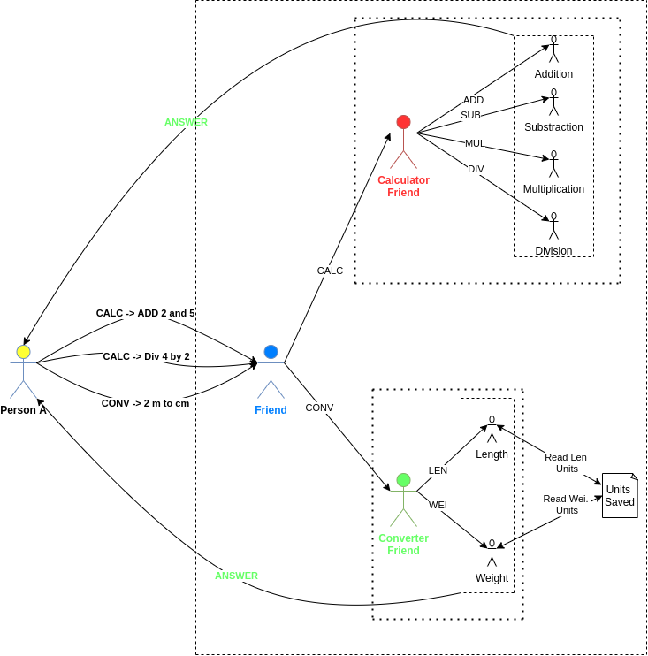
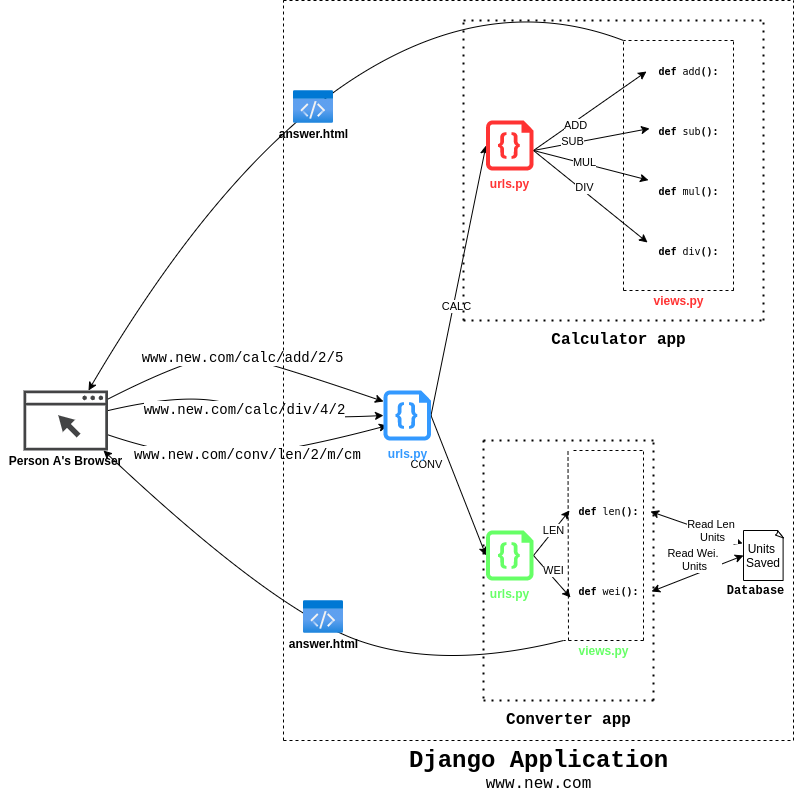
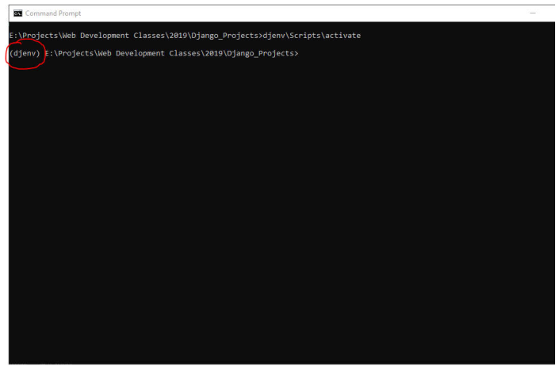
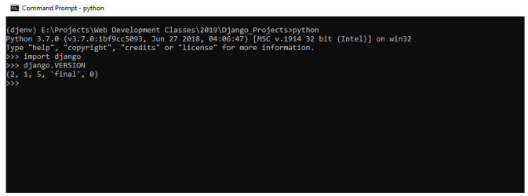

# Web Development Class - V

#### May 10, 2021

<div align="center"><h3>Client-Server architecture</h3></div>

<div align="center"></div>

### What is Client?
* Anything requesting for some resource is a client.
* **Example** - Browser, Mobile-App, Tools like Postman.

### What is Server?
* Anything responding to request by providing reasources is a Server.
* **Example** - Your PC (When Running a Local Server), Dedicated Hardware (Used by Companies for hosting Some Data e.g. Websites), 

### What is Web Server?
* It is a Server that responds to client's request by providing reasources in the form of **HTML file**, **CSS file**, **JS file** or, **images**, etc.

### What is Web Server Software?
* It is program running on the Server Hardware which handles the request-response process.
* **Example** - Apache, Nginx etc. 
* The primary task of these programs is to respond to client requests by processing your backend code. 
* Client Side and Server Side are *two different things*. 
* Both are **not connected** in any way but interact to each other using **Request-Response method**.
* Generally Client sends request to server and server responds accordingly. 
* Server can not send any data to client until it asks server to respond.
* Different protocols(http, https, ftp, ws etc) are followed to establish communication between client and server.

### Types of Responses Sent by Web Server 
* **Static Response** - Directly Available in to Web-Server in a Static Storage Device e.g. Hard-Disk.
* **Dynamic Response** - Response have to be generated by first fetching some data from the Database and then using it inside the Response which is to be sent.

<br/>

<div align="center"></div>

<hr>

<div align="center"><h2>Django Web Framework</h2></div>

### What is Django?
* Django is a **web development framework**.
* It helps in **building** and **maintaining** quality web applications.
* Django helps **eliminate repetitive tasks** making the development process an easy and time saving experience.
* Some popular websites built using Django are - **Instagram**, **Pinterest**, **Disqus**, **Spotify**, **Youtube**, etc.

### Library vs Framework
* When we use a library, **we are in charge of the application flow**. 
* We choose when and where to call the library. 
* When you use a framework, the **framework is in charge of the flow**. 
* It provides you with a few places to plug in your code, but it calls the code you plugged in as needed.

<div align="center"></div>

### Django Apps
* A Django Project is collection of multiple apps.
* These apps are **standalone** components.
* One app can be used in different projects and one project can have multiple apps.
* It promotes **DRY (Do Not Repeat Yourself)** principle.

### Django MVT
* MVT stands for **Model View Template**.
* Django is based on MVT Pattern.
* It has **four** core components - 
	* **URLs** -
		* Request sent by users' browsers come here.
		* Each **URL** is mapped with some **view**.
		* This mapping of URL and view is written is written in **urls.py** file.
	* **Views** - 
		* A view is a python function written inside **views.py** file.
		* Each view is mapped/attached with a URL.
		* Whenever a request comes on a URL, view (function) mapped/attached to that URL is called.
		* A view interacts with tables (models) in database to fetch/store required data.
		* Finally, a view **returns the response** to user in form of **templates**.
	* **Templates** - 
		* It is basically a HTML document which is returned as a response to the browser.
		* A view, fits in required data into the template (HTML file) and then returns the template.
		* HTML files are kept in a directory called **templates** in each app.
	* **Models** - 
		* Models define the **tables** in the database with help of **Object Oriented Programming**.
		* These models are basically **Python classes**, which represent a Table in Database.
		* These classes are defined in **models.py** file.
		* **Class Variables** of Model (Class) represent **Attributes/Columns** of Table.
		* **Instances/Objects** of Model (Class) represent **Rows/Tuple** in Table.

		* | Object Oriented Programming | Database |
		  | ----- | -------- |
		  | Class | Table    |
		  | Class Variables | Columns |
		  | Instances/Objects of Class | Rows/Tuple in table |

* Generally, each app in a Django project has it's own **urls**, **views**, **models**, and **templates**.
* This promotes **de-coupling** and helps in making an app a standalone component.

### A Real World Analogy
* Here, we will try to understand a real - world scenario.
* Later we will relate this real world scenario with Django to better understand components of Django.

<div align="center"></div>

### Relating real-world analogy with Django

<div align="center"></div>

### Setting up Django Project
* **Step 1** - Install Python 3.
* **Step 2** - Run `python --version` or `python3 --version` in your command prompt or terminal to check whether Python is successfully installed or not.
* **Step 3** - Go to directory where you want to create the project.
* **Step 4** - Make a new folder named **Django_Projects**.
* **Step 5** - Right Click in that directory and open command prompt or terminal.
* **Step 6** - Run the following command to create a **virtual environment**.
	```
	python -m venv djenv
	```
* **Step 7** - Activate the environment.
	* In **Windows** run the following command - 
	
	```
	djenv\scripts\activate
	``` 
	
	* In **Linux/Mac** run the following command - 

	```
	source djenv/bin/activate
	```

	* After this step you should see environment name besides the command line as shown below.

	<div align="center"></div>

* **Step 8** - Download and install Django
	
	```
	python -m pip install --upgrade pip
	pip install django
	```

	* This will download and install necessary files.
	* To verify the installation type following command - 

	```
	python
	>>> import django
	>>> django.VERSION
	```

	* If output matches with the following output, then django is properly installed. Your django version might be different from the one shown in this image.

	<div align="center"></div>

* **Step 9** - Starting a project in Django.
	
	```
	django-admin startproject project1
	```

	* **project1** is just the project name.

* **Step 10** - Open **PyCharm Professional IDE**. Open **project1** in PyCharm.

* **Step 11** - Setting Virtual environment for project in PyCharm
	* After opening **project1** in PyCharm go to **File** and open **Settings**.
	* Click on **Project:project1** and then select **Project Interpreter**.
	* Click on **Settings icon**, then click on **Add** and then select **Existing Environment**.
	* Select **djenv/Scripts/python3.exe** or **djenv/bin/python3.exe** from Interpreter dropdown and click **OK**.
	* Click **OK** again.
	* Now open the terminal in Pycharm and you'll see `(djenv)` written in it just like Step 7.

### Some pre-existing files in Django Project
* **settings.py file** - It sets the basic configuration of the project like - 
	* Language of Website, 
	* Timezone to be used in website,
	* Database Engine of Website, etc
* **manage.py file** - It is used to perform various tasks related to project like - 
	* Making a new app in project,
	* Starting the server,
	* Creating the database, etc.
	* We can write commands like `python manage.py runserver`.
* **\_\_init\_\_.py file** - It defines **project1** as a Python package.
* **wsgi.py file** - It stands for Web Server Gateway Interface. It is used to **forward requests** from a web server (such as Apache or NGINX) to a backend Python web application or framework.

### Content Contributors
    
* [Ankit Sangwan](https://github.com/ankitsangwan1999)
* [Kshitiz Srivastava](https://github.com/pirateksh/)

### Materials
