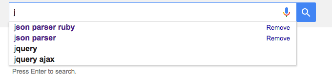

# Web Development Class - VIII

## Web Development Class - VIII recording: [Here](https://drive.google.com/file/d/17j-O9cUiR_l5cPI9lSSu8_3SmYnjBfw6/view?usp=sharing)

#### October 29, 2021

<div align="center"></div>

<hr>

<div align="center"><h2>Advanced JavaScript</h2></div>

<div align="center"><h3>Prerequisite - <a href="https://github.com/CC-MNNIT/2021-22-Classes/tree/main/WebDev/2021_04_28_WebClass-3">Basics of JavaScript</a></h2></div>


* ### Declaring a varible
    * **var**
		- The scope is **global** when a `var` variable is declared outside a function. This means that any variable that is declared with `var` outside a function block is available for use in the whole window.

			```jsx
			var tester = "hey hi";
			var hello = "outer-hello";
				
			function newFunction() {
				console.log(hello) // undefined
				var hello = "inner-hello";
				console.log(hello) // inner-hello
			}
			console.log(hello); // outer-hello
			```

		- `var` variables can be **re-declared** and **updated**

			```jsx
			var greeter = "hey hi";
			var greeter = "say Hello instead";
			greeter = "say Hello again";
			```

		- Problem with var

			```jsx
			var greeter = "hey hi";
			var times = 4;

			if (times > 3) {
				var greeter = "say Hello instead"; 
			}

			console.log(greeter) // "say Hello instead"
			```

			```jsx
			for(var i=0; i<5; i++) {
				console.log(i);  // 0 1 2 3 4
			}
			console.log(i) // 5
			```

		- So, since `times > 3` returns true, `greeter` is **redefined**  to `"say Hello instead"`. 
		- While this is not a problem if you knowingly want `greeter` to be redefined, it becomes a problem when you do not realize that a variable `greeter` has already been defined before.
		- If you have used `greeter` in other parts of your code, you might be surprised at the output you might get. This will likely cause a **lot of bugs** in your code. 
		- This is why `let` and `const` are necessary

	* **let** 

		- `let` is **block scoped**.

		- A block is a chunk of code **bounded by `{ }`** or simply anything within curly braces is a block.

			```jsx
			let greeting = "say Hi";
			let times = 4;

			if (times > 3) {
				let hello = "say Hello instead";
				console.log(hello); // "say Hello instead"
			}
			console.log(hello) // hello is not defined
			```

		- `let` can be updated but **not re-declared**.

			```jsx
			// this works fine:
			let greeting = "say Hi";
			greeting = "say Hello instead";
			```

			```jsx
			// this will return an error:
			let greeting = "say Hi";
			let greeting = "say Hello instead"; // error: Identifier 'greeting' has already been declared
			```

			```jsx
			let greeting = "say Hi";
				if (true) {
					let greeting = "say Hello instead";
					console.log(greeting); // "say Hello instead"
				}
				console.log(greeting); // "say Hi"
			```

	* **const**

		- Variables declared with the `const` **maintain constant values**. `const` declarations share some similarities with `let` declarations.

		- Like `let` declarations, `const` declarations are also **block scoped**, i.e they can only be accessed within the block they were declared.

		- `const` declarations **cannot be updated or re-declared**.

		- This means that the value of a variable declared with `const` remains the same within its scope.

			```jsx
			const greeting = "say Hi";
			greeting = "say Hello instead"; // error: Assignment to constant variable.
			```

* ### **Template literal**
	- Template literals provide an easy way to **interpolate** variables and expressions into strings.
		
		```jsx
		const fist_name = "Jon"
		const last_name = "Snow"
		const message1 = "Good Morning " + first_name + " " + last_name;
		// Same thing using Template Literal 
		const message2 = `Good Morning ${first_name} ${last_name}`
		```
	- **Can you relate ?** - This is similar to [**f-string**](https://realpython.com/python-f-strings/) String Formatting syntax of **Python 3**.

* ### Array Methods

	* **map**

		- Map is not meant to be used like a loop. It is used to transform an array into another.

			```jsx
			const shoppingList = ["mango", "apple", "oranges"];

			// map applies a function to each value of array and returns a new array with updated values.
			const newShopingList = shoppingList.map(function(item) {
				return `new ${item}`;
			});
			console.log(newShopingList);
			```
		- Read more about **map** [here](https://www.w3schools.com/jsref/jsref_map.asp).

	* **forEach**

		- The function **forEach()** is similar to the **map(),** but the difference is it does not return an array.

			```jsx
			const shoppingList = ["mango", "apple", "oranges"];

			shoppingList.forEach(function(item) {
				console.log(item)
			});
			```

	* **filter**

		- If the callback function returns **true** or a value equivalent to **true**, the corresponding array element is appended to the **filteredArray.**

			```jsx
			const shoppingList = ["mango", "apple", "oranges"];

			const filterShoppingList = shoppingList.filter(function(item) {
				return (item !== "mango");
			});
			console.log(filterShoppingList);
			```

	* There are more array methods like **some, every, reduce.** Explore them yourself.

* ### Destructuring

	* **Rest, Spread operators**

		```jsx
		const person = {
			first_name: "Jon",
			last_name: "Snow"
		}

		// object destructuring 
		const { first_name, last_name } = person;

		// object destructuring - This will give Error (undefined)
		const { a, b } = person;

		// object destructuring (changing name)
		const { first_name: new_first_name, last_name } = person;

		// Can You Relate? Destructuring is somewhat similar to "Tuple Unpacking" in Python.

		const a = [1, 2, 3]
		
		// Spread 'a'
		const b = [...a, 4, 5, 6]     // b = [1, 2, 3, 4, 5, 6]

		// Rest 'c'
		const [d, ...c] = b           // d = 1, c = [2, 3, 4, 5, 6]
		```

* ### Classes

	- The **constructor** is a special method that **initializes** an object created by a class automatically.
	
	- So each time we need to make a new User, we would have to pass in their username, age and address.

		```jsx
		class Rectangle {
			constructor(height, width) {
				this.height = height;  // property
				this.width = width;    // property
			}
		
			// method 
			getArea() {
				return this.width * this.height;
			}
		}
		```

	- Creating an instance -

		```jsx
		let rectangle = new Rectangle(5, 6);
		rectangle.getArea(); // 30
		```

	- Extending a class - 

		```jsx
		class Square extends Rectangle {
			constructor(length) {
				super(length, length);  // Calling constructor of parent class
			}
		}
		```

* ### 'this' keyword

	- The JavaScript `this` keyword refers to the **object it belongs to**. It has different values depending on where it is used.

	- Alone, this refers to the global object.

		```jsx
		console.log(this === global);   // true
		// global = window (client-side JS)
		// global = module.exports (node)
		```

	- In a function, `this` refers to the **owner** object.

		```jsx
		function foo() {
			console.log(this === global)
		}

		foo(); // owner of foo function is global

		const person = {
			firstName: "Harshit Gangwar",
			sayFullName: function () {
				console.log(this === person) // true
			},
		};

		person.sayFullName(); // owner of sayFullName functin is person object
		```

	- In a function, in [**strict mode**](https://www.w3schools.com/js/js_strict.asp), this is `undefined`.

		```jsx
		"use strict"; // Strict Mode
		function Hero(heroName, realName) {
			console.log(this); // undefined 
			this.realName = realName; // throws error 
			this.heroName = heroName;
		}
		const superman = Hero("Superman", "Clark Kent");
		console.log(superman);
		```

	- In a class, `this` refers to the **current class instance**.

		```jsx
		class Car {
			constructor() {
				this.brand = "Lexus";
				console.log(this); // Car { brand: "Lexus" }
				this.sayHello(); // Hello!
			}

			sayHello() {
				console.log("Hello!")
			}
		}

		const car = new Car();
		```

	- In an **event**, `this` refers to the **element that received the event**.

		```jsx
		<button onclick="this.style.display='none'">
			Click to Remove Me!
		</button>
		```

	- Methods like `call()`, and `apply()`, `bind()` can refer `this` to any object

		```jsx
		const person1 = {
			fullName: function() {
				return this.firstName + " " + this.lastName;
			}
		}
		const person2 = {
			firstName:"John",
			lastName: "Doe",
		}
		person1.fullName.call(person2);  // Will return "John Doe"
		```

* ### Arrow Function

	- Arrow function is **syntactical sugar**.

		```jsx
		function add(x, y) {
			return x + y;
		}
		add(10, 15); // 25

		// Using arrow function 
		const add = (x, y) => {
			return x + y;
		};

		add(10, 15) // 25 
		```

	- Arrow doesn't have its execution context, it captures exectution context of its enclosing lexical context.

		```jsx
		const car = {
			model: 'Fiesta',
			manufacturer: 'Ford',
			fullName: function() {
				return `${this.manufacturer} ${this.model}`
			}
		}

		console.log(car.fullName()) // Ford Fiesta

		// Using Arrow function
		// 1.

		const car = {
			model: 'Fiesta',
			manufacturer: 'Ford',
			fullName: () => {
				return `${this.manufacturer} ${this.model}`
			}
		}

		console.log(car.fullName()) // undefined undefined 

		// 2.

		const obj = {
			manufacturer: 'Tesla',
			model: 'X',
			sayHello: function() {
				const car = {
					model: 'Fiesta',
					manufacturer: 'Ford',
					fullName: () => {
						console.log( `${this.manufacturer} ${this.model}` );
					}
				}  
				car.fullName(); // Tesla X
			}
		}

		obj.sayHello();
		```

* ### AJAX

	- AJAX stands for **Asynchronous JavaScript And XML**.

	- Often when we request data from other sources, such as an external API, we don’t always know **when** our data will be served back. 
	
	- In these instances we want to wait for the response, but we don’t always want our entire application grinding to a halt while our data is being fetched.

	- **Asynchronous** means that the the Web Application could send and receive data from the Web Server without refreshing the page. 
	
	- This **background process** of sending and receiving data from the server along with updating different sections of a web page defines Asynchronous property/feature of AJAX.

<div align="center"></div>

* ### Callback

	- A **callback function** is a function that is passed **as an argument** to another function, to be **“called back”** at a later time.

		```jsx
		console.log("start");

		setTimeout(() => {
			console.log("Hello!")
		}, 1000);

		console.log("finish");

		// start
		// finish
		// Hello!
		```

	- Problem with callbacks

		```jsx
		console.log("start");

		function loginUser(email, password, callbackFn) {
			console.log('Logging in user...');
			setTimeout(() => { // Fake login
					console.log("User logged in");
					const userInfo = {
					email: email,
					username: "jon_snow"
				}
				// call the callback function
				callbackFn(userInfo);
			}, 2000);
		}

		function getUserVideos(username, callback) {
			console.log(`Fetching videos for ${username}...`)
			setTimeout(() => {
				console.log("Fetched videos")
				callback(["Video1", "Video2", "Video3"]);
			}, 2500)
		}

		function getVideoDetails(videoId, callback) {
			console.log(`Fetching video details for ${videoId}...`)
			setTimeout(() => {
				console.log("Fetched video detail")
				callback({
					id: videoId,
					title: "GOT Trailer" 
				});
			}, 1500)
		}

		// callback hell
		loginUser("jon@gmail.com", 12345, (userInfo) => {
			console.log(userInfo);
			getUserVideos(userInfo.username, (videos) => {
				console.log(videos);
				getVideoDetails(videos[0], (videoDetail) => {
					console.log(videoDetail)
				});
			});
		});

		console.log("finish");

		/*
		OUTPUT - 
			start
			Logging in user...
			finish
			User logged in
			{ email: 'jon@gmail.com', username: 'jon_snow' }
			Fetching videos for jon_snow...
			Fetched videos
			[ 'Video1', 'Video2', 'Video3' ]
			Fetching video details for Video1...
			Fetched video detail
			{ id: 'Video1', title: 'GOT Trailer' }
		*/
		```

* ### Promise

	- A promise is an object that may produce a single value some time in the future.

	- It can be a resolved value, or a reason that it’s not resolved (e.g., a network error occurred). 

	- A promise may be in one of 3 possible states: **fulfilled, rejected, or pending.**

		```jsx
		console.log("start");

		const promise = new Promise((resolve, reject) => {
			setTimeout(() => {
				resolve("Hello!");
				// reject("Some error occured!");   
				}
			}, 2000)
		})

		promise.then(data => {
			console.log(data);  // Hello!
		})
		.catch(error => {
			console.log(error);  // Some error occured
		})

		console.log("finish");
		```

	- **Promise Chaining** - 

		```jsx
		console.log("start");

		function loginUser(email, password) {
			return new Promise((resolve, reject) => {
				console.log("Logging in user...");
				setTimeout(() => {
				console.log("User logged in");
				const userInfo = {
					email: email,
					username: "jon_snow",
				};
				resolve(userInfo);
				}, 2000);
			});
		}

		function getUserVideos(username) {
			return new Promise((resolve, reject) => {
				console.log(`Fetching videos for ${username}...`);
				setTimeout(() => {
				console.log("Fetched videos");
				resolve(["Video1", "Video2", "Video3"]);
				}, 2500);
			});
		}

		function getVideoDetails(videoId) {
			return new Promise((resolve, reject) => {
				console.log(`Fetching video details for ${videoId}...`);
				setTimeout(() => {
				console.log("Fetched video detail");
				resolve({
					id: videoId,
					title: "GOT Trailer",
				});
				}, 1500);
			});
		}

		// chaining promises 
		loginUser("jon@gmail.com", 12345) // returns a promise
			.then(userInfo => {
				console.log(userInfo);
				return getUserVideos(userInfo.username); // returns a promise
			})
			.then(videos => {
				console.log(videos);
				return getVideoDetails(videos[0]); // returns a promise
			})
			.then(videoDetail => {
				console.log(videoDetail);
			})
			.catch(err => {
				console.log(`Error occured ${err}`);
			})

		console.log("finish");
		```

* ### Async-Await

	- The keyword `async` before a function means one simple thing: a function always **returns a promise**

	- The keyword `await` makes JavaScript wait until that promise settles (is resolved or rejected) and returns its result.

	- Using async/await makes code much **simpler to read**.

		```jsx

		async function loginUser(email, password) {
			// ...
		}

		async function getUserVideos(username) {
			// ...
		}

		async function getVideoDetails(videoId) {
			// ...
		}

		async function display() {
			// await can only be used inside a async function
			const userInfo = await loginUser("jon@gmail.com", 12345);
			console.log(userInfo);

			const videos = await getUserVideos(userInfo.username);
			console.log(videos);
			
			const videoDetails = await getVideoDetails(videos[0]);
			console.log(videoDetails);
		}

		display();

		console.log("finish");
		```
	- If you are still confused, watch this awesome video tutorial on [Callbacks, Promises and Async/Await [English]](https://www.youtube.com/watch?v=PoRJizFvM7s&ab_channel=TraversyMedia) by **Traversy Media**.

### Content Contributors 
* [Aman Tibrewal](https://github.com/amantibrewal310)
* [Harshit Gangwar](https://github.com/harshjoeyit)
* [Kshitiz Srivastava](https://github.com/pirateksh/)

### Materials
- ['var', 'let' and 'const', (when/why they're used, difference)](https://www.freecodecamp.org/news/var-let-and-const-whats-the-difference/)
- [Classes (properties and methods)](https://medium.com/@onejohi/understanding-javascript-classes-4e38d355702b)
- ['this' keyword](https://www.freecodecamp.org/news/what-is-this-in-javascript/)
- [Array methods (foreach, map, etc)](https://medium.com/@saravana.kumarr/javascript-array-methods-map-foreach-filter-reduce-5be802afa41)
- [Arrow functions](https://flaviocopes.com/javascript-arrow-functions/)
- [Work with objects and arrays using Rest and Spread](https://flaviocopes.com/javascript-rest-spread/)
- [Object and array destructuring](https://flaviocopes.com/javascript-destructuring/)
- [Template literals](https://flaviocopes.com/javascript-template-literals/)
- [Callbacks](https://flaviocopes.com/javascript-callbacks/)
- [ES Modules](https://flaviocopes.com/es-modules/) (imports, exports)
- [Event handling](https://medium.com/swlh/understanding-event-handlers-js-9792e457b4a5)
