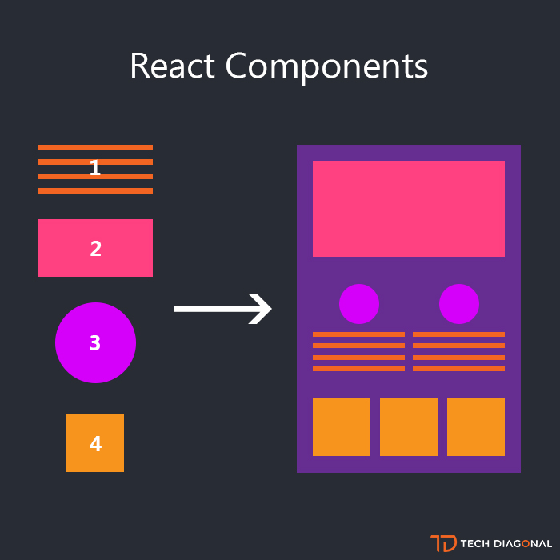
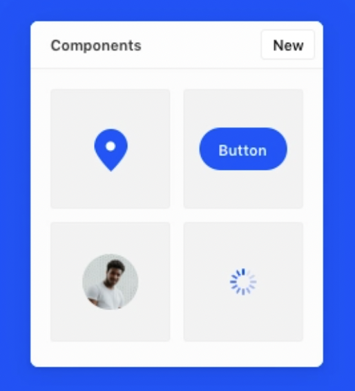

# Web Development Class - IX

## Web Development Class - IX recording: [Here](https://drive.google.com/file/d/1R0m8kbx341iowCcVYGbW0j-ZZhWCsWcm/view?usp=sharing)

#### November 17, 2021

<div align="center"></div>

<hr>

<div align="center"><h2>ReactJS</h2></div>

* ### **What is React?**

    * React is a JavaScript library that aims to simplify the development of visual interfaces. It does this by dividing the UI into a collection of components.

    * The reason React was created is because it’s easy to get lost in a bit of maze of DOM searches and updates with plain JavaScript.

* ### **Why React?**

    1. Easy to build complex UIs - components maintains all of the code needed to *both* **display** and **update** the UI
    2. Efficient - Renders just the right components when your data changes
    3. Maintainable and easier to debug
    4. Not only web-apps you can create mobile apps using React-Native and desktop apps using ElectronJs
    5. Easier learning curve as compared to AngularJS

* ### **React vs React Native**

    * ReactJS is a JavaScript library, supporting both front-end web and being run on a server, for building user interfaces and web applications. It follows the concept of reusable components

    * React Native is a **cross-platform mobile framework** that uses Reactjs for building apps and websites. React Native compiles to native app components enables the programmer to build mobile applications that can run on different platforms such as Windows, Android, iOS in JavaScript.

* ### **Installing React**

    * Install **Node.js**, **NPM** beforehand. You can follow [this](https://github.com/CC-MNNIT/2020-21-Classes/blob/master/WebD/Installation%20Guide.pdf) tutorial.

    * Creating React App - 
        ```
        npx create-react-app my-app
        cd my-app
        npm start
        ```

* ### **Folder Structure**

    * Folder structure is as following - 
        ```
        |- package.json
        |- package-lock.json
        |- index.js
        |- index.html
        ```

    - Plain JS apps usually start with the initial UI created on the server (as HTML), whereas React apps start with a blank HTML page, and dynamically create the initial state in JavaScript. 
    - That's why react application are called **Single Page Application**. As, there is only one HTML file.


* ### **CodeSandbox**

    - [https://codesandbox.io/s/ecstatic-germain-972lv?file=/src/App.js](https://codesandbox.io/s/ecstatic-germain-972lv?file=/src/App.js)

* ### **Components**

    * Everything on screen in a React app is part of a component. Essentially, a React app is just components within components within components.

    * They give you a simple structure to divide every project into smaller pieces, or components. So you don’t build pages in React, you build components. At any time you just have to think about a single component rather than whole page

    * A React component is usually created in its own file, because that's how we can easily reuse it (by importing it) in other components.

    <div align="center">  </div>

* ### **JSX**

    * We call JSX everything wrapped inside the parentheses returned by the component

    * This *looks* like HTML, but it's not really HTML. It's a little different.

    * Under the hood, React will process the JSX and it will transform it into JavaScript that the browser will be able to interpret. So we're writing JSX, but in the end there's a translation step that makes it digestible to a JavaScript interpreter. In short, JSX is just a syntactical sugar.

* ### **The difference between JSX and HTML**

    - In JSX we can embed JavaScript by using curly brackets.
    - Unlike HTML, JSX is not forgiving. If you forget to close a tag, you will have a clear error message:

* ### **Handling user events in React**

    - When the `click` event is fired on the button, React calls the event handler function. React supports a vast amount of types of events, like `onKeyUp`, `onFocus`,`onChange`, `onMouseDown`, `onSubmit` and many more.
        ```jsx
        export default function SomeComponent() {
            // ...
            const handleBtnClick = (e) => {
                console.log("Button was pressed");
            };

            return <button onClick={handleBtnClick}>Click Me</button>;
        }
        ```

* ### **State**

    * The state is the set of data that is managed by the component. Every React component can have its own state.

    - State is local to a component by default (it cannot be modified from the outside).
    - State can only be passed down the component tree (from a parent to child component). This is called unidirectional data flow, but it just means ‘one-way traffic.

    - [https://cdn.sanity.io/files/oneb1r22/production/2386a362fe7863e32d2e191aa19b0d652655c7cb.mp4](https://cdn.sanity.io/files/oneb1r22/production/2386a362fe7863e32d2e191aa19b0d652655c7cb.mp4)

* ### **Props**

    - Props are like parameters which we pass to our component. It can even be a function

    - [https://cdn.sanity.io/files/oneb1r22/production/385e424dff57a487c41e3a390f8912ffacf4b7af.mp4](https://cdn.sanity.io/files/oneb1r22/production/385e424dff57a487c41e3a390f8912ffacf4b7af.mp4)

* ### **Data flow in a React application**

    - In a React application, data typically flows from a parent component to a child component, using props as we saw in the previous section

        ```jsx
        <WelcomeMessage myprop={"somevalue"} />
        ```

    - If you pass a function to the child component, you can however change the state of the parent component from a child component

        ```jsx
        function ComponentUsingCounter({}) {
            //...
            const [count, setCount] = useState(0);

            return (
                //...
                <Counter setCount={setCount} />
            );
        }

        // Counter Component
        function Counter({ setCount }) {
            //...

            setCount(1);

            //...
        }
        ```

* ### **Component Lifecycle**

    - React components live certain life events that are called lifecycle events. These lifecycle's events are tied to lifecycle methods. Like `componentDidMount`, `componentWillUnmount`, etc.

    - These methods can be divide into three categories - 
        1. Mounting
        2. Updating
        3. Unmounting

* ### **Mounting Phase**

    - The first phase of the React Component life cycle is the Mounting phase. This is where we start initialisation of the Component. At this phase, the Component's `props` and `state` are defined. This Mounting phase only occurs once.

    | Lifecycle Method     | Description                                                                                          |
    | -------------------- | ---------------------------------------------------------------------------------------------------- |
    | componentWillMount() | is invoked immediately before mounting occurs.                                                       |
    | componentDidMount()  | is invoked immediately after mounting occurs. Initialization that requires DOM nodes should go here. |

* ### **Updating Phase**

    - The next phase of the life cycle is the Update phase. In this phase, we get new `props`, change `state`. This phase occur every-time we change our state.

    | Lifecycle Method                                          | Description                                                                                                                                                                                                                                |
    | --------------------------------------------------------- | ------------------------------------------------------------------------------------------------------------------------------------------------------------------------------------------------------------------------------------------ |
    | shouldComponentUpdate(object nextProps, object nextState) | is invoked when a component decides whether any changes warrant an update to the DOM. Implement this as an optimization to compare this.props with nextProps and this.state with nextState and return false if React should skip updating. |
    | componentWillUpdate(object nextProps, object nextState)   | is invoked immediately before updating occurs. You cannot call this.setState() here.                                                                                                                                                       |
    | componentDidUpdate(object prevProps, object prevState)    | is invoked immediately after updating occurs.                                                                                                                                                                                              |

* ### **Unmount**

    - The final phase of the life cycle is the Unmount phase. This phase occurs when a component instance is unmounted from the UI. This can occur when the user navigates away, the UI page changes, a component is hidden (like a drawer), etc. This phase occurs once, just like the mounting phase.

    | Lifecycle method       | Description                                                                                   |
    | ---------------------- | --------------------------------------------------------------------------------------------- |
    | componentWillUnmount() | is invoked immediately before a component is unmounted and destroyed. Cleanup should go here. |

* ### **Want to deep dive in lifecycle of component?**

    <div align="center"></div>

<br>

* ### **Comparison to Vanilla JS**

    **In Vanilla JS**

    ```html
    <div>
    <ul id="grocery-list">
        <li>Apples</li>
        <li>Oranges</li>
        <li>Mangoes</li>
    </ul>
    <input id="item-input" />
    <button id="add-button">Add Item</button>
    </div>
    ```

    ```jsx
    const list = document.getElementById("grocery-list");

    // Function to add item to grocery list
    const addItemToList = (item) => {
        const listNode = document.createElement("li");
        const textNode = document.createTextNode(item);
        listNode.appendChild(textNode);
        list.appendChild(listNode);
    };

    // Items already present in grocery list
    const items = ["Apples", "Mangoes", "Oranges"];

    items.forEach((item) => {
        addItemToList(item);
    });

    // To add more items
    const addButton = document.getElementById("add-button");
    addButton.addEventListener("click", function () {
        const input = document.getElementById("item-input");
        const list = document.getElementById("grocery-list");

        const listNode = document.createElement("li");
        const textNode = document.createTextNode(input.value);

        listNode.appendChild(textNode);
        list.appendChild(listNode);
    });
    ```

    **In React**

    ```jsx
    import { useState } from "react";

    export default function GroceryList() {
        const [items, setItems] = useState(["Apples", "Oranges", "Manges"]);
        const [newItem, setNewItem] = useState("");

        // runs when something is typed in input box
        const handleChange = (e) => {
            setNewItem(e.target.value);
        };

        // runs when add item button clicked
        const handleClick = () => {
            const updItems = [...items, newItem];
            setItems(updItems);
            setNewItem("");
        };

        return (
            <div>
            <h3>Grocery List</h3>
            <ul id="grocery-list">
                {items.map((item) => (
                <li>{item}</li>
                ))}
            </ul>
            <input onChange={handleChange} />
            <button onClick={handleClick}> Add Item </button>
            </div>
        );
    }
    ```

### **Content Contributors** 
* [Aman Tibrewal](https://github.com/amantibrewal310)
* [Harshit Gangwar](https://github.com/harshjoeyit)

### **Resources**
- [React JS Crash Course 2021](https://www.youtube.com/watch?v=w7ejDZ8SWv8) - by **Traversy Media**
- [ReactJS Tutorial for Beginners](https://www.youtube.com/playlist?list=PLC3y8-rFHvwgg3vaYJgHGnModB54rxOk3) - by **Codevolution**
- [React Beginner Handbook](https://www.freecodecamp.org/news/react-beginner-handbook/#lifecycleeventsinareactcomponent)
- [React vs vanilla js](https://www.framer.com/blog/posts/react-vs-vanilla-js/)
- [Framer Guide to React](https://www.framer.com/books/framer-guide-to-react/)
- [React Component State](https://www.framer.com/blog/posts/react-components-state/)
