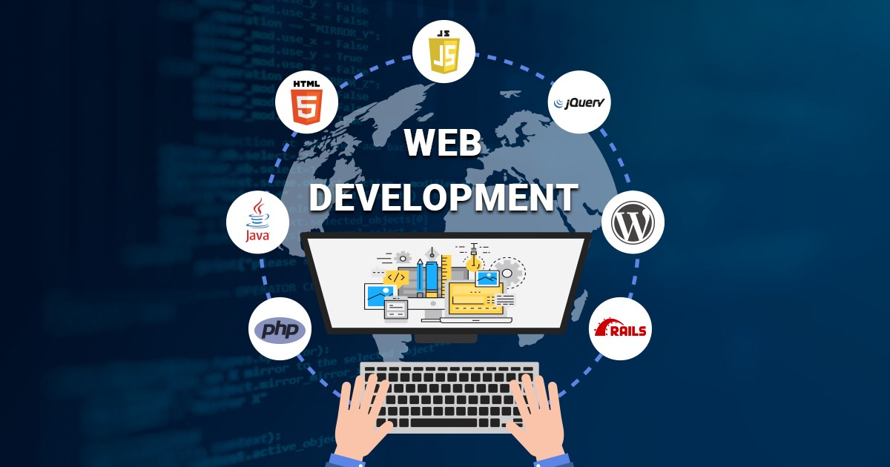

# Web Development Classes Resources

## Table of Contents
- [Classes Held](#classes-held)
- [Getting Started](#getting-started)
- [HTML Resources](#html-resources)
- [CSS Resources](#css-resources)
- [JS Resources](#js-resources)
- [Django Resources](#django-resources)
- [Node Resources](#node-resources)
- [Installations](#installations)

## Classes Held

- [Class 1 (HTML): held on April 24, 2021](./2021_04_24_WebClass-1)
- [Class 2 (HTML + CSS): held on April 26, 2021](./2021_04_26_WebClass-2)
- [Class 3 (JS): held on April 28, 2021](./2021_04_28_WebClass-3)
- [Class 4 (SQL): held on May 01, 2021](./2021_05_01_WebClass-4)
- [Class 5 (Django-1): held on May 10, 2021](./2021_05_10_WebClass-5)
- [Class 6 (Django-2): held on May 12, 2021](./2021_05_12_WebClass-6)

## Getting Started
Getting started with Web :-

* [Web Developer Roadmap](https://github.com/CC-MNNIT/developer-roadmap)
* [Free Code Camp](https://learn.freecodecamp.org/)
* [The Odin Project](https://www.theodinproject.com/courses/)
* [Training for web developers by Google](https://developers.google.com/training/)

## HTML Resources
List of some useful HTML resources to begin with :-

* [W3Schools](https://www.w3schools.com/html/)
* [MDN](https://developer.mozilla.org/en-US/docs/Web/HTML)
* [New Boston](https://www.youtube.com/playlist?list=PL081AC329706B2953)
* [Webster Classes - MNNIT](https://github.com/CC-MNNIT/2018-19-Classes/tree/master/WebDev)

## CSS Resources
List of some useful CSS resources to begin with :-

* [W3Schools](https://www.w3schools.com/css/default.asp)
* [MDN](https://developer.mozilla.org/en-US/docs/Web/CSS)
* [New Boston](https://www.youtube.com/playlist?list=PL4365CEFCE3DC35D1)
* [Webster Classes - MNNIT](https://github.com/CC-MNNIT/2018-19-Classes/tree/master/WebDev)

## JS Resources
List of some useful JS resources to begin with :-

* [JavaScript Is Sexy](http://javascriptissexy.com/16-javascript-concepts-you-must-know-well/)
* [W3Schools](https://www.w3schools.com/js/default.asp)
* [MDN](https://developer.mozilla.org/en-US/docs/Web/JavaScript)
* [jQuery - W3Schools](https://www.w3schools.com/jquery/default.asp)
* [Webster Classes - MNNIT](https://github.com/CC-MNNIT/2018-19-Classes/tree/master/WebDev)

## Django Resources
List of some useful Django resources to begin with :-

* [Django Girls Tutorial](https://tutorial.djangogirls.org/en/)
* [Django Official Documentation](https://docs.djangoproject.com/en/3.2/intro/)
* [Python Book for Absolute Beginners](https://drive.google.com/file/d/1bopnZt5DqgIzwx2BR1uMYBXk8-6HKmDK/view?usp=sharing)
* [Python Tutorial](https://www.youtube.com/watch?v=YYXdXT2l-Gg&list=PL-osiE80TeTskrapNbzXhwoFUiLCjGgY7)

## Node Resources
List of some useful Node resources to begin with :-

* [W3Schools](https://www.w3schools.com/nodejs/)

## Installations
* __PHP Installation__
	- [XAMPP](https://www.apachefriends.org/download.html)
* [Set up Visual Studio IDE -  Installation](https://code.visualstudio.com/docs/setup/setup-overview)
* __NodeJS Installation__
	- [PDF Instructions](https://github.com/CC-MNNIT/2020-21-Classes/blob/master/WebD/Installation%20Guide.pdf)
	- [Linux based OS](https://nodejs.org/en/download/package-manager/)
	- [Windows](https://nodejs.org/en/download/)
* __Django Installation__
	- [Linux Based OS](https://drive.google.com/open?id=1a349WG01xBNShJzYnYwrT5L5Lshhnxc9)
	- [Windows](https://drive.google.com/open?id=1ZvUfMq82X8B0SSfvpQoBsdAoAE99oHG5)
